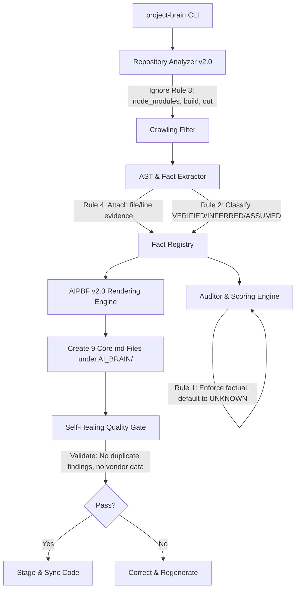

# Universal AI Project Brain Framework (AIPBF) v2.0 — Upgrading Plan

This document outlines the v2.0 architectural design and implementation plan to elevate the **Universal AI Project Brain Framework (AIPBF)** to a highly rigorous, evidence-based auditing and context restoration suite. It strictly implements the non-negotiable rules against fabrication, introduces fact classification, mandates file/line evidence for every claim, and expands the output directory to 9 specific target files.

---

## 1. Goal Description

Upgrade AIPBF to v2.0, establishing a rigorous codebase auditor that:
- **Never fabricates data**: Uses `UNKNOWN` / `NOT_AVAILABLE` when concrete file or log evidence is absent (e.g. coverage metrics).
- **Classifies every fact**: Appends a `Verification: VERIFIED | INFERRED | ASSUMED` status to every extracted node.
- **Mandates evidence logs**: Accompanies all facts with file path, line number, and confidence.
- **Produces 9 specific output files** under `/AI_BRAIN`:
  1. `PROJECT_BRAIN.md` (conforming to the 22 required sections)
  2. `AI_CONTEXT.md` (LLM-optimized context restorer)
  3. `PROJECT_STATUS.md` (current build, test, and sprint status)
  4. `PROJECT_GAPS.md` (missing requirements, tests, security controls, docs)
  5. `PROJECT_SECURITY.md` (security posture, CVEs, auth risks, secrets exposure)
  6. `PROJECT_TESTING.md` (factual coverage matrix and tests)
  7. `PROJECT_ARCHITECTURE.md` (components, dependencies, sequence diagrams)
  8. `REQUIREMENTS_TRACEABILITY.md` (detailed trace engine matching components)
  9. `IMPLEMENTATION_INTELLIGENCE.md` (module specifications, responsibilities)
- **Self-Healing Quality Gate**: Implements verification rules rejecting metrics and outputs if vendor code is analyzed, contradictory techs are logged, or duplicate findings exist.

---

## 2. v2.0 Architecture & Module Upgrade

We will update the core classes in `tools/project_brain/` to support the v2.0 directives:

### v2.0 Code Structure:
1. `analyzer.py`:
   - Updated to strictly ignore `node_modules`, `vendor`, `build`, etc. (Rule 3).
   - Extracts files, lines, and constructs the fact classification registry (Rule 2 & 4).
   - Discovers APIs, databases, events, and component graphs with line number traces.
2. `reviewer.py`:
   - Formulates security findings, technical debt elements, and reliability logs with exact file boundaries.
   - Strictly overrides assumed scores with `UNKNOWN` when coverage, mutation, or performance benchmark evidence does not exist in build output logs or configuration settings (Rule 1).
3. `generator.py`:
   - Renders 9 specific files under `/AI_BRAIN` utilizing v2.0 evidence templates.
4. `project_brain.py`:
   - Adds the **Self-Healing Quality Gate** post-process. It reviews the generated dictionary structure, checks for contradictory technologies (e.g. Node.js mixed with Rust when only C++ is present), scans for duplicate findings, and rejects generation on violations, triggering safe defaults.

---

## 3. User Review Required

> [!IMPORTANT]
> **Heuristic Verification Rules for Git Evidences**
> To extract exact file and line references for components, APIs, and tests (Rule 4), AIPBF v2.0 crawls configuration files, headers, and AST nodes. 
> For abstract requirements and general architecture states, it infers connection mappings from code comments (e.g., matching `@requirement R-100` patterns) and tags them as `Verification: VERIFIED` when direct matches are found, or `Verification: INFERRED` when derived from folder groupings.
> We recommend this pattern to preserve evidence-based rigor without requiring external runtime instrumentation.

---

## 4. Verification Plan

### Automated Verification
1. Run `python tools/project_brain/project_brain.py --scan` in both the C++ UADOS repository and the Node.js monorepo (`H:\autonomoustradingos`).
2. Verify that **all 9 core markdown files** are generated under `/AI_BRAIN`.
3. Open `PROJECT_BRAIN.md` and check that all metrics lack fabricated coverage indexes (displaying `UNKNOWN` where evidence files are absent, as mandated by Rule 1).
4. Verify that every finding block contains `Verification` and `Evidence` properties.

### Manual Verification
1. Introduce a contradictory file inside a target repository (e.g. `node_modules` parsing violation) and verify that the **Self-Healing Quality Gate** successfully rejects and heals the metadata reports.
