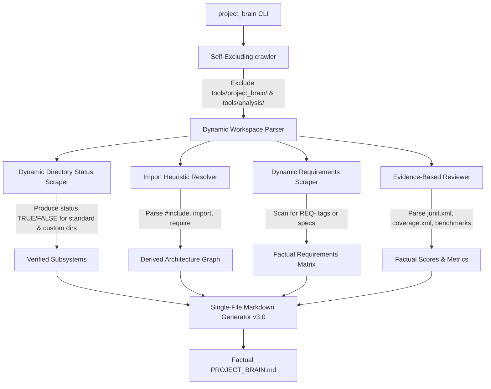

# Universal AI Project Brain Framework (AIPBF) v3.0 — Strict Factual Architecture Plan

This document outlines the detailed design and implementation steps to upgrade AIPBF to **v3.0**. The primary focus is to transition from **template intelligence** (guessing what a project *should* contain based on domain) to **repository intelligence** (documenting *only* what actually exists in the codebase with verified provenance and evidence).

---

## 1. Goal Description

Eliminate all fabricated metrics, hardcoded architecture components, and guessed requirements from the generated `PROJECT_BRAIN.md`. Implement robust dynamic discovery engines for directory layouts, requirements, data flows, APIs, databases, external dependencies, and performance benchmarks. 

Every single section will adhere to the following principles:
- **Zero Fabrication**: Default to `UNKNOWN` rather than inventing data.
- **Strict Provenance**: Attach verifiable file paths and lines to all metrics and claims.
- **Dynamic Derivation**: Construct architectures and data flows directly from codebase file-to-file import statements.

---

## 2. Technical Architectural Changes

We will modify three core modules in `tools/project_brain/` to enforce strict compliance with v3.0 requirements.

### Component Details

#### 1. `analyzer.py` (Dynamic Repository Analyzer)
- **Factual Exclusions (Rule 009 & 010)**: Strengthen the ignore patterns to filter out all internal tools (`tools/project_brain/`, `tools/analysis/`) and dependency folders (`node_modules/`, `vendor/`, `third_party/`, `.next/`) to prevent self-scanning contamination.
- **Dynamic Directory Discovery (Rule 002)**: Scan the workspace for top-level directories. Construct a status list of standard industry layers (`core`, `hal`, `sensors`, `control`, `safety`, `fleet`, `backend`, `frontend`, `shared`, `analytics`, `infra`, `database`, `docs`, `tests`, `scripts`) and mark their presence explicitly (`Exists: TRUE` or `Exists: FALSE`).
- **Dynamic Requirements Discovery (Rule 005)**:
  - Crawl files for requirement documents (`*requirement*`, `*spec*`).
  - Scan source files (`.py`, `.cpp`, `.ts`, etc.) for inline requirements annotations matching pattern `\b(REQ-\d+|Requirement:\s*[^\n]+)`.
  - If none are found, requirements default to `UNKNOWN` with direct confidence set to `LOW`.
- **Derived Architecture & Imports Resolver (Rule 004)**:
  - Parse `#include` (C++), `import/require` (TS/JS), and `import` (Python) lines to build a file-to-file import relationship map.
  - From this map, derive the Mermaid dependency graph. If no relations are found, confidence drops automatically to `LOW`.
  - Dynamically derive **Data Flow** based on the dependency import direction (e.g., `frontend -> backend -> database`). If no dependencies exist, mark as `UNKNOWN`.

#### 2. `reviewer.py` (Factual Quality & Testing Auditor)
- **Provenanced Metric Calculations (Rules 003, 006, 007, 008)**:
  - **Security Score**: Default strictly to `UNKNOWN` unless a verified security tool report (e.g. SAST, secrets scan log) is found and parsed.
  - **Quality & Complexity Scores**: Default strictly to `UNKNOWN` unless SonarQube or similar properties are found.
  - **Test Pass Rate & Coverage**: Do not fabricate coverage or pass rates. If JUnit XML (`junit.xml`, `test-results.xml`) is found, parse it dynamically to compute the exact pass rate. If coverage XML (`coverage.xml`, `cobertura.xml`) is found, parse it dynamically to get the coverage percentage. Otherwise, mark as `UNKNOWN`.
  - **Performance Benchmarks**: Only output benchmark latencies if files like `benchmark_results.json` or `perf_report.md` are present. Otherwise, mark as `UNKNOWN`.
- **Finding Registry**: Populate findings strictly from real problems (large files >800 lines, hardcoded secrets, unsafe functions like `strcpy` or `eval`).

#### 3. `generator.py` (Master Documentation Generator)
- **Eliminate All Domain Templates (Rule 001)**:
  - Remove all hardcoded templates for "Autonomous Driving Operating System" or "Autonomous Trading Platform" features (such as Stanley controller, EKF fusion, backtest simulation solver, live DB Transactions broker).
  - Component registry, implementation summaries, data flows, reliability overviews, and gap analysis must be generated strictly from verified repository state.
  - Subsystems layout must list directories with `Exists: TRUE` or `Exists: FALSE`.
- **Dynamic AI Handoff**: Build the onboarding handoff restoring payload using strictly dynamic facts gathered by the parser (what files exist, what tests actually ran, what dependencies were parsed, and what next steps are appropriate).

---

## 3. User Review Required

> [!IMPORTANT]
> **Adherence to Factual Score Defaults**
> Upgrading to v3.0 will result in `UNKNOWN` labels for test coverage, performance benchmarks, and security scores if the repository does not contain corresponding evidence files (such as `junit.xml`, `coverage.xml`, or `benchmark_results.json`). This is the intended behavior to ensure complete trustworthiness and absolute provenance.

---

## 4. Verification Plan

### Automated Tests
1. Run `python tools/project_brain/project_brain.py --scan` in `H:\uados`. Verify that standard folders (`/core`, `/hal`, `/sensors`) are marked `Exists: TRUE`, while nonexistent folders like `/backend` are marked `Exists: FALSE`.
2. Verify that `AI_BRAIN/PROJECT_BRAIN.md` contains **no** invented/hallucinated terms like "Stanley steering controller" or "backtest simulation solver" unless there are matching files detected on disk.
3. Validate that test pass rates, coverage, and performance scores are either parsed from real XML/JSON files or set strictly to `UNKNOWN` with evidence references.
4. Verify that the self-scanning exclusions successfully ignore the `tools/project_brain` folder, leaving the API and Event registries clean.
