# AI Context Document (AIPBF v4.0)

> **Generated**: 2026-06-03
> **Purpose**: LLM-optimized project understanding. A completely different AI model should be able to read ONLY this file and understand the project well enough to continue development accurately.

---

## Project Identity

- **Project Type**: Autonomous Driving Operating System
- **Project Domain**: Autonomous Vehicles & Robotic Systems
- **Primary Purpose**: Failsafe real-time vehicle scheduling, fusion, path planning, and envelope controls.
- **Confidence**: HIGH
- **Primary Languages**: C++, Markdown, Python, YAML
- **Build Tooling**: Conan, CMake
- **Total LOC**: 33411

---

## System Intent Map

### Primary Goal:
Safely navigate autonomous vehicles in dynamic environments.

### System Mission:
1. Acquire sensor data (IMU, GPS, LiDAR, Camera)
2. Fuse sensor streams (EKF state filters)
3. Localize vehicle (Pose & Odometry)
4. Predict actor behavior (Trajectory estimates)
5. Plan trajectory (Obstacle-avoidance motion planner)
6. Generate control commands (Stanley lateral controller, PID speed loops)
7. Monitor safety boundaries (Emergency braking, envelope constraints)
8. Execute fallback actions (CAN hardware shutdown, safe harbor maneuvers)

---

## Runtime Data Flow

```mermaid
graph LR
    Sensors[1. Sensors] -->|Raw feeds| Perception[2. Perception]
    Perception -->|Fused streams| Localization[3. Localization]
    Localization -->|Pose & Velocity| Prediction[4. Prediction]
    Prediction -->|Actor trajectories| Planning[5. Planning]
    Planning -->|Steer & Throttle commands| Control[6. Control]
    Control -->|Actuator commands| Safety[7. Safety Envelope]
    Safety -->|Plausible commands| HAL[8. HAL Actuators]
```



---

## Architecture Rules

> [!IMPORTANT]
> **Strict Robotics Structural Boundaries**
> 1. **Perception never directly controls actuators**: Perception must output track/object states; it is forbidden to bypass the planner and send direct CAN commands.
> 2. **Planning cannot bypass the safety layer**: All planned trajectories must pass through safety envelope collision checks before control execution.
> 3. **All subsystem commands pass through the EventBus**: Explicit decoupled IPC model. Direct inline cross-imports between core modules are prohibited.
> 4. **Safety may override any subsystem**: Failsafe watchdogs and emergency braking can override planned trajectories at any step.
> 5. **No module directly accesses hardware except HAL**: Subsystems must interact with sensors and actuators through HAL abstractions only.

---

## Known Constraints

- **Zero Heap Allocations on Realtime Hot Path**: All control loop steps must use pre-allocated static memory blocks (NFR-PERF-010).
- **Hard Realtime Deadlines**: System-wide control loop frequencies must sustain >= 100Hz with watchdog alerts (NFR-PERF-004).
- **Deterministic Scheduling**: Scheduler prioritizes failsafe critical execution rings (FR-KRN-003).
- **ASIL-D Independence**: Safety monitors run isolated from user control space (NFR-SAF-001).

---

## VERIFIED_FACTS VS AI_INFERENCES

### VERIFIED_FACTS (100% Proven on Disk)
- **Directory Layout**: Subsystem folders verified on disk.
- **Source Files**: 431 source files, 25 test files present.
- **Build Configurations**: Conan, CMake active and verified.
- **Static Security**: Static analyzer results completed.

### AI_INFERENCES (Inferred from Static Structures)
- **Architecture Import Graph**: Derived through import dependencies (build-time, not runtime).
- **Runtime flow**: Thread orchestration paths are inferred from standard boot sequences.
- **Performance budgets**: Latency boundaries are simulated targets; no physical CPU profiling data verified.


---

## FEATURE_SPECIFICATIONS

### Lane Detection

Purpose:
Detect lane boundaries.

Inputs:
- Camera frames

Outputs:
- Lane geometry

Failure Modes:
- Missing lane markings
- Heavy rain

Consumers:
- Planning
- Safety

Source Files:
- perception/lanes/src/lane_detector.cpp

Tests:
- perception/detection/tests/test_perception.cpp

### Obstacle Detection

Purpose:
Detect and classify dynamic obstacles in vehicle surroundings.

Inputs:
- Camera frames
- LiDAR point clouds

Outputs:
- ObjectList (dynamic obstacle tracks)

Failure Modes:
- Severe occlusions
- Heavy fog or snow
- Sensor misalignment

Consumers:
- Prediction
- Planning
- Safety

Source Files:
- perception/detection/src/object_detector.cpp

Tests:
- perception/detection/tests/test_perception.cpp

### EKF Pose Localization

Purpose:
Calculate vehicle 6-DOF map-relative pose.

Inputs:
- SensorFrame (IMU, GPS NMEA streams)
- HD Map geometry

Outputs:
- VehicleState (position, velocity, orientation covariance)

Failure Modes:
- GPS dropout in urban canyons
- High wheel slip

Consumers:
- Planning
- Control
- Safety

Source Files:
- localization/pose/src/pose_estimator.cpp

Tests:
- localization/pose/tests/test_localization.cpp

### Stanley Steering Control

Purpose:
Track lateral reference trajectory errors and generate steering commands.

Inputs:
- VehicleState
- Reference Trajectory / PathPlan

Outputs:
- ControlCommand (steering angle)

Failure Modes:
- Low surface friction (ice)
- Discontinuous reference trajectory

Consumers:
- HAL Actuators

Source Files:
- control/steering/src/stanley_controller.cpp

Tests:
- control/loops/tests/test_control.cpp

### Real-time EventBus

Purpose:
Coordinate low-latency, zero-copy lock-free IPC messaging.

Inputs:
- Component message payloads

Outputs:
- IPC channel distribution

Failure Modes:
- Buffer overflow
- Priority inversion

Consumers:
- All Subsystems

Source Files:
- core/event_bus/src/event_bus.cpp

Tests:
- core/event_bus/tests/test_event_bus.cpp

### Safety Envelope Watchdog

Purpose:
Audit actuator commands against kinematic envelopes and override with emergency stop if violated.

Inputs:
- VehicleState
- ControlCommand
- ObjectList

Outputs:
- SafetyEnvelope
- Emergency deceleration triggers

Failure Modes:
- Missed watchdog ticks
- Plausibility check failures

Consumers:
- Control
- HAL Actuators

Source Files:
- safety/monitors/src/safety_monitor.cpp

Tests:
- safety/monitors/tests/test_safety.cpp

### OTA Rollback Client

Purpose:
Securely query and apply over-the-air system updates with dual-partition fallback.

Inputs:
- Update metadata packages

Outputs:
- A/B partition boot flag updates

Failure Modes:
- Package signature verification failure
- Network loss mid-download

Consumers:
- Core System

Source Files:
- fleet/ota/src/ota_client.cpp

Tests:
- fleet/ota/tests/test_fleet.cpp

### Digital Twin Simulator Bridge

Purpose:
Interface with simulation backends (e.g. CARLA) for hardware-in-the-loop virtual testing.

Inputs:
- ControlCommand

Outputs:
- Mocked SensorFrame streams

Failure Modes:
- Simulation clock desynchronization
- Network socket timeouts

Consumers:
- Sensors
- Validation

Source Files:
- digital_twin/bridge/src/simulation_bridge.cpp

Tests:
- simulation/scenarios/tests/test_simulation.cpp

### Prediction Trajectory Engine

Purpose:
Predict future trajectory paths of surrounding dynamic traffic actors.

Inputs:
- ObjectList

Outputs:
- PredictionTracks (forecasted coordinates)

Failure Modes:
- Erratic pedestrian movement
- Tracking identity swaps

Consumers:
- Planning

Source Files:
- prediction/trajectory/src/trajectory_predictor.cpp

Tests:
- prediction/trajectory/tests/test_prediction.cpp

### Sensor Fusion Pipeline

Purpose:
Synchronize and fuse camera, LiDAR, and radar frames for multi-modal perception.

Inputs:
- Raw peripheral hardware sensor channels

Outputs:
- Fused object tracks

Failure Modes:
- Driver connection timeouts
- Extreme calibration offsets

Consumers:
- Perception

Source Files:
- sensors/fusion/src/sensor_fusion.cpp

Tests:
- sensors/fusion/tests/test_sensors.cpp

---

## CHANGE_IMPACT_MATRIX

Feature:
Lane Detection

Changing affects:
- Planning
- Prediction
- Safety

Risk:
High

Tests Required:
- Planning tests
- Safety tests

Feature:
Obstacle Detection

Changing affects:
- Planning
- Prediction
- Safety

Risk:
High

Tests Required:
- Prediction tests
- Planning tests
- Safety tests

Feature:
EKF Pose Localization

Changing affects:
- Planning
- Control
- Safety
- Navigation

Risk:
Critical

Tests Required:
- Localization tests
- Control tests
- Safety tests

Feature:
Stanley Steering Control

Changing affects:
- Actuators HAL
- Safety

Risk:
Critical

Tests Required:
- Control tests
- Safety tests

Feature:
Real-time EventBus

Changing affects:
- All Subsystems

Risk:
Critical

Tests Required:
- Core EventBus tests
- Integration validation tests

Feature:
Safety Envelope Watchdog

Changing affects:
- Actuators HAL
- Control

Risk:
Critical

Tests Required:
- Safety tests
- Control tests
- System validation tests

Feature:
OTA Rollback Client

Changing affects:
- Boot Loader
- Core System

Risk:
High

Tests Required:
- Fleet OTA tests
- Boot verification tests

Feature:
Digital Twin Simulator Bridge

Changing affects:
- Sensors
- Simulation Validation

Risk:
Medium

Tests Required:
- Simulation tests
- Scenario tests

Feature:
Prediction Trajectory Engine

Changing affects:
- Planning
- Safety

Risk:
High

Tests Required:
- Prediction tests
- Planning tests

Feature:
Sensor Fusion Pipeline

Changing affects:
- Perception
- Safety

Risk:
High

Tests Required:
- Sensor tests
- Perception tests

---

## AI_TASK_ROUTING_MAP

Task:
Add sensor

Modify:
- sensors/
- localization/

Task:
Add planner

Modify:
- planning/

Task:
Add safety rule

Modify:
- safety/

Task:
Fix CAN issue

Modify:
- hal/
- fleet/

---

## SYSTEM STARTUP FLOW

1. main()
2. Kernel initialization
3. EventBus creation
4. Plugin loading
5. Sensor registration
6. Perception startup
7. Planning startup
8. Safety startup
9. Begin execution loop

---

## DATA MODELS

### VehicleState
- Location: `core/kernel/include/uados/vehicle_state.hpp`
- Fields: `Pose position`, `SpeedVector velocity`, `AccelVector acceleration`, `SystemStatus status`
- Used By: control, safety, localization
- Produced By: localization
- Consumed By: planning, control, safety

### PathPoint
- Location: `planning/motion/include/uados/planning/motion_planner.hpp`
- Fields: `double x`, `double y`, `double yaw`, `double kappa`
- Used By: planning, control
- Produced By: planning
- Consumed By: control

### Trajectory
- Location: `planning/motion/include/uados/planning/motion_planner.hpp`
- Fields: `std::vector<PathPoint> points`, `std::vector<double> velocity_profile`, `double confidence`
- Used By: planning, control, safety
- Produced By: planning
- Consumed By: control, safety

### LocalizationState
- Location: `localization/pose/include/uados/localization/pose_estimator.hpp`
- Fields: `Pose pose`, `CovarianceMatrix covariance`, `bool gps_locked`
- Used By: localization, planning, control
- Produced By: localization
- Consumed By: planning, control

### SensorFrame
- Location: `sensors/api/include/uados/sensors/sensor.hpp`
- Fields: `uint64_t timestamp`, `SensorType type`, `std::vector<uint8_t> data`
- Used By: sensors, perception, localization
- Produced By: sensors
- Consumed By: perception, localization

### Obstacle
- Location: `perception/detection/include/uados/perception/object_detector.hpp`
- Fields: `int32_t id`, `ObjectClass classification`, `Pose pose`, `SpeedVector velocity`
- Used By: perception, prediction, planning, safety
- Produced By: perception
- Consumed By: prediction, planning, safety

### PredictionTrack
- Location: `prediction/trajectory/include/uados/prediction/trajectory_predictor.hpp`
- Fields: `int32_t obstacle_id`, `std::vector<Pose> predicted_path`, `double probability`
- Used By: prediction, planning
- Produced By: prediction
- Consumed By: planning

### ControlCommand
- Location: `control/loops/include/uados/control/control_loop.hpp`
- Fields: `double steering_angle`, `double throttle`, `double brake`, `bool gear_forward`
- Used By: control, safety, hal
- Produced By: control
- Consumed By: safety, hal

---

## INTERFACES

### IPlanner
- Methods: `virtual Status plan(const VehicleState& current_state, const std::vector<Obstacle>& obstacles, Trajectory& output_trajectory) = 0`
- Implementations: `uados::planning::MotionPlanner`, `uados::planning::StrategicPlanner`
- Usage: Used by core kernel to calculate motion commands during execution loop.

### IPerception
- Methods: `virtual Status detect(const SensorFrame& frame, std::vector<Obstacle>& output_obstacles) = 0`
- Implementations: `uados::perception::ObjectDetector`, `uados::perception::LaneDetector`
- Usage: Subscribed to raw camera/LiDAR frames via EventBus; outputs dynamic tracks.

### ISensor
- Methods: `virtual Status init(const Config& config) = 0`, `virtual Status read(SensorFrame& output_frame) = 0`
- Implementations: `uados::sensors::GPSSensor`, `uados::sensors::IMUSensor`, `uados::sensors::CameraSensor`
- Usage: Low-level hardware drivers interfacing with peripheral device ports.

### IController
- Methods: `virtual Status compute_control(const VehicleState& current_state, const Trajectory& target_trajectory, ControlCommand& output_command) = 0`
- Implementations: `uados::control::StanleyController`, `uados::control::ThrottleController`
- Usage: Resolves tracking error and publishes actuators commands on event loops.

### IEventBus
- Methods: `virtual Status publish(Topic topic, const EventEnvelope& msg) = 0`, `virtual Status subscribe(Topic topic, EventHandler handler) = 0`
- Implementations: `uados::core::EventBus`
- Usage: Lock-free IPC ring buffer coordinating multi-thread component communication.

### IKernel
- Methods: `virtual Status register_component(std::shared_ptr<ComponentBase> component) = 0`, `virtual Status boot() = 0`, `virtual Status shutdown() = 0`
- Implementations: `uados::core::Kernel`
- Usage: Microkernel system entry and subsystem life cycle registry.

---

## BUILD TARGETS

### core_kernel
- Dependencies: `fmt`, `spdlog`
- Output Binary: `build/release/bin/core_kernel`
- Build Command: `cmake --build build --target core_kernel`

### planning_service
- Dependencies: `core_kernel`
- Output Binary: `build/release/bin/planning_service`
- Build Command: `cmake --build build --target planning_service`

### prediction_service
- Dependencies: `core_kernel`
- Output Binary: `build/release/bin/prediction_service`
- Build Command: `cmake --build build --target prediction_service`

### safety_service
- Dependencies: `core_kernel`
- Output Binary: `build/release/bin/safety_service`
- Build Command: `cmake --build build --target safety_service`

### simulation_runner
- Dependencies: `core_kernel`, `planning_service`, `safety_service`
- Output Binary: `build/release/bin/simulation_runner`
- Build Command: `cmake --build build --target simulation_runner`

---

## TEST SUITES

### test_event_bus
- tests `EventBus`

### test_kernel
- tests `scheduler`

### test_planning
- tests `trajectory planner`

### test_safety
- tests `watchdog`

### test_localization
- tests `pose estimator`

### test_prediction
- tests `trajectory predictor`

### test_sensors
- tests `sensor fusion`

---

## CHANGE IMPACT

Planning:
  Affects:
    Prediction
    Safety
    Simulation

Perception:
  Affects:
    Prediction
    Planning

Localization:
  Affects:
    Planning
    Safety
    Control

---

## FEATURE INVENTORY

| Feature ID | Feature | Status | Owner | Completion |
|:---|:---|:---|:---|:---|
| F-001 | Event Bus (Lock-free IPC) | Complete | Core | 100% |
| F-002 | Microkernel Scheduler | Complete | Core | 100% |
| F-003 | Memory Pool Allocator | Complete | Core | 100% |
| F-004 | Health Monitor | Complete | Core | 100% |
| F-005 | Lifecycle Manager | Complete | Core | 100% |
| F-006 | GPS Driver | Complete | Sensors | 100% |
| F-007 | IMU Driver | Complete | Sensors | 100% |
| F-008 | Camera Driver | Complete | Sensors | 100% |
| F-009 | LiDAR Driver | Complete | Sensors | 100% |
| F-010 | Radar Driver | Complete | Sensors | 100% |
| F-011 | Sensor Fusion (EKF) | Complete | Sensors | 100% |
| F-012 | Object Detection (ONNX) | Complete (Simulated) | Perception | 90% |
| F-013 | Multi-Object Tracking | Complete | Perception | 100% |
| F-014 | Lane Detection | Complete | Perception | 100% |
| F-015 | Traffic Light Detector | Complete (Simulated) | Perception | 80% |
| F-016 | Traffic Sign Recognition | Planned | Perception | 0% |
| F-017 | Semantic Segmentation | Planned | Perception | 0% |
| F-018 | EKF Pose Localization | Complete | Localization | 100% |
| F-019 | HD Map Engine (Lanelet2) | Partial (Mock) | Localization | 40% |
| F-020 | Trajectory Prediction | Complete | Prediction | 100% |
| F-021 | Behavior Prediction | Complete | Prediction | 100% |
| F-022 | Risk Estimation | Complete | Prediction | 100% |
| F-023 | Strategic Planner | Complete | Planning | 100% |
| F-024 | Behavior Planner | Complete | Planning | 100% |
| F-025 | Motion Planner | Complete | Planning | 100% |
| F-026 | Stanley Steering Controller | Complete | Control | 100% |
| F-027 | Throttle PID Controller | Complete | Control | 100% |
| F-028 | Control Loop Orchestrator | Complete | Control | 100% |
| F-029 | Brake Controller | Complete | Control | 100% |
| F-030 | Safety Monitor | Complete | Safety | 100% |
| F-031 | Emergency Response System | Complete | Safety | 100% |
| F-032 | Fault Detection & Isolation | Partial | Safety | 60% |
| F-033 | Runtime Invariant Checker | Partial | Safety | 50% |
| F-034 | CAN Bus Driver | Complete | HAL | 100% |
| F-035 | Vehicle API | Complete | HAL | 100% |
| F-036 | Vehicle Digital Twin | Complete | Digital Twin | 100% |
| F-037 | Digital Twin Dashboard | Complete | Digital Twin | 100% |
| F-038 | Scenario Engine | Complete | Simulation | 100% |
| F-039 | Replay System | Complete | Simulation | 100% |
| F-040 | Automated Validator | Complete | Validation | 100% |
| F-041 | Fault Injector | Complete | Validation | 100% |
| F-042 | OTA Manager | Complete | Fleet | 100% |
| F-043 | Fleet Telemetry | Partial | Fleet | 50% |
| F-044 | CARLA Bridge | Planned | Simulation | 0% |
| F-045 | SUMO Traffic Bridge | Planned | Simulation | 0% |

---

## RUNTIME EXECUTION FLOW

```
User Input / Mission Start
         ↓
   Sensor Layer
   (GPS, IMU, LiDAR, Camera, Radar)
         ↓
   Sensor Fusion (EKF)
         ↓
   Perception
   (Object Detection, Tracking, Lane Detection)
         ↓
   Localization
   (EKF Pose Estimation, HD Map Query)
         ↓
   Prediction
   (Trajectory Prediction, Behavior Estimation)
         ↓
   Planning
   (Strategic → Behavior → Motion Planner)
         ↓
   Control
   (Stanley Steering + PID Throttle/Brake)
         ↓
   Safety Monitor
   (Envelope Checks, Plausibility Audit)
         ↓
   HAL Actuators
   (CAN Bus → Steering, Throttle, Brake)
         ↓
   Vehicle / Simulation
```

Loop Frequencies:
- **100 Hz**: Localization, Control commands
- **50 Hz**: Motion planning, Safety checks
- **10 Hz**: Perception inference, Object tracking

---

## ENTRY POINT REGISTRY

### Main Entry Points
| Entry Point | File | Type | Description |
|:---|:---|:---|:---|
| Kernel Boot | `core/kernel/src/kernel.cpp` | Main | System boot, memory pool init, scheduler start |
| Control Loop | `control/loops/src/control_loop.cpp` | Service | Lateral + longitudinal command fusion loop |
| Safety Watchdog | `safety/monitors/src/safety_monitor.cpp` | Daemon | Continuous boundary violation scanner |
| OTA Manager | `fleet/ota/src/ota_client.cpp` | Service | Firmware update listener and rollback handler |

### CLI Entry Points
| Entry Point | File | Description |
|:---|:---|:---|
| AIPBF Scanner | `tools/project_brain/project_brain.py` | Generate AI Brain documentation |
| Doc Generator | `tools/analysis/doc_generator.py` | Legacy documentation generator |
| Build Script | `scripts/build/build.sh` | Conan + CMake build automation |
| Dev Setup | `scripts/setup/setup_dev.sh` | Developer environment bootstrap |

### Background Workers
| Worker | File | Frequency | Description |
|:---|:---|:---|:---|
| EKF Fusion Loop | `sensors/fusion/src/sensor_fusion.cpp` | 100 Hz | Fuse GPS/IMU into pose states |
| Perception Inference | `perception/detection/src/inference_engine.cpp` | 10 Hz | Run ONNX object detection |
| Prediction Engine | `prediction/trajectory/src/trajectory_predictor.cpp` | 10 Hz | Forecast actor trajectories |
| Motion Planner | `planning/motion/src/motion_planner.cpp` | 50 Hz | Solve collision-free paths |
| Health Monitor | `core/health/src/health_monitor.cpp` | 1 Hz | Heartbeat and subsystem diagnostics |

---

## CLASS / SERVICE REGISTRY

### Core Services
| Class | File | Implements | Key Methods |
|:---|:---|:---|:---|
| `Kernel` | `core/kernel/src/kernel.cpp` | `IKernel` | `boot()`, `shutdown()`, `register_component()` |
| `EventBus` | `core/event_bus/src/event_bus.cpp` | `IEventBus` | `publish()`, `subscribe()`, `poll()` |
| `Scheduler` | `core/scheduler/src/scheduler.cpp` | — | `schedule_task()`, `execute_pending()` |
| `HealthMonitor` | `core/health/src/health_monitor.cpp` | — | `check_heartbeat()`, `report_status()` |
| `LifecycleManager` | `core/lifecycle/src/lifecycle_manager.cpp` | — | `transition_state()`, `get_state()` |

### Sensor Services
| Class | File | Implements | Key Methods |
|:---|:---|:---|:---|
| `GPSDriver` | `sensors/gps/src/gps_driver.cpp` | `ISensor` | `init()`, `read()`, `parse_nmea()` |
| `IMUDriver` | `sensors/imu/src/imu_driver.cpp` | `ISensor` | `init()`, `read()`, `calibrate()` |
| `CameraDriver` | `sensors/camera/src/camera_driver.cpp` | `ISensor` | `init()`, `read()`, `set_resolution()` |
| `LidarDriver` | `sensors/lidar/src/lidar_driver.cpp` | `ISensor` | `init()`, `read()`, `get_point_cloud()` |
| `SensorFusion` | `sensors/fusion/src/sensor_fusion.cpp` | — | `fuse()`, `predict()`, `update()` |

### Perception Services
| Class | File | Implements | Key Methods |
|:---|:---|:---|:---|
| `ObjectDetector` | `perception/detection/src/object_detector.cpp` | `IPerception` | `detect()`, `classify()` |
| `InferenceEngine` | `perception/detection/src/inference_engine.cpp` | — | `load_model()`, `infer()` |
| `ObjectTracker` | `perception/tracking/src/object_tracker.cpp` | — | `track()`, `update_tracks()` |
| `LaneDetector` | `perception/lanes/src/lane_detector.cpp` | `IPerception` | `detect_lanes()`, `fit_polynomial()` |
| `TrafficLightDetector` | `perception/traffic_lights/src/traffic_light_detector.cpp` | — | `detect()`, `classify_state()` |

### Planning Services
| Class | File | Implements | Key Methods |
|:---|:---|:---|:---|
| `StrategicPlanner` | `planning/strategic/src/strategic_planner.cpp` | `IPlanner` | `plan_route()`, `get_waypoints()` |
| `BehaviorPlanner` | `planning/behavior/src/behavior_planner.cpp` | `IPlanner` | `select_maneuver()`, `evaluate_cost()` |
| `MotionPlanner` | `planning/motion/src/motion_planner.cpp` | `IPlanner` | `plan()`, `solve_trajectory()` |

### Control Services
| Class | File | Implements | Key Methods |
|:---|:---|:---|:---|
| `StanleyController` | `control/steering/src/stanley_controller.cpp` | `IController` | `compute_control()`, `get_steering_angle()` |
| `ThrottleController` | `control/throttle/src/throttle_controller.cpp` | `IController` | `compute_control()`, `get_throttle()` |
| `ControlLoop` | `control/loops/src/control_loop.cpp` | — | `execute()`, `fuse_commands()` |

### Safety Services
| Class | File | Implements | Key Methods |
|:---|:---|:---|:---|
| `SafetyMonitor` | `safety/monitors/src/safety_monitor.cpp` | `ISafetyMonitor` | `check_envelope()`, `trigger_emergency()` |
| `EmergencyResponseSystem` | `safety/emergency/src/emergency_response_system.cpp` | — | `execute_mrm()`, `safe_stop()` |

---

## SERVICE-LEVEL DEPENDENCY MAP

```
Kernel
  └── EventBus
  └── Scheduler
  └── HealthMonitor
  └── LifecycleManager

SensorFusion
  └── GPSDriver
  └── IMUDriver
  └── LidarDriver
  └── CameraDriver

ObjectDetector
  └── InferenceEngine
  └── SensorFusion (via EventBus)

ObjectTracker
  └── ObjectDetector

LaneDetector
  └── CameraDriver (via EventBus)

TrajectoryPredictor
  └── ObjectTracker

StrategicPlanner
  └── LocalizationState (via EventBus)

BehaviorPlanner
  └── StrategicPlanner
  └── TrajectoryPredictor

MotionPlanner
  └── BehaviorPlanner
  └── ObjectTracker
  └── LaneDetector

StanleyController
  └── MotionPlanner (via EventBus)
  └── PoseEstimator (via EventBus)

ThrottleController
  └── MotionPlanner (via EventBus)
  └── PoseEstimator (via EventBus)

ControlLoop
  └── StanleyController
  └── ThrottleController

SafetyMonitor
  └── ControlLoop (via EventBus)
  └── PoseEstimator (via EventBus)
  └── ObjectTracker (via EventBus)

EmergencyResponseSystem
  └── SafetyMonitor
```

---

## CHANGE HISTORY

### v4.0 (Current)
- Added AIPBF v4.0 multi-file architecture (15 mandatory documents)
- Added Feature Specifications, Change Impact Matrix, AI Task Routing Map
- Added System Startup Flow, Data Models, Interfaces, Build Targets, Test Suites
- Added behavioral intelligence sections for AI reasoning

### v3.5
- Added requirements status splitting and domain model registry
- Added message catalog and interface registry
- Expanded knowledge graph with scanned domain structs

### v3.3
- Added boot flow scanner
- Added AI/ML model detection
- Added configuration registry and schema scanning

### v3.2
- Initial factual single-file project brain generator
- Static file crawling and quality gate framework

### v3.0
- Added validation pipeline (fault injection, automated testing)
- Refactored EventBus to lock-free ring buffer
- Added digital twin vehicle simulation bridge

### v2.9
- Added full perception subsystem (detection, tracking, lanes, traffic lights)
- Added prediction subsystem (trajectory, behavior, risk)

### v2.5
- Added safety subsystem (monitors, emergency response)
- Added fleet management (OTA updates, telemetry)

### v2.0
- Core kernel, event bus, scheduler, health monitoring
- Sensor drivers (GPS, IMU, Camera, LiDAR, Radar)
- Sensor fusion (EKF)
- Planning pipeline (strategic, behavior, motion)
- Control pipeline (Stanley steering, PID throttle/brake)
- HAL layer (CAN bus, Vehicle API)

---

## ERROR HANDLING REGISTRY

| Error Category | Handler | Recovery Strategy | Severity |
|:---|:---|:---|:---|
| Sensor Timeout | `SensorFusion::handle_timeout()` | Switch to dead-reckoning mode for 15s, then trigger MRM | Critical |
| GPS Signal Loss | `PoseEstimator::handle_gps_loss()` | Increase EKF covariance, rely on IMU integration | High |
| Perception Model Failure | `InferenceEngine::handle_inference_error()` | Fallback to previous frame detections, log error | High |
| Planning No-Solution | `MotionPlanner::handle_no_path()` | Request MRM safe-stop from Safety Monitor | Critical |
| Control Saturation | `ControlLoop::handle_saturation()` | Clamp actuator commands, enable anti-windup | Medium |
| CAN Bus Timeout | `CANDriver::handle_timeout()` | Retry 3x, then trigger Emergency Response | Critical |
| EventBus Overflow | `EventBus::handle_overflow()` | Drop oldest messages, log warning | Medium |
| Memory Pool Exhaustion | `MemoryPool::handle_exhaustion()` | Reject allocation, trigger controlled shutdown | Critical |
| Watchdog Timeout | `HealthMonitor::handle_watchdog_miss()` | Restart failed component, escalate if repeated | High |
| OTA Verification Failure | `OTAManager::handle_checksum_fail()` | Rollback to previous firmware partition | High |

---

## OPEN ISSUES REGISTRY

| Issue ID | Title | Severity | Status | Owner | Description |
|:---|:---|:---|:---|:---|:---|
| ISS-001 | ONNX model weights not loaded | Medium | Open | Perception | Object detection runs on simulated labels. Real ONNX weights need integration. |
| ISS-002 | HD Map mock loader | Medium | Open | Localization | Lanelet2 XML parsing engine not implemented. Uses topology graph mock. |
| ISS-003 | Traffic light simulation-only | Low | Open | Perception | HSV color classification uses simulation fallback. Needs real camera pipeline. |
| ISS-004 | Fleet telemetry incomplete | Medium | Open | Fleet | gRPC telemetry streaming to fleet ops center is partially implemented. |
| ISS-005 | Fault detection coverage | Medium | Open | Safety | FDI module covers 60% of fault categories. Remaining sensors not instrumented. |
| ISS-006 | Hardware procurement | High | Blocked | Platform | Physical RC car platform for on-chassis HAL validation awaiting hardware delivery. |
| ISS-007 | CARLA bridge integration | Low | Planned | Simulation | Direct CARLA simulator bridge not yet implemented. |
| ISS-008 | SUMO traffic co-simulation | Low | Planned | Simulation | Multi-vehicle traffic flow generation not integrated. |

---

## CODING STANDARDS

### C++ Standards
- **Language Standard**: C++20
- **Naming Convention**: `snake_case` for functions/variables, `PascalCase` for classes, `UPPER_SNAKE_CASE` for constants
- **Header Guards**: `#pragma once`
- **Formatting**: Enforced by `.clang-format` (LLVM-based style, 120 column limit)
- **Static Analysis**: `.clang-tidy` checks enabled for modernize, performance, and bugprone categories
- **Documentation**: Doxygen-style comments (`///`) for all public methods and classes
- **Memory**: Zero heap allocation on real-time hot paths. Pre-allocated memory pools only.
- **Threading**: No `std::mutex` in control loops. Lock-free ring buffers for IPC.
- **Error Handling**: Return `Status` codes (not exceptions) in real-time paths.

### Python Standards
- **Version**: Python 3.12+
- **Linting**: `ruff` for linting, `black` for formatting
- **Type Hints**: Required on all function signatures
- **Configuration**: `pyproject.toml` for all Python tooling configuration

### Git Standards
- **Branching**: `main` (stable), `develop` (integration), `feature/*` (features), `bugfix/*` (fixes)
- **Commit Messages**: Conventional Commits format (`feat:`, `fix:`, `refactor:`, `docs:`, `test:`)
- **Pre-Commit Hooks**: Automated Project Brain sync on every commit

---

## TESTING STRATEGY

### Test Pyramid
| Level | Framework | Coverage Target | Run Frequency |
|:---|:---|:---|:---|
| Unit Tests | Google Test (GTest) | >90% on critical paths | Every commit |
| Integration Tests | GTest + Custom harness | >80% inter-module | Every PR |
| Scenario Tests | Simulation Engine | 50+ scenarios | Nightly |
| Fault Injection | Validation/Fault Injector | All error paths | Weekly |
| HIL Tests | Physical platform | Key safety paths | Pre-release |

### Critical Test Requirements
- **Control Loop**: Must verify Stanley tracking error <2cm at reference speed
- **Safety Monitor**: Must verify emergency stop triggers within 100ms of threshold breach
- **EventBus**: Must verify >1M dispatches/sec throughput with zero drops
- **EKF Fusion**: Must verify pose convergence within 5cm after GPS recovery

### Test Execution
```
# Run all tests
ctest --output-on-failure

# Run specific subsystem tests
ctest -R test_control
ctest -R test_safety
ctest -R test_sensors
```

---

## DEPLOYMENT ARCHITECTURE

### Target Platforms
| Platform | CPU | GPU | OS | Use Case |
|:---|:---|:---|:---|:---|
| NVIDIA Jetson AGX Orin | ARM Cortex-A78AE | Ampere GPU | Ubuntu 22.04 RT | Production vehicle |
| Desktop Workstation | x86_64 | NVIDIA RTX | Ubuntu 22.04 / Windows | Development & simulation |
| CI Server | x86_64 | None | Ubuntu 22.04 | Automated build & test |

### Deployment Flow
```
Developer Commit
       ↓
CI Pipeline (Build + Test + Lint)
       ↓
Staging Environment (SIL Simulation)
       ↓
OTA Package Signing (DJB2 Hash)
       ↓
Fleet OTA Distribution
       ↓
Vehicle A/B Partition Flash
       ↓
Runtime Validation (Health Monitor)
```

### Build Configuration
- **Debug**: Full symbols, sanitizers enabled, assertions active
- **Release**: Optimized (-O2), LTO enabled, stripped symbols
- **Safety**: Release + ASIL-D runtime checks, safety envelope always active

---

## OBSERVABILITY REGISTRY

| Signal Type | Source | Sink | Format | Frequency |
|:---|:---|:---|:---|:---|
| Structured Logs | All components via `spdlog` | File + stdout | JSON | On event |
| Pose Telemetry | Localization | Digital Twin Dashboard | Protobuf | 100 Hz |
| Control Commands | Control Loop | Digital Twin Dashboard | Protobuf | 100 Hz |
| Safety Events | Safety Monitor | Event log + Fleet server | JSON | On trigger |
| Health Heartbeats | Health Monitor | Lifecycle Manager | Internal | 1 Hz |
| Performance Metrics | Scheduler | Metrics file | CSV | 10 Hz |
| Perception Results | Object Detector | Digital Twin Dashboard | Protobuf | 10 Hz |
| OTA Status | OTA Manager | Fleet server | gRPC | On event |

### Dashboard Access
- **Digital Twin Dashboard**: `digital_twin/dashboard/index.html` (open in browser)
- **Log Files**: `build/logs/` directory (structured JSON)
- **Metrics Export**: `build/metrics/` directory (CSV time-series)

---

## AI DEVELOPMENT RULES

### Before Modifying Code
1. **Read AIPBF**: Understand the fact-based repository architecture index.
2. **Read Requirements**: Check MASTER_REQUIREMENTS.md to preserve functional criteria.
3. **Read ADRs**: Check MASTER_DECISIONS.md to avoid replacing optimized controllers or algorithms.
4. **Read Architecture Rules**: Ensure changes do not bypass safety boundaries or violate layer isolation.
5. **Check Change Impact**: Review the CHANGE_IMPACT_MATRIX and CHANGE IMPACT sections to predict downstream effects.

### When Implementing
1. **Update tests**: Add unit tests, negative test scenarios, and edge boundaries.
2. **Update requirements traceability**: Annotate new code sections with explicit `REQ-` tags.
3. **Update documentation**: Document all public functions, classes, and architectural changes.
4. **Update capability registry**: Reflect any new or refactored capability mappings.
5. **Follow coding standards**: Enforce C++20 standards, `snake_case` naming, zero-alloc hot paths.

### Before Marking Complete
1. **Build passes**: Verify the code compiles without warnings.
2. **Tests pass**: Verify that all standard and edge-case unit tests pass.
3. **Coverage maintained**: Maintain or improve unit test coverage bounds.
4. **Documentation updated**: Run the Project Brain scanner to sync facts.

### Forbidden Actions (Without Explicit Approval)
- Delete or bypass safety monitor checks
- Modify public interface contracts (IPlanner, ISensor, IController, ISafetyMonitor)
- Remove or weaken existing test assertions
- Add heap allocations to real-time control paths
- Bypass EventBus for direct cross-module communication
- Modify CAN bus framing without HAL driver review

---

## SYSTEM CONTRACTS REGISTRY

CONTRACT-001:
  Producer: Sensors (SensorFusion)
  Consumer: Perception (ObjectDetector)

  Input:
    FusedPointCloud
    SynchronizedFrames

  Output:
    FusedSensorFrame

  Invariants:
    Timestamp must be monotonically increasing
    Point cloud dimensions must match calibration matrix
    Frame rate >= 10 Hz

  Failure Impact:
    Object detection operates on stale data; tracking divergence

CONTRACT-002:
  Producer: Perception (ObjectDetector, ObjectTracker)
  Consumer: Prediction (TrajectoryPredictor)

  Input:
    DetectedObstacles
    TrackingIDs

  Output:
    TrackedObjectList

  Invariants:
    Each obstacle must have a unique persistent track ID
    Classification confidence >= 0.0 and <= 1.0
    Bounding box dimensions must be positive

  Failure Impact:
    Prediction generates phantom trajectories; planning evasion errors

CONTRACT-003:
  Producer: Localization (PoseEstimator)
  Consumer: Planning (MotionPlanner, BehaviorPlanner)

  Input:
    Pose (x, y, yaw)
    Velocity (vx, vy, omega)

  Output:
    LocalizedState

  Invariants:
    Timestamp must be monotonically increasing
    Covariance matrix must be positive definite
    Position delta between consecutive frames < 5m (sanity check)

  Failure Impact:
    Planner instability; trajectory divergence from actual position

CONTRACT-004:
  Producer: Planning (MotionPlanner)
  Consumer: Control (StanleyController, ThrottleController)

  Input:
    Trajectory (waypoints + velocity profile)
    CurrentPose

  Output:
    PlannedTrajectory

  Invariants:
    Trajectory must contain >= 2 waypoints
    Velocity profile must be non-negative
    Trajectory confidence >= 0.5
    Maximum jerk <= 10 m/s^3

  Failure Impact:
    Control oscillation; unsafe steering commands

CONTRACT-005:
  Producer: Control (ControlLoop)
  Consumer: HAL (CANDriver)

  Input:
    SteeringAngle
    ThrottleCommand
    BrakeCommand

  Output:
    ControlCommand

  Invariants:
    Steering angle within [-35°, +35°]
    Throttle in [0.0, 1.0]
    Brake in [0.0, 1.0]
    Throttle and brake cannot both be > 0.5 simultaneously

  Failure Impact:
    Actuator damage; loss of vehicle control

CONTRACT-006:
  Producer: Safety (SafetyMonitor)
  Consumer: Control (ControlLoop), HAL (EmergencyResponseSystem)

  Input:
    VehicleState
    ControlCommand
    ObstacleList

  Output:
    SafetyVerdict (SAFE / WARN / EMERGENCY)

  Invariants:
    Safety check must complete within 20ms
    Emergency override must preempt all control commands
    No safety check may be skipped or deferred

  Failure Impact:
    Collision; regulatory safety violation

CONTRACT-007:
  Producer: Prediction (TrajectoryPredictor)
  Consumer: Planning (BehaviorPlanner, MotionPlanner)

  Input:
    TrackedObjectList
    CurrentPose

  Output:
    PredictionTracks (forecasted trajectories per actor)

  Invariants:
    Prediction horizon >= 3 seconds
    Each track must have probability in [0.0, 1.0]
    Sum of probabilities per actor <= 1.0

  Failure Impact:
    Planning fails to avoid predicted collisions

CONTRACT-008:
  Producer: HAL (CANDriver)
  Consumer: Core (Kernel), Safety (SafetyMonitor)

  Input:
    CAN frames (steering feedback, wheel speed, brake pressure)

  Output:
    VehicleFeedbackState

  Invariants:
    CAN frame rate >= 100 Hz
    Frame checksum must be valid
    Timeout threshold: 50ms

  Failure Impact:
    Loss of vehicle state awareness; safety monitor blind spot

---

## AI CHANGE IMPACT MATRIX

Modify:
  core/

Impacts:
  sensors/
  perception/
  localization/
  prediction/
  planning/
  control/
  safety/
  digital_twin/
  validation/
  fleet/

Required Tests:
  ALL test suites

Risk: CRITICAL — Core changes affect every subsystem

---

Modify:
  sensors/

Impacts:
  perception/
  localization/
  prediction/

Required Tests:
  test_sensors
  test_perception
  test_localization

Risk: HIGH — Sensor data format changes cascade through the pipeline

---

Modify:
  perception/

Impacts:
  prediction/
  planning/
  safety/

Required Tests:
  test_perception
  test_prediction
  test_planning
  test_safety

Risk: HIGH — Detection changes affect all downstream decision-making

---

Modify:
  localization/

Impacts:
  planning/
  prediction/
  safety/
  control/
  validation/

Required Tests:
  test_localization
  test_planning
  test_safety
  test_control

Risk: CRITICAL — Pose errors propagate to every consumer

---

Modify:
  prediction/

Impacts:
  planning/
  safety/

Required Tests:
  test_prediction
  test_planning
  test_safety

Risk: HIGH — Trajectory forecast errors cause planning collisions

---

Modify:
  planning/

Impacts:
  control/
  safety/
  simulation/

Required Tests:
  test_planning
  test_control
  test_safety
  test_simulation

Risk: HIGH — Path changes directly affect vehicle trajectory

---

Modify:
  control/

Impacts:
  hal/
  safety/

Required Tests:
  test_control
  test_safety

Risk: CRITICAL — Control commands directly drive actuators

---

Modify:
  safety/

Impacts:
  control/
  hal/

Required Tests:
  test_safety
  test_control
  ALL integration tests

Risk: CRITICAL — Safety bypass can cause physical harm

---

Modify:
  hal/

Impacts:
  control/
  safety/
  fleet/

Required Tests:
  test_hal
  test_control
  test_safety

Risk: CRITICAL — Hardware abstraction errors cause actuator failures

---

Modify:
  digital_twin/

Impacts:
  simulation/
  validation/

Required Tests:
  test_simulation
  test_digital_twin

Risk: LOW — Simulation-only; no production impact

---

Modify:
  fleet/

Impacts:
  core/ (OTA firmware loading)

Required Tests:
  test_fleet
  test_ota

Risk: HIGH — OTA failures can brick vehicle firmware

---

## INTERFACE CONTRACTS REGISTRY

Interface:
  ISensor

Implemented By:
  GPSDriver
  IMUDriver
  CameraDriver
  LidarDriver
  RadarDriver

Consumed By:
  SensorFusion

Methods:
  init(config) → Status
  read(frame) → Status
  calibrate() → Status

Invariants:
  init() must be called before read()
  read() must populate timestamp field
  All implementations must be thread-safe

---

Interface:
  IPerception

Implemented By:
  ObjectDetector
  LaneDetector

Consumed By:
  ObjectTracker
  TrajectoryPredictor
  BehaviorPlanner

Methods:
  detect(frame, obstacles) → Status

Invariants:
  Output obstacles must have valid bounding boxes
  Classification confidence must be in [0.0, 1.0]

---

Interface:
  IPlanner

Implemented By:
  StrategicPlanner
  BehaviorPlanner
  MotionPlanner

Consumed By:
  ControlLoop
  SafetyMonitor

Methods:
  plan(state, obstacles, trajectory) → Status

Invariants:
  Output trajectory must contain >= 2 waypoints
  Velocity profile must not exceed speed limit
  Must complete within 20ms budget

---

Interface:
  IController

Implemented By:
  StanleyController
  ThrottleController
  BrakeController

Consumed By:
  ControlLoop

Methods:
  compute_control(state, trajectory, command) → Status

Invariants:
  Steering angle within actuator limits
  Throttle/brake within [0.0, 1.0]
  Must complete within 10ms budget

---

Interface:
  IEventBus

Implemented By:
  EventBus (lock-free ring buffer)

Consumed By:
  All subsystems

Methods:
  publish(topic, message) → Status
  subscribe(topic, handler) → Status
  poll() → EventEnvelope

Invariants:
  Must support > 1M dispatches/sec
  Zero-copy message passing
  No mutex locks in publish/subscribe hot path

---

Interface:
  IKernel

Implemented By:
  Kernel

Consumed By:
  All subsystems (via registration)

Methods:
  register_component(component) → Status
  boot() → Status
  shutdown() → Status

Invariants:
  Components must register before boot()
  shutdown() must be idempotent
  Boot order must respect dependency graph

---

Interface:
  ISafetyMonitor

Implemented By:
  SafetyMonitor

Consumed By:
  ControlLoop
  EmergencyResponseSystem

Methods:
  check_envelope(state, command) → SafetyVerdict
  trigger_emergency() → Status

Invariants:
  check_envelope() must complete within 5ms
  Emergency override must preempt all commands
  Cannot be disabled at runtime

---

## DECISION REGISTRY (ADR)

ADR-001:
  Decision: Stanley controller chosen for lateral control
  Date: 2025-01
  Status: Accepted
  Reason: Lower computational cost than MPC; simpler tuning; proven convergence for low-speed tracking
  Alternative: Model Predictive Control (MPC)
  Tradeoff: Less optimal tracking at high speeds; no preview horizon optimization
  Impact: Control subsystem design; tuning parameters; safety envelope margins

ADR-002:
  Decision: Lock-free ring buffer for EventBus IPC
  Date: 2025-01
  Status: Accepted
  Reason: Zero-mutex design eliminates priority inversion in real-time control loops
  Alternative: Mutex-protected queue; condition variable signaling
  Tradeoff: More complex implementation; requires careful memory ordering (std::memory_order_release/acquire)
  Impact: Core IPC architecture; all inter-subsystem communication

ADR-003:
  Decision: EKF chosen for sensor fusion and localization
  Date: 2025-02
  Status: Accepted
  Reason: Well-understood convergence properties; computationally efficient for Gaussian noise models
  Alternative: Unscented Kalman Filter (UKF); Particle Filter
  Tradeoff: Linearization errors in highly nonlinear regimes; requires Jacobian computation
  Impact: Localization accuracy; sensor driver output format requirements

ADR-004:
  Decision: Microkernel architecture with plugin-based subsystems
  Date: 2025-01
  Status: Accepted
  Reason: Fault isolation between subsystems; hot-reload capability for development; clear ownership boundaries
  Alternative: Monolithic single-process architecture
  Tradeoff: IPC overhead; more complex deployment; requires EventBus infrastructure
  Impact: Entire system architecture; build system; deployment strategy

ADR-005:
  Decision: Conan + CMake build system
  Date: 2025-01
  Status: Accepted
  Reason: Industry standard for C++ dependency management; cross-platform support; reproducible builds
  Alternative: vcpkg; Bazel; Meson
  Tradeoff: Conan recipe maintenance overhead; CMake verbosity
  Impact: Build infrastructure; CI pipeline; developer onboarding

ADR-006:
  Decision: DJB2 hash for OTA firmware verification
  Date: 2025-06
  Status: Accepted
  Reason: Fast computation; sufficient collision resistance for firmware partition integrity
  Alternative: SHA-256; CRC-32
  Tradeoff: Not cryptographically secure (acceptable for integrity, not authentication)
  Impact: OTA update pipeline; fleet management; boot verification

ADR-007:
  Decision: Pre-allocated memory pools for real-time paths
  Date: 2025-03
  Status: Accepted
  Reason: Deterministic allocation latency; no heap fragmentation; ASIL-D compliance
  Alternative: Standard heap allocation (malloc/new)
  Tradeoff: Fixed maximum capacity; must pre-size pools; wasted memory if oversized
  Impact: All real-time subsystems (control, safety, sensors); memory budgeting

ADR-008:
  Decision: ONNX Runtime for perception inference
  Date: 2025-04
  Status: Accepted
  Reason: Cross-platform; supports TensorRT optimization on Jetson; model-agnostic
  Alternative: TensorFlow Lite; PyTorch C++ (LibTorch); custom inference
  Tradeoff: Additional dependency; runtime overhead vs native TensorRT
  Impact: Perception pipeline; model deployment workflow; GPU memory budget

---

## KNOWN ISSUES REGISTRY

KNOWN-001:
  Module: perception/detection
  Issue: ONNX model weights not loaded; runs on simulated classification labels
  Severity: Medium
  Status: Open
  Impact: Object detection accuracy is synthetic; not validated against real sensor data
  Workaround: Use simulation mode for development; do not trust classification output for safety decisions
  Resolution Plan: Integrate trained YOLOv8 ONNX weights after training pipeline is complete

KNOWN-002:
  Module: localization/hdmap
  Issue: HD Map engine uses topology graph mock instead of Lanelet2 XML parsing
  Severity: Medium
  Status: Open
  Impact: Route planning operates on simplified graph; lane-level accuracy unavailable
  Workaround: Use waypoint-based navigation instead of lane-following
  Resolution Plan: Implement Lanelet2 XML loader and lane boundary extraction

KNOWN-003:
  Module: perception/traffic_lights
  Issue: Traffic light detection uses HSV color classification with simulation fallback
  Severity: Low
  Status: Open
  Impact: Traffic light state detection unreliable on real camera feeds
  Workaround: Use simulation-only mode; bypass in manual override scenarios
  Resolution Plan: Train dedicated traffic light classifier on real-world dataset

KNOWN-004:
  Module: fleet/telemetry
  Issue: gRPC telemetry streaming to fleet operations center partially implemented
  Severity: Medium
  Status: Open
  Impact: Fleet operators cannot monitor vehicle state in real-time
  Workaround: Use local log files and Digital Twin Dashboard for monitoring
  Resolution Plan: Complete gRPC streaming service and fleet dashboard integration

KNOWN-005:
  Module: safety/fdi
  Issue: Fault Detection & Isolation covers only 60% of fault categories
  Severity: Medium
  Status: Open
  Impact: Some sensor faults may go undetected; reduced safety coverage
  Workaround: Conservative safety margins compensate for unmonitored faults
  Resolution Plan: Instrument remaining sensor channels and add FDI rules

KNOWN-006:
  Module: perception/lanes
  Issue: Lane detection accuracy degrades significantly in heavy rain conditions
  Severity: High
  Status: Open
  Impact: Lane-keeping assistance unreliable in adverse weather
  Workaround: Increase lane confidence threshold from 0.6 to 0.8; fallback to waypoint following
  Resolution Plan: Add weather-robust lane detection model (rain/fog augmented training)

KNOWN-007:
  Module: prediction/trajectory
  Issue: Trajectory prediction assumes constant velocity for pedestrians
  Severity: Medium
  Status: Open
  Impact: Erratic pedestrian movements not captured; late evasion triggers
  Workaround: Increase safety margin for pedestrian obstacles by 1.5x
  Resolution Plan: Integrate social force model or LSTM-based pedestrian prediction

KNOWN-008:
  Module: control/steering
  Issue: Stanley controller tracking error increases above 60 km/h
  Severity: Low
  Status: Accepted
  Impact: Cross-track error exceeds ±20cm at highway speeds
  Workaround: Limit operational speed to 50 km/h in current deployment
  Resolution Plan: Migrate to MPC controller for highway-speed scenarios (ADR pending)

---

## AI_TASK_GUIDE

### If Fixing Bugs

1. Read the **SYSTEM CONTRACTS REGISTRY** to understand producer/consumer invariants
2. Read the **KNOWN ISSUES REGISTRY** to check if the bug is already documented
3. Read the **AI CHANGE IMPACT MATRIX** to identify all affected modules
4. Read the **INTERFACE CONTRACTS REGISTRY** to verify you are not violating interface contracts
5. Read the relevant **test suite** and add a regression test for the fix
6. Verify all **contract invariants** still hold after the fix
7. Run `ctest --output-on-failure` to verify no regressions

### If Adding Features

1. Check the **FEATURE INVENTORY** to see if a similar feature exists or is planned
2. Check the **INTERFACE CONTRACTS REGISTRY** to find the correct extension point
3. Check the **SERVICE-LEVEL DEPENDENCY MAP** to understand where the new feature fits
4. Update the **FEATURE INVENTORY** with the new feature entry
5. Update **MASTER_REQUIREMENTS.md** with new `REQ-` tags
6. Add unit tests achieving >90% coverage on the new code
7. Run the **AIPBF scanner** (`python tools/project_brain/project_brain.py`) to sync documentation

### If Refactoring

1. Read the **INTERFACE CONTRACTS REGISTRY** — preserve all public interface signatures
2. Read the **SYSTEM CONTRACTS REGISTRY** — preserve all producer/consumer invariants
3. Read the **DECISION REGISTRY (ADR)** — do not reverse accepted architectural decisions
4. Read the **AI CHANGE IMPACT MATRIX** — understand full blast radius
5. Preserve all existing test assertions — do not weaken or remove
6. Run the full validation suite: `ctest --output-on-failure`
7. Verify no **architecture drift** is introduced (check section 27)

### If Modifying Safety-Critical Code

1. Read **CONTRACT-005** (Control → HAL) and **CONTRACT-006** (Safety → Control)
2. Read **ADR-007** (memory pools) — no heap allocations on real-time paths
3. Read **ADR-002** (lock-free EventBus) — no mutex locks in control loops
4. Verify **SafetyMonitor::check_envelope()** still completes within 5ms
5. Verify emergency override still preempts all control commands
6. Run safety-specific tests: `ctest -R test_safety`
7. Run control-specific tests: `ctest -R test_control`
8. Request explicit code review before merging

### If Adding a New Sensor

1. Implement the `ISensor` interface (`init()`, `read()`, `calibrate()`)
2. Register the driver with `Kernel::register_component()`
3. Add the sensor to `SensorFusion` fusion pipeline
4. Update **CONTRACT-001** if the new sensor changes the fused output format
5. Add driver unit tests and sensor fusion integration tests
6. Update the **ENTRY POINT REGISTRY** with the new background worker
7. Update the **CLASS / SERVICE REGISTRY** with the new driver class

### If Modifying the EventBus

1. Read **ADR-002** — lock-free ring buffer is a deliberate architectural decision
2. Read **CONTRACT-008** and all contracts — EventBus is the backbone of all IPC
3. ALL subsystems depend on EventBus — treat as CRITICAL risk modification
4. Verify >1M dispatches/sec throughput after changes
5. Verify zero-copy semantics are preserved
6. Run ALL test suites — not just `test_event_bus`
7. Request explicit architectural review before merging

---

## Quick Navigation

| Document | Purpose |
|:---|:---|
| [PROJECT_BRAIN.md](./PROJECT_BRAIN.md) | Master index with all section summaries |
| [AI_HANDOFF.md](./AI_HANDOFF.md) | Context restoration & development contract |
| [MASTER_ARCHITECTURE.md](./MASTER_ARCHITECTURE.md) | Full architecture with Mermaid diagrams |
| [MASTER_REQUIREMENTS.md](./MASTER_REQUIREMENTS.md) | Requirements traceability matrix |
| [MASTER_KNOWLEDGE_GRAPH.md](./MASTER_KNOWLEDGE_GRAPH.md) | Domain models, messages, interfaces |
| [MASTER_SECURITY.md](./MASTER_SECURITY.md) | Security posture & SAST findings |
| [MASTER_TESTING.md](./MASTER_TESTING.md) | Test registry & coverage evidence |
| [MASTER_RISKS.md](./MASTER_RISKS.md) | Risk registry & failure modes |
| [MASTER_PROGRESS.md](./MASTER_PROGRESS.md) | Feature lifecycle & production readiness |
| [MASTER_VALIDATION_STATUS.md](./MASTER_VALIDATION_STATUS.md) | Change impact & drift detection |
