# UADOS — Master Architecture Document

> **Version**: 0.1.0  
> **Status**: Draft  
> **Last Updated**: 2026-05-30  
> **Owner**: UADOS Architecture Team

---

## Table of Contents

1. [Architecture Overview](#1-architecture-overview)
2. [Design Principles](#2-design-principles)
3. [Layer Architecture](#3-layer-architecture)
4. [Component Architecture](#4-component-architecture)
5. [Data Flow Architecture](#5-data-flow-architecture)
6. [Interface Contracts](#6-interface-contracts)
7. [Deployment Architecture](#7-deployment-architecture)
8. [Technology Stack](#8-technology-stack)
9. [Cross-Cutting Concerns](#9-cross-cutting-concerns)

---

## 1. Architecture Overview

UADOS employs a **layered microkernel architecture** where a minimal, safety-critical kernel manages component lifecycle, scheduling, and communication. All domain-specific functionality (perception, planning, control, etc.) is implemented as plugins that communicate through a zero-copy event bus.

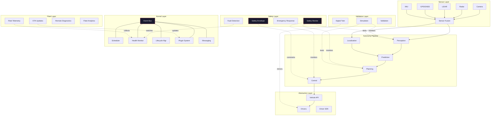

---

## 2. Design Principles

### 2.1 Core Principles

| # | Principle | Description |
|---|-----------|-------------|
| P1 | **Microkernel** | Minimal trusted core; all domain logic in plugins |
| P2 | **Zero-Copy** | Shared-memory message passing on performance-critical paths |
| P3 | **Deterministic** | Priority-based scheduling with deadline guarantees |
| P4 | **Abstraction** | All hardware accessed through uniform driver interfaces |
| P5 | **Safety Independence** | Safety monitor is an independent subsystem with override authority |
| P6 | **Observable** | Every component emits structured metrics, logs, and traces |
| P7 | **Simulation-First** | All components testable in simulation before deployment |
| P8 | **Plugin Architecture** | Versioned interfaces, hot-reload, capability negotiation |
| P9 | **Fail-Safe** | Every failure mode has a defined safe response |
| P10 | **Reproducible** | Deterministic builds, reproducible test environments |

### 2.2 Dependency Rules

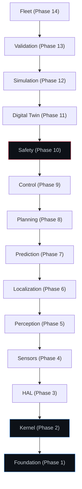

**Rule**: A layer may only depend on layers below it. No upward dependencies. The Safety layer is an exception — it monitors all layers but has no functional dependency on them.

---

## 3. Layer Architecture

### 3.1 Kernel Layer (Phase 2)

The kernel is the minimal trusted computing base. It provides:

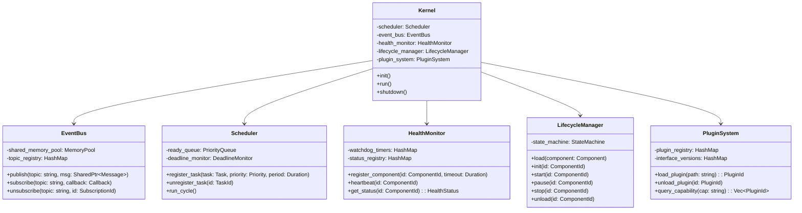

#### Component Lifecycle State Machine

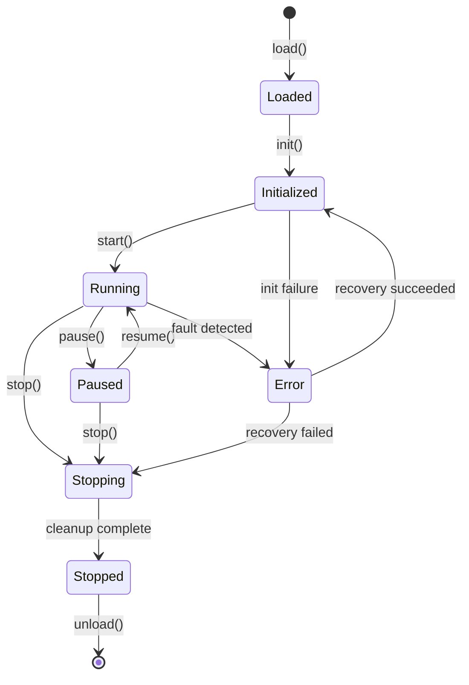

### 3.2 Vehicle Abstraction Layer (Phase 3)

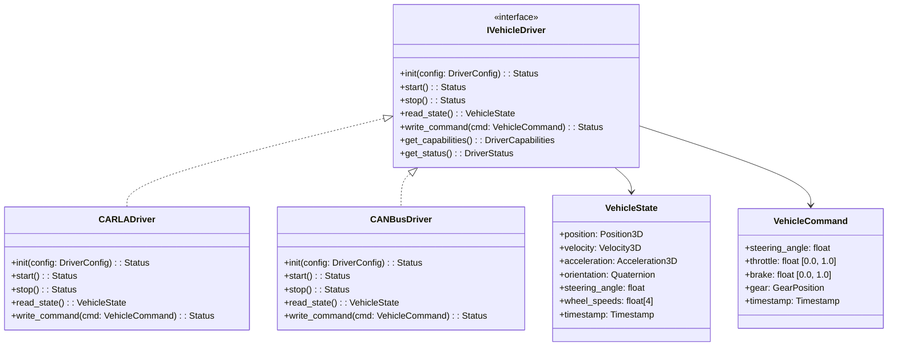

### 3.3 Sensor Layer (Phase 4)

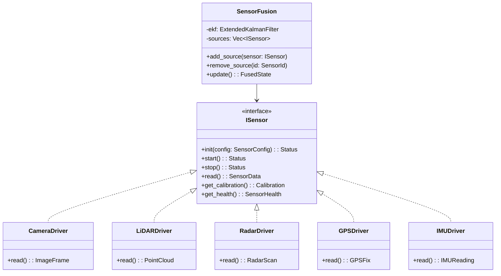

### 3.4 Autonomy Pipeline (Phases 5–9)

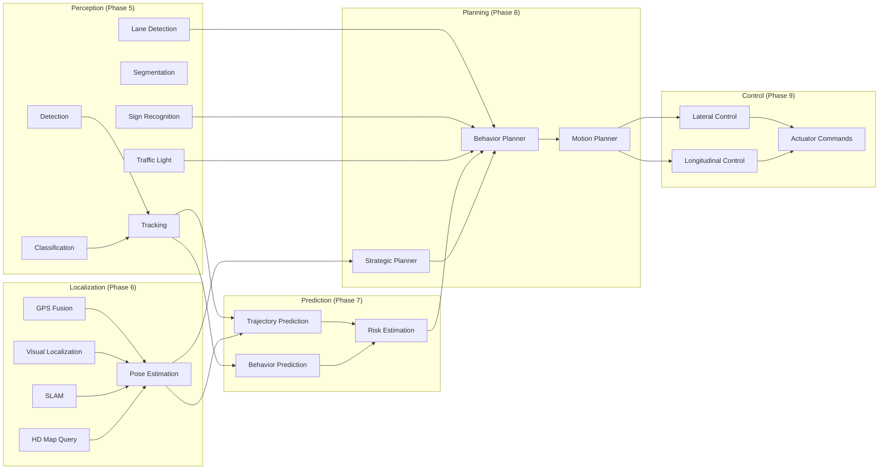

### 3.5 Safety Layer (Phase 10)

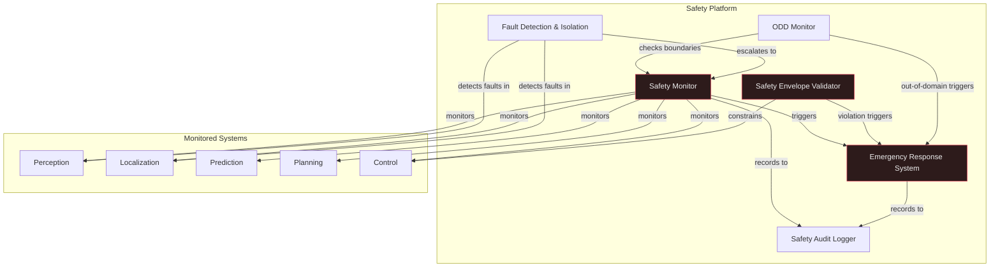

---

## 4. Component Architecture

### 4.1 Event Bus Architecture

The event bus is the backbone of inter-component communication. It uses a **publish-subscribe** model with **zero-copy shared memory** for high-throughput, low-latency data transfer.

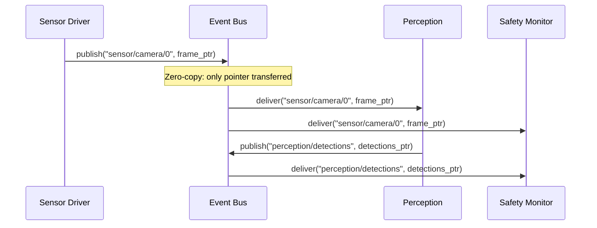

**Key Design Decisions:**
- **Shared Memory Pool**: Pre-allocated at startup, no runtime allocation
- **Lock-Free Queues**: SPSC (single-producer, single-consumer) queues per subscription
- **Topic-Based Routing**: Hierarchical topic names (e.g., `sensor/camera/0/image`)
- **QoS Policies**: Configurable per-topic (reliable, best-effort, last-value)
- **Message Lifecycle**: Reference-counted, automatically returned to pool

### 4.2 Scheduler Architecture

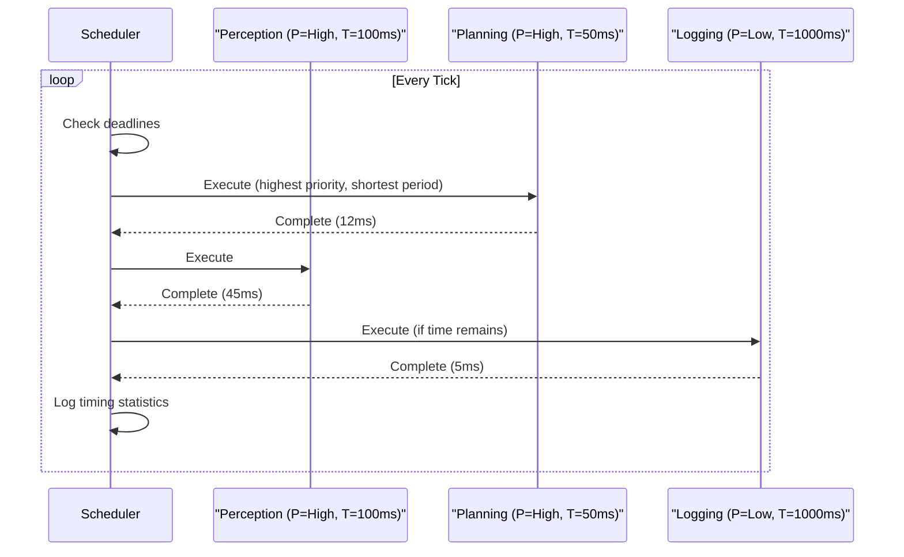

**Scheduling Algorithm**: Rate-Monotonic Scheduling (RMS) with deadline monitoring. Tasks that miss deadlines are reported to the Health Monitor.

### 4.3 Plugin Architecture

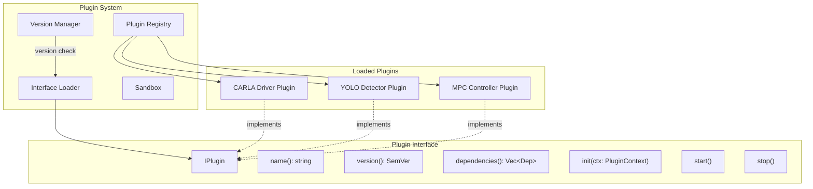

---

## 5. Data Flow Architecture

### 5.1 Main Autonomy Loop

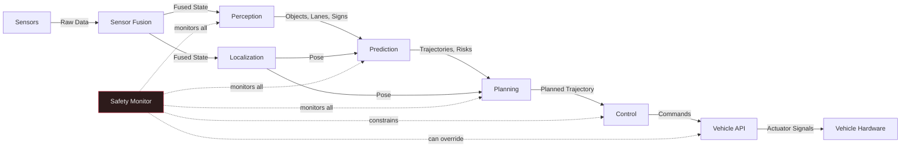

### 5.2 Data Types and Flow Rates

| Data Flow | Type | Size (approx) | Rate | Latency Budget |
|-----------|------|---------------|------|---------------|
| Camera → Perception | ImageFrame (1920×1080 RGB) | 6 MB | 30 Hz | 33ms |
| LiDAR → Perception | PointCloud (300K points) | 3.6 MB | 10 Hz | 100ms |
| Radar → Fusion | RadarScan (64 targets) | 4 KB | 20 Hz | 50ms |
| GPS → Localization | GPSFix | 128 B | 10 Hz | 100ms |
| IMU → Fusion | IMUReading | 64 B | 200 Hz | 5ms |
| Perception → Prediction | DetectedObjects (100 max) | 50 KB | 10 Hz | 10ms |
| Localization → Planning | Pose6D | 128 B | 50 Hz | 2ms |
| Prediction → Planning | PredictedTrajectories | 200 KB | 10 Hz | 10ms |
| Planning → Control | PlannedTrajectory | 10 KB | 10 Hz | 5ms |
| Control → HAL | VehicleCommand | 64 B | 100 Hz | 1ms |

### 5.3 Recording and Replay

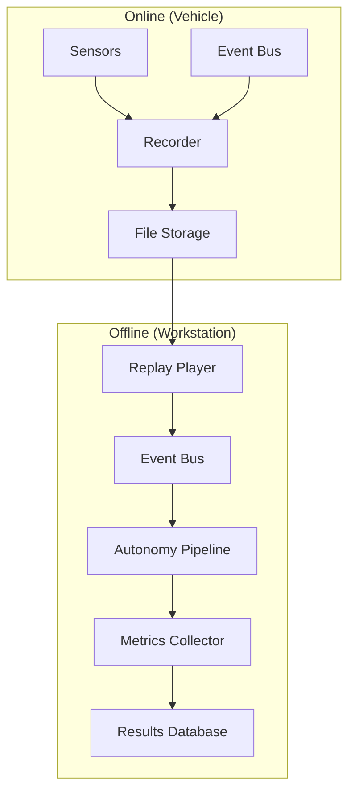

---

## 6. Interface Contracts

### 6.1 Component Interface (Base)

Every UADOS component implements this interface:

```cpp
// uados/core/component.hpp
namespace uados::core {

class IComponent {
public:
    virtual ~IComponent() = default;

    // Lifecycle
    virtual Status init(const Config& config) = 0;
    virtual Status start() = 0;
    virtual Status stop() = 0;

    // Identity
    virtual std::string_view name() const = 0;
    virtual Version version() const = 0;

    // Health
    virtual HealthStatus health() const = 0;

    // Configuration
    virtual void reconfigure(const Config& config) = 0;
};

} // namespace uados::core
```

### 6.2 Event Bus Interface

```cpp
// uados/core/event_bus.hpp
namespace uados::core {

class IEventBus {
public:
    virtual ~IEventBus() = default;

    // Publish a message to a topic (zero-copy)
    virtual void publish(std::string_view topic,
                         SharedPtr<const Message> msg) = 0;

    // Subscribe to a topic
    virtual SubscriptionId subscribe(
        std::string_view topic,
        std::function<void(SharedPtr<const Message>)> callback,
        QoSPolicy qos = QoSPolicy::BestEffort) = 0;

    // Unsubscribe
    virtual void unsubscribe(SubscriptionId id) = 0;

    // Query
    virtual std::vector<std::string> list_topics() const = 0;
    virtual size_t subscriber_count(std::string_view topic) const = 0;
};

} // namespace uados::core
```

### 6.3 Vehicle Driver Interface

```cpp
// uados/hal/driver.hpp
namespace uados::hal {

class IVehicleDriver {
public:
    virtual ~IVehicleDriver() = default;

    virtual Status init(const DriverConfig& config) = 0;
    virtual Status start() = 0;
    virtual Status stop() = 0;

    virtual VehicleState read_state() = 0;
    virtual Status write_command(const VehicleCommand& cmd) = 0;

    virtual DriverCapabilities capabilities() const = 0;
    virtual DriverStatus status() const = 0;
};

} // namespace uados::hal
```

### 6.4 Sensor Interface

```cpp
// uados/sensors/sensor.hpp
namespace uados::sensors {

class ISensor {
public:
    virtual ~IComponent() = default;

    virtual Status init(const SensorConfig& config) = 0;
    virtual Status start() = 0;
    virtual Status stop() = 0;

    virtual SensorData read() = 0;
    virtual Calibration calibration() const = 0;
    virtual SensorHealth health() const = 0;
    virtual SensorInfo info() const = 0;
};

} // namespace uados::sensors
```

### 6.5 Plugin Interface

```cpp
// uados/core/plugin.hpp
namespace uados::core {

class IPlugin {
public:
    virtual ~IPlugin() = default;

    virtual std::string_view name() const = 0;
    virtual Version version() const = 0;
    virtual std::vector<Dependency> dependencies() const = 0;

    virtual Status init(PluginContext& ctx) = 0;
    virtual Status start() = 0;
    virtual Status stop() = 0;
};

// Plugin entry point macro
#define UADOS_PLUGIN(PluginClass) \
    extern "C" IPlugin* create_plugin() { return new PluginClass(); } \
    extern "C" void destroy_plugin(IPlugin* p) { delete p; }

} // namespace uados::core
```

---

## 7. Deployment Architecture

### 7.1 Single Vehicle Deployment

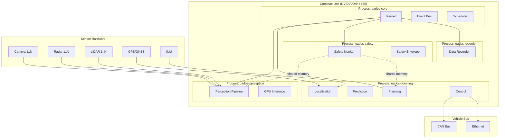

### 7.2 Fleet Deployment

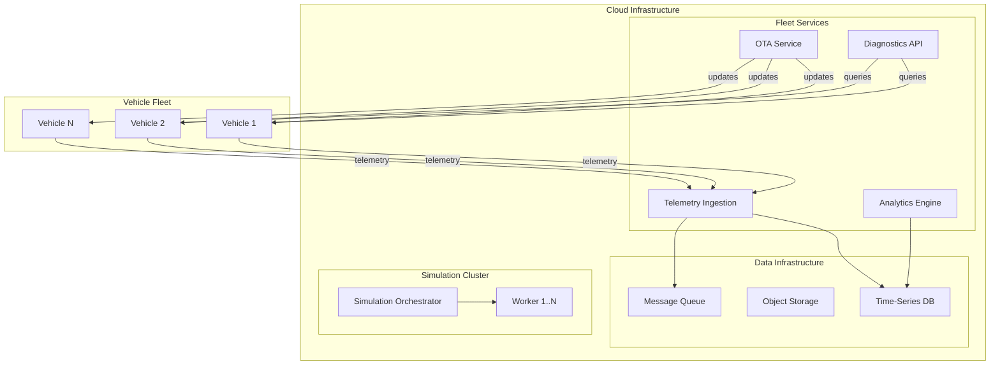

---

## 8. Technology Stack

### 8.1 Core Technologies

| Layer | Technology | Version | Rationale |
|-------|-----------|---------|-----------|
| **Language (runtime)** | C++20 | GCC 13+ / Clang 17+ | Performance, determinism, zero-cost abstractions |
| **Language (tooling)** | Python 3.12 | 3.12+ | ML ecosystem, scripting, test automation |
| **Build** | CMake | 3.28+ | Cross-platform, widely supported |
| **Package Manager** | Conan 2 | 2.x | C++ dependency management |
| **Python Packages** | pip + pyproject.toml | — | Standard Python packaging |
| **Serialization (hot)** | FlatBuffers | 24.x | Zero-copy deserialization |
| **Serialization (cold)** | Protocol Buffers | 3.x | Strong typing, broad ecosystem |
| **ML Inference** | ONNX Runtime | 1.18+ | Hardware-agnostic, broad model support |
| **ML Training** | PyTorch | 2.x | Dominant in research, strong ecosystem |
| **Maps** | Lanelet2 | latest | Open-source, automotive-grade |
| **Simulation** | CARLA | 0.9.15+ | Open-source, realistic rendering |
| **Traffic Sim** | SUMO | 1.x | Microscopic traffic simulation |

### 8.2 Infrastructure Technologies

| Purpose | Technology | Rationale |
|---------|-----------|-----------|
| **Metrics** | Prometheus | Industry standard, pull-based |
| **Tracing** | OpenTelemetry | Vendor-neutral, comprehensive |
| **Dashboards** | Grafana | Flexible, supports Prometheus |
| **Logging** | spdlog (C++) + structlog (Python) | High-performance structured logging |
| **CI/CD** | GitHub Actions | Integrated with repository |
| **Containers** | Docker | Reproducible environments |
| **Docs (C++)** | Doxygen | Standard for C++ API docs |
| **Docs (Python)** | Sphinx | Standard for Python docs |
| **Diagrams** | Mermaid | Version-controlled, text-based |

### 8.3 Key Libraries

| Library | Purpose | License |
|---------|---------|---------|
| Eigen3 | Linear algebra, matrix operations | MPL2 |
| OpenCV | Image processing, basic CV | Apache 2.0 |
| PCL | Point cloud processing | BSD |
| Ceres Solver | Non-linear optimization (SLAM, calibration) | Apache 2.0 |
| Google Test | C++ unit testing | BSD-3 |
| Google Benchmark | C++ micro-benchmarking | Apache 2.0 |
| pybind11 | C++/Python bindings | BSD |
| nlohmann/json | JSON parsing (config) | MIT |
| yaml-cpp | YAML parsing (config) | MIT |
| fmt | String formatting | MIT |
| spdlog | Structured logging | MIT |
| abseil-cpp | Utilities, containers | Apache 2.0 |
| gRPC | Fleet communication | Apache 2.0 |

---

## 9. Cross-Cutting Concerns

### 9.1 Error Handling Strategy

```
Error Classification:
├── Recoverable Errors
│   ├── Sensor timeout → retry with backoff
│   ├── GPS signal loss → switch to dead reckoning
│   └── Plugin crash → restart plugin
├── Degraded Operation
│   ├── Camera failure → radar/LiDAR-only perception
│   ├── HD map unavailable → local SLAM only
│   └── Connectivity loss → autonomous operation continues
└── Critical Errors (→ Safe Stop)
    ├── Multiple sensor failures → minimum risk condition
    ├── Planning failure → execute fallback trajectory
    ├── Control loop timeout → emergency brake
    └── Safety monitor failure → immediate safe stop
```

### 9.2 Configuration Management

```yaml
# Example: Vehicle Configuration
vehicle:
  name: "carla_simulation"
  driver: "uados::hal::CARLADriver"
  capabilities:
    max_steering_angle: 70.0  # degrees
    max_speed: 50.0           # m/s
    max_acceleration: 4.0     # m/s²
    max_deceleration: 8.0     # m/s²

sensors:
  - type: camera
    driver: "uados::sensors::CARLACamera"
    config:
      resolution: [1920, 1080]
      fov: 90
      fps: 30
      mount:
        position: [2.0, 0.0, 1.5]  # x, y, z in vehicle frame
        rotation: [0.0, 0.0, 0.0]  # roll, pitch, yaw

  - type: lidar
    driver: "uados::sensors::CARLALiDAR"
    config:
      channels: 64
      range: 100.0
      points_per_second: 300000
      rotation_frequency: 10

scheduler:
  perception:
    priority: 8
    period_ms: 100
  planning:
    priority: 9
    period_ms: 50
  control:
    priority: 10
    period_ms: 10
  safety:
    priority: 11  # highest
    period_ms: 10
```

### 9.3 Logging Standard

All log entries follow this structure:

```json
{
  "timestamp": "2026-05-30T15:30:00.123456Z",
  "level": "INFO",
  "component": "perception.detection",
  "thread_id": 12345,
  "message": "Detection cycle complete",
  "data": {
    "objects_detected": 12,
    "inference_time_ms": 23.4,
    "frame_id": 98765
  },
  "trace_id": "abc123def456"
}
```

### 9.4 Metrics Standard

All metrics use OpenTelemetry naming conventions:

```
uados.perception.detection.inference_time_ms      (histogram)
uados.perception.detection.objects_count           (gauge)
uados.planning.cycle_time_ms                       (histogram)
uados.control.tracking_error.lateral_m             (gauge)
uados.control.tracking_error.longitudinal_ms       (gauge)
uados.safety.envelope_violations_total             (counter)
uados.event_bus.messages_total                     (counter)
uados.event_bus.latency_us                         (histogram)
uados.scheduler.deadline_misses_total              (counter)
uados.health.component_status                      (gauge, labeled)
```

### 9.5 Memory Management Strategy

```
Hot Path (Real-time):
├── Pre-allocated memory pools
├── Fixed-size ring buffers for sensor data
├── Lock-free SPSC queues
└── No malloc/free during runtime

Cold Path (Non-real-time):
├── Standard allocators acceptable
├── Smart pointers for ownership
└── RAII for all resources

Shared Memory:
├── Named shared memory regions per topic
├── Reference-counted message buffers
├── Memory-mapped files for large data (point clouds, images)
└── Automatic cleanup on process exit
```

---

*End of Master Architecture Document*
