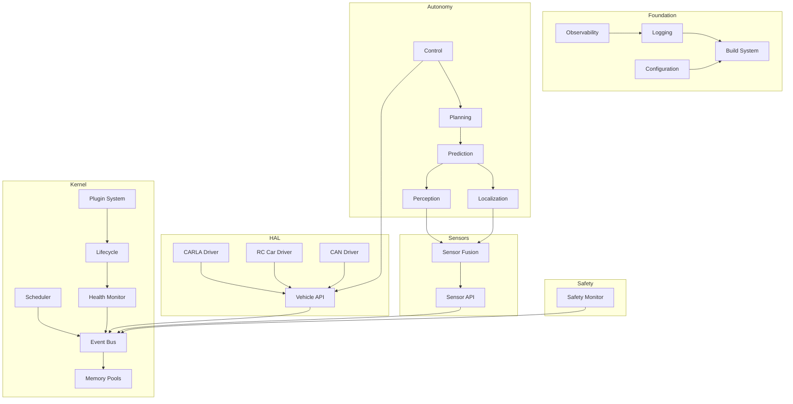

# UADOS — Master Dependencies

> **Version**: 0.1.0  
> **Status**: Draft  
> **Last Updated**: 2026-05-30  
> **Owner**: UADOS Architecture Team

---

## 1. External C++ Dependencies

| Library | Version | License | Purpose | Phase | Security Status |
|---------|---------|---------|---------|-------|----------------|
| Eigen3 | 3.4.x | MPL2 | Linear algebra, matrix operations | 2+ | ✅ Clean |
| fmt | 11.x | MIT | String formatting | 1+ | ✅ Clean |
| spdlog | 1.14.x | MIT | Structured logging | 1+ | ✅ Clean |
| nlohmann/json | 3.11.x | MIT | JSON parsing | 1+ | ✅ Clean |
| yaml-cpp | 0.8.x | MIT | YAML configuration parsing | 1+ | ✅ Clean |
| Google Test | 1.15.x | BSD-3 | Unit testing framework | 1+ | ✅ Clean |
| Google Benchmark | 1.9.x | Apache 2.0 | Performance benchmarking | 1+ | ✅ Clean |
| FlatBuffers | 24.x | Apache 2.0 | Zero-copy serialization (hot path) | 2+ | ✅ Clean |
| Protobuf | 3.27.x | BSD-3 | Serialization (config, fleet API) | 2+ | ✅ Clean |
| abseil-cpp | 20240722 | Apache 2.0 | Utilities, hash maps, strings | 2+ | ✅ Clean |
| OpenCV | 4.10.x | Apache 2.0 | Image processing, basic CV | 4+ | ✅ Clean |
| PCL | 1.14.x | BSD | Point cloud processing | 4+ | ✅ Clean |
| ONNX Runtime | 1.19.x | MIT | ML model inference | 5+ | ✅ Clean |
| Ceres Solver | 2.2.x | Apache 2.0 | Nonlinear optimization | 4+ | ✅ Clean |
| pybind11 | 2.13.x | BSD | C++/Python bindings | 3+ | ✅ Clean |
| gRPC | 1.66.x | Apache 2.0 | Fleet RPC communication | 14 | ✅ Clean |
| Boost | 1.86.x | BSL-1.0 | Geometry, graph, serialization | 3+ | ✅ Clean |
| Lanelet2 | latest | BSD-3 | HD map format and routing | 6+ | ✅ Clean |
| CARLA Client | 0.9.15 | MIT | Simulation vehicle/sensor bridge | 3+ | ✅ Clean |

## 2. External Python Dependencies

| Package | Version | License | Purpose | Phase |
|---------|---------|---------|---------|-------|
| numpy | 2.1.x | BSD-3 | Numerical computing | 1+ |
| scipy | 1.14.x | BSD-3 | Scientific computing | 4+ |
| matplotlib | 3.9.x | PSF | Plotting, visualization | 1+ |
| pytorch | 2.4.x | BSD-3 | ML model training | 5+ |
| onnx | 1.17.x | Apache 2.0 | Model export format | 5+ |
| onnxruntime | 1.19.x | MIT | Python inference binding | 5+ |
| opencv-python | 4.10.x | Apache 2.0 | Python CV bindings | 4+ |
| open3d | 0.18.x | MIT | Point cloud visualization | 4+ |
| carla | 0.9.15 | MIT | CARLA Python client | 3+ |
| pytest | 8.3.x | MIT | Python testing | 1+ |
| pytest-cov | 5.x | MIT | Coverage reporting | 1+ |
| ruff | 0.7.x | MIT | Python linting | 1+ |
| black | 24.x | MIT | Python formatting | 1+ |
| sphinx | 8.x | BSD-2 | Python documentation | 1+ |
| structlog | 24.x | Apache 2.0 | Structured logging (Python) | 1+ |
| prometheus-client | 0.21.x | Apache 2.0 | Metrics export | 1+ |
| flask / fastapi | latest | BSD/MIT | Dashboard backend | 12+ |
| plotly | 5.24.x | MIT | Interactive visualizations | 12+ |
| dash | 2.18.x | MIT | Dashboard framework | 12+ |
| pyyaml | 6.x | MIT | YAML parsing | 1+ |
| click | 8.x | BSD-3 | CLI framework | 1+ |
| rich | 13.x | MIT | Terminal formatting | 1+ |
| grpcio | 1.66.x | Apache 2.0 | gRPC Python client | 14 |

## 3. System Dependencies

| Dependency | Version | Purpose | Phase |
|-----------|---------|---------|-------|
| GCC | 13+ | C++20 compiler | 1+ |
| Clang | 17+ | Alternative compiler + tooling | 1+ |
| CMake | 3.28+ | Build system | 1+ |
| Conan | 2.x | C++ package manager | 1+ |
| Python | 3.12+ | Scripting, ML, tooling | 1+ |
| Docker | 24+ | Containerized builds | 1+ |
| NVIDIA CUDA | 12.x | GPU compute for ML inference | 5+ |
| NVIDIA cuDNN | 9.x | DNN acceleration | 5+ |
| Linux (Ubuntu) | 22.04/24.04 LTS | Operating system | 1+ |
| Grafana | 11.x | Dashboard visualization | 1+ |
| Prometheus | 2.x | Metrics collection | 1+ |
| Git | 2.40+ | Version control | 1+ |

## 4. Hardware Dependencies

| Hardware | Purpose | Phase | Required For |
|----------|---------|-------|-------------|
| NVIDIA GPU (RTX 3060+) | ML inference, CARLA rendering | 3+ | Simulation |
| Arduino / Teensy | RC car motor/servo control | 3 (RC) | RC car driver |
| RC Car chassis (1/10 scale) | Physical test platform | 3 (RC) | RC car testing |
| PWM servo controller | Steering actuator for RC car | 3 (RC) | RC car driver |
| ESC (Electronic Speed Controller) | Throttle/brake for RC car | 3 (RC) | RC car driver |
| Raspberry Pi / Jetson Nano | RC car compute platform | 3 (RC) | RC car deployment |
| Intel RealSense D435i | Depth camera for RC car | 4 (RC) | RC car perception |
| RPLiDAR A1/A3 | 2D LiDAR for RC car | 4 (RC) | RC car perception |
| GPS module (u-blox) | Positioning for RC car | 4 (RC) | RC car localization |
| IMU (MPU-9250 / BNO055) | Inertial measurement for RC car | 4 (RC) | RC car localization |
| OBD-II adapter | Production vehicle interface | 3 (prod) | Vehicle data |
| CAN interface (PCAN, Kvaser) | Production vehicle CAN bus | 3 (prod) | Vehicle control |

## 5. Internal Dependency Graph

## 6. License Compatibility Matrix

| License | Compatible with Apache 2.0? | Notes |
|---------|---------------------------|-------|
| MIT | ✅ Yes | Permissive |
| BSD-2/3 | ✅ Yes | Permissive |
| Apache 2.0 | ✅ Yes | Same license |
| MPL 2.0 | ✅ Yes | File-level copyleft only |
| BSL 1.0 | ✅ Yes | Permissive (Boost) |
| LGPL 2.1/3.0 | ⚠️ Conditional | Dynamic linking OK |
| GPL 2.0/3.0 | ❌ No | Viral copyleft |
| PSF | ✅ Yes | Python-specific permissive |

> All selected dependencies are Apache 2.0 compatible. No GPL dependencies.

---

*End of Master Dependencies*
