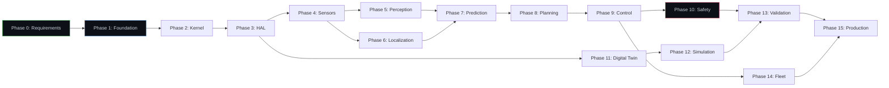

# UADOS — Master Knowledge Graph

> **Version**: 0.1.0  
> **Status**: Draft  
> **Last Updated**: 2026-05-30  
> **Owner**: UADOS Architecture Team

---

## 1. System Taxonomy

```mermaid
graph TD
    UADOS[UADOS] --> CORE[Core Kernel]
    UADOS --> HAL[Vehicle Abstraction]
    UADOS --> SENS[Sensor Platform]
    UADOS --> AUTO[Autonomy Pipeline]
    UADOS --> SAFE[Safety Platform]
    UADOS --> TWIN[Digital Twin]
    UADOS --> SIM[Simulation]
    UADOS --> VALID[Validation]
    UADOS --> FLEET[Fleet Platform]

    CORE --> EB[Event Bus]
    CORE --> SCH[Scheduler]
    CORE --> HM[Health Monitor]
    CORE --> LC[Lifecycle Manager]
    CORE --> PS[Plugin System]
    CORE --> MSG[Messaging]
    CORE --> CFG[Configuration]
    CORE --> LOG[Logging]
    CORE --> MEM[Memory Pools]
    CORE --> TIME[Time Sync]

    HAL --> VAPI[Vehicle API]
    HAL --> DSDK[Driver SDK]
    HAL --> CARLA_DRV[CARLA Driver]
    HAL --> RC_DRV[RC Car Driver]
    HAL --> PROD_DRV[Production Vehicle Driver]
    HAL --> CAN_DRV[CAN Bus Driver]
    HAL --> DVAL[Driver Validation]

    SENS --> CAM[Camera Framework]
    SENS --> RAD[Radar Framework]
    SENS --> LID[LiDAR Framework]
    SENS --> GPS_S[GPS Framework]
    SENS --> IMU_S[IMU Framework]
    SENS --> FUSE[Sensor Fusion]
    SENS --> CALIB[Calibration]
    SENS --> SREC[Sensor Recording]

    AUTO --> PER[Perception]
    AUTO --> LOC[Localization]
    AUTO --> PRD[Prediction]
    AUTO --> PLN[Planning]
    AUTO --> CTL[Control]

    PER --> DET[Detection]
    PER --> CLS[Classification]
    PER --> TRK[Tracking]
    PER --> SEG[Segmentation]
    PER --> LAN[Lane Detection]
    PER --> SGN[Sign Recognition]
    PER --> TFL[Traffic Light Recognition]
    PER --> OCC[Occupancy Grid]

    LOC --> GF[GPS Fusion]
    LOC --> VL[Visual Localization]
    LOC --> SLAM_C[SLAM]
    LOC --> HDM[HD Map Engine]
    LOC --> POSE[Pose Estimation]

    PRD --> TP[Trajectory Prediction]
    PRD --> BP[Behavior Prediction]
    PRD --> RE[Risk Estimation]

    PLN --> SP[Strategic Planner]
    PLN --> BPL[Behavior Planner]
    PLN --> MP[Motion Planner]
    PLN --> FB[Fallback Planner]

    CTL --> STEER[Steering Controller]
    CTL --> BRAKE[Brake Controller]
    CTL --> THROT[Throttle Controller]
    CTL --> TRANS[Transmission Controller]
    CTL --> PID_C[PID Controller]
    CTL --> MPC_C[MPC Controller]

    SAFE --> SM[Safety Monitor]
    SAFE --> FDI[Fault Detection]
    SAFE --> RV[Runtime Validation]
    SAFE --> ERS[Emergency Response]
    SAFE --> SEV[Safety Envelope]
    SAFE --> ODD[ODD Monitor]

    TWIN --> VT[Vehicle Twin]
    TWIN --> ST[Sensor Twin]
    TWIN --> RT[Road Twin]
    TWIN --> TT[Traffic Twin]
    TWIN --> WT[Weather Twin]

    SIM --> SCG[Scenario Generator]
    SIM --> SOR[Sim Orchestrator]
    SIM --> REP[Replay System]
    SIM --> MET[Metrics Collector]
    SIM --> CARLA_B[CARLA Bridge]
    SIM --> SUMO_B[SUMO Bridge]

    VALID --> ATV[Automated Validation]
    VALID --> REG[Regression Framework]
    VALID --> PERF[Performance Framework]
    VALID --> CHS[Chaos Testing]
    VALID --> FIN[Fault Injection]

    FLEET --> TEL[Fleet Telemetry]
    FLEET --> OTA[OTA Updates]
    FLEET --> DIAG[Remote Diagnostics]
    FLEET --> ANAL[Fleet Analytics]
```

---

## 2. Requirement → Component Traceability

| Requirement ID | Component Path | Test Suite |
|---------------|---------------|------------|
| FR-FND-001 | `CMakeLists.txt`, `scripts/build/` | Build verification |
| FR-FND-002 | `conanfile.py` | Dependency resolution test |
| FR-FND-003 | Root project scaffold | Build test |
| FR-FND-004 | `.github/workflows/` | CI pipeline self-test |
| FR-FND-005 | `docs/` | Doc generation test |
| FR-KRN-001 | `core/kernel/` | Unit, integration |
| FR-KRN-002 | `core/event_bus/` | Unit, performance benchmark |
| FR-KRN-003 | `core/scheduler/` | Unit, determinism test |
| FR-KRN-004 | `core/lifecycle/` | Unit, state machine test |
| FR-KRN-005 | `core/health/` | Unit, timeout test |
| FR-KRN-006 | `core/plugin/` | Unit, load/unload test |
| FR-KRN-007 | `core/kernel/` (logging subsystem) | Unit |
| FR-KRN-008 | `core/kernel/` (config subsystem) | Unit |
| FR-KRN-009 | `core/messaging/` | Unit, IPC benchmark |
| FR-KRN-010 | `core/kernel/` (time sync) | Unit |
| FR-KRN-011 | `core/kernel/` (memory pools) | Unit, allocation benchmark |
| FR-KRN-012 | `core/kernel/` (signal handling) | Integration |
| FR-VAL-001 | `hal/api/` | Interface compliance |
| FR-VAL-002 | `hal/sdk/` | SDK build, binding test |
| FR-VAL-003 | `hal/api/` | Interface test |
| FR-VAL-004 | `hal/drivers/simulation/` | Integration with CARLA |
| FR-VAL-005 | `hal/drivers/canbus/` | CAN integration |
| FR-VAL-006 | `hal/validation/` | Compliance suite |
| FR-VAL-007 | `hal/api/` | State model test |
| FR-VAL-008 | `hal/api/` | Command interface test |
| FR-SEN-001 | `sensors/api/` | Interface compliance |
| FR-SEN-002 | `sensors/camera/` | Camera driver test |
| FR-SEN-003 | `sensors/radar/` | Radar driver test |
| FR-SEN-004 | `sensors/lidar/` | LiDAR driver test |
| FR-SEN-005 | `sensors/gps/` | GPS driver test |
| FR-SEN-006 | `sensors/imu/` | IMU driver test |
| FR-SEN-007 | `sensors/` (calibration) | Calibration load test |
| FR-SEN-008 | `sensors/` (sync) | Synchronization test |
| FR-SEN-009 | `sensors/fusion/` | EKF convergence test |
| FR-SEN-010 | `sensors/` (health) | Degradation detection test |
| FR-PER-001 | `perception/detection/` | mAP benchmark |
| FR-PER-002 | `perception/detection/` | 3D detection benchmark |
| FR-PER-003 | `perception/classification/` | Accuracy benchmark |
| FR-PER-004 | `perception/tracking/` | MOTA/MOTP benchmark |
| FR-PER-005 | `perception/segmentation/` | mIoU benchmark |
| FR-PER-006 | `perception/lanes/` | Lane accuracy benchmark |
| FR-PER-007 | `perception/signs/` | Classification accuracy |
| FR-PER-008 | `perception/traffic_lights/` | State recognition accuracy |
| FR-LOC-001 | `localization/gps_fusion/` | RMSE benchmark |
| FR-LOC-002 | `localization/visual/` | Localization accuracy |
| FR-LOC-003 | `localization/slam/` | Map quality + real-time |
| FR-LOC-004 | `localization/hdmap/` | Map query performance |
| FR-LOC-005 | `localization/pose/` | 6-DOF accuracy |
| FR-PRD-001 | `prediction/trajectory/` | ADE/FDE benchmark |
| FR-PRD-002 | `prediction/behavior/` | Classification accuracy |
| FR-PRD-003 | `prediction/risk/` | Ranking accuracy |
| FR-PLN-001 | `planning/strategic/` | Route quality test |
| FR-PLN-002 | `planning/behavior/` | Scenario coverage |
| FR-PLN-003 | `planning/motion/` | Feasibility test |
| FR-PLN-008 | `planning/motion/` | Fallback availability |
| FR-CTL-001 | `control/steering/` | Tracking RMSE |
| FR-CTL-002 | `control/brake/`, `control/throttle/` | Speed tracking RMSE |
| FR-CTL-003 | `control/loops/` (MPC) | MPC performance test |
| FR-CTL-004 | `control/` | Loop frequency test |
| FR-CTL-008 | `control/brake/` | Emergency brake test |
| FR-SFT-001 | `safety/monitors/` | Independence test |
| FR-SFT-002 | `safety/runtime_validation/` | Invariant check test |
| FR-SFT-003 | `safety/fault_detection/` | FDI coverage test |
| FR-SFT-004 | `safety/emergency/` | Response time test |

---

## 3. Component → Interface Mapping

| Component | Implements Interface | Depends On |
|-----------|---------------------|------------|
| `core/kernel` | `IKernel` | — |
| `core/event_bus` | `IEventBus` | Memory pools |
| `core/scheduler` | `IScheduler` | Time sync |
| `core/health` | `IHealthMonitor` | Event bus |
| `core/lifecycle` | `ILifecycleManager` | Health monitor |
| `core/plugin` | `IPluginSystem` | Lifecycle manager |
| `hal/drivers/simulation` | `IVehicleDriver` | CARLA client library |
| `hal/drivers/rc_car` | `IVehicleDriver` | Serial/PWM interface |
| `hal/drivers/canbus` | `IVehicleDriver` | SocketCAN |
| `sensors/camera` | `ISensor` | Camera hardware |
| `sensors/radar` | `ISensor` | Radar hardware |
| `sensors/lidar` | `ISensor` | LiDAR hardware |
| `sensors/gps` | `ISensor` | GPS receiver |
| `sensors/imu` | `ISensor` | IMU hardware |
| `sensors/fusion` | `ISensorFusion` | All sensors |
| `perception/detection` | `IDetector` | Sensor fusion, ONNX Runtime |
| `perception/tracking` | `ITracker` | Detection |
| `localization/pose` | `IPoseEstimator` | GPS fusion, visual loc, SLAM |
| `prediction/trajectory` | `IPredictor` | Tracking, pose |
| `planning/motion` | `IMotionPlanner` | Prediction, localization |
| `control/steering` | `IController` | Motion planner |
| `control/brake` | `IController` | Motion planner |
| `safety/monitors` | `ISafetyMonitor` | Event bus (read-only) |

---

## 4. Technology → Component Mapping

| Technology | Used By |
|-----------|---------|
| C++20 | All runtime components |
| Python 3.12 | Tools, ML training, simulation scripts, tests |
| CMake 3.28+ | Build system |
| Conan 2 | C++ dependency management |
| FlatBuffers | Event bus messages (hot path) |
| Protobuf | Fleet API, config schemas |
| ONNX Runtime | Perception inference |
| PyTorch | ML model training |
| Eigen3 | All math-heavy components |
| OpenCV | Perception, sensor drivers |
| PCL | LiDAR processing |
| Lanelet2 | HD map engine |
| CARLA | Simulation driver, digital twin |
| SUMO | Traffic simulation |
| spdlog | Structured logging |
| OpenTelemetry | Metrics, tracing |
| Prometheus | Metrics storage |
| Grafana | Dashboards |
| Google Test | C++ unit testing |
| pytest | Python testing |

---

## 5. Phase → Dependency Graph

---

## 6. Concept Glossary

| Concept | Definition | Related Components |
|---------|-----------|-------------------|
| **ODD** | Operational Design Domain — the conditions under which the AV is designed to operate | Safety, Planning |
| **MRC** | Minimum Risk Condition — safest achievable state when system cannot continue | Safety, Control |
| **HARA** | Hazard Analysis and Risk Assessment — systematic identification of hazards | Safety |
| **ASIL** | Automotive Safety Integrity Level — risk classification per ISO 26262 | Safety |
| **EKF** | Extended Kalman Filter — nonlinear state estimation | Sensor Fusion, Localization |
| **SLAM** | Simultaneous Localization and Mapping | Localization |
| **MPC** | Model Predictive Control — optimization-based control | Control |
| **PID** | Proportional-Integral-Derivative controller | Control |
| **ADE** | Average Displacement Error — prediction accuracy metric | Prediction |
| **FDE** | Final Displacement Error — endpoint prediction accuracy | Prediction |
| **mAP** | Mean Average Precision — detection accuracy metric | Perception |
| **MOTA** | Multiple Object Tracking Accuracy | Perception/Tracking |
| **mIoU** | Mean Intersection over Union — segmentation accuracy | Perception/Segmentation |
| **FlatBuffers** | Zero-copy serialization library by Google | Event Bus |
| **Zero-Copy** | Data sharing without memory copying | Event Bus, Shared Memory |
| **SPSC** | Single Producer Single Consumer — lock-free queue pattern | Event Bus |
| **RMS** | Rate-Monotonic Scheduling — priority scheduling algorithm | Scheduler |
| **DDS** | Data Distribution Service — pub/sub middleware standard | Messaging (optional) |
| **OTA** | Over-The-Air — remote software update mechanism | Fleet |
| **CAN** | Controller Area Network — vehicle bus standard | HAL |

---

*End of Master Knowledge Graph*
