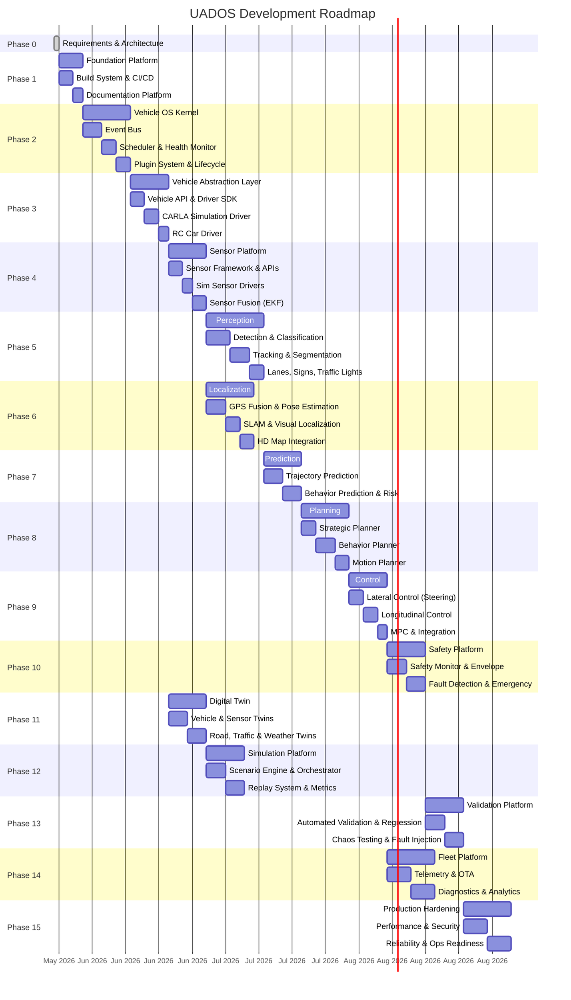

# UADOS — Master Roadmap

> **Version**: 0.1.0  
> **Status**: Draft  
> **Last Updated**: 2026-05-30  
> **Owner**: UADOS Architecture Team

---

## Execution Strategy

**Principle**: Simulation works before everything. RC car validates before production vehicle.

```
Simulation (CARLA) → RC Car (1/10 scale) → Production Vehicle
```

Each phase is validated in simulation first, then on the RC car platform, then on the production vehicle.

---

## Phase Timeline



---

## Phase Details

### Phase 0 — Requirements & Architecture ✅
**Duration**: 1 day  
**Status**: IN PROGRESS  
**Deliverables**: AI_BRAIN documents, architecture diagrams, risk registry

---

### Phase 1 — Foundation Platform
**Duration**: 5 days  
**Dependencies**: Phase 0  
**Critical Path**: Yes

| Deliverable | Priority | Effort |
|-------------|----------|--------|
| CMake build system with cross-compilation | Critical | 1d |
| Conan 2 dependency manifest | Critical | 0.5d |
| C++20 project scaffold | Critical | 0.5d |
| GitHub Actions CI pipeline | High | 1d |
| Doxygen + Sphinx documentation | High | 0.5d |
| clang-format / clang-tidy config | High | 0.25d |
| Python tooling (ruff, black, pytest) | High | 0.25d |
| OpenTelemetry skeleton | High | 0.5d |
| Dev environment setup script | Medium | 0.5d |

---

### Phase 2 — Vehicle OS Kernel
**Duration**: 10 days  
**Dependencies**: Phase 1  
**Critical Path**: Yes

| Deliverable | Priority | Effort |
|-------------|----------|--------|
| Event Bus (zero-copy, shared memory) | Critical | 4d |
| Deterministic Scheduler (RMS) | Critical | 2d |
| Health Monitor (watchdog) | Critical | 1d |
| Lifecycle Manager (state machine) | Critical | 1d |
| Plugin System (dlopen, versioned) | High | 1.5d |
| Memory Pool Allocator | High | 0.5d |

---

### Phase 3 — Vehicle Abstraction Layer
**Duration**: 8 days  
**Dependencies**: Phase 2  
**Critical Path**: Yes

| Deliverable | Priority | Effort |
|-------------|----------|--------|
| Vehicle API (IVehicleDriver) | Critical | 2d |
| Driver SDK (C++ & Python) | Critical | 1d |
| CARLA Simulation Driver | Critical | 2d |
| RC Car Driver (Arduino/PWM) | High | 2d |
| Driver Validation Framework | High | 1d |

---

### Phase 4 — Sensor Platform
**Duration**: 8 days  
**Dependencies**: Phase 3

| Deliverable | Priority | Effort |
|-------------|----------|--------|
| Sensor API (ISensor) | Critical | 1d |
| CARLA Camera/LiDAR/Radar/GPS/IMU | Critical | 2d |
| RC Car sensors (RealSense, RPLiDAR, GPS, IMU) | High | 2d |
| Sensor Fusion (EKF/UKF) | Critical | 2d |
| Calibration system | High | 1d |

---

### Phases 5–15
See detailed breakdowns in each phase section above. Key ordering:

1. **Phases 5 & 6 run in parallel** (Perception + Localization)
2. **Phase 7** depends on both Phase 5 and Phase 6
3. **Phase 11** (Digital Twin) can start after Phase 3 (runs in parallel with Phases 4-9)
4. **Phase 12** (Simulation) depends on Phase 11
5. **Phase 14** (Fleet) can start after Phase 9

---

## Vehicle Platform Validation Order

### For Each Phase:

```
1. Simulation (CARLA)
   └── All features developed and validated in simulation first
   └── Automated CI tests run against CARLA

2. RC Car (1/10 Scale)
   └── Port to RC car hardware
   └── Validate in controlled environment
   └── Fix simulation-to-real gaps

3. Production Vehicle
   └── Port to production CAN bus
   └── Validate on closed course
   └── Graduated testing program
```

### RC Car Platform Specification

| Component | Specification |
|-----------|--------------|
| Chassis | 1/10 scale RC car (Traxxas Slash or similar) |
| Compute | NVIDIA Jetson Orin Nano / Raspberry Pi 5 |
| Camera | Intel RealSense D435i (RGB + Depth) |
| LiDAR | RPLiDAR A1 (2D, 360°) or RPLiDAR A3 (outdoor) |
| GPS | u-blox NEO-M8N or ZED-F9P (RTK) |
| IMU | BNO055 or MPU-9250 |
| Steering | PWM servo via Arduino/Teensy |
| Throttle/Brake | ESC via Arduino/Teensy |
| Communication | WiFi (telemetry), USB (sensors) |

### Production Vehicle Platform Specification

| Component | Specification |
|-----------|--------------|
| Interface | CAN bus via PCAN-USB or Kvaser |
| Compute | NVIDIA Jetson AGX Orin / x86 workstation |
| Cameras | Industrial cameras (GigE Vision or MIPI CSI) |
| LiDAR | Velodyne VLP-16 or Ouster OS1-32 |
| Radar | Continental ARS408 or similar |
| GPS/GNSS | u-blox ZED-F9P (RTK-capable) |
| IMU | Xsens MTi-30 or similar |

---

## Critical Path Analysis

```
Phase 0 → Phase 1 → Phase 2 → Phase 3 → Phase 4 → Phase 5 → Phase 7 → Phase 8 → Phase 9
```

Total critical path: ~70 development days

**Parallel tracks**:
- Phase 6 (Localization) runs in parallel with Phase 5 (Perception)
- Phase 11 (Digital Twin) starts after Phase 3
- Phase 14 (Fleet) starts after Phase 9

---

## Milestones

| Milestone | Phase | Definition of Done |
|-----------|-------|-------------------|
| M1: Build Green | 1 | CI pipeline passes, docs generate |
| M2: Kernel Operational | 2 | Event bus, scheduler, plugins working |
| M3: Sim Vehicle Driving | 3 | CARLA vehicle controllable via UADOS |
| M4: Sensor Data Flowing | 4 | All sim sensors publishing data |
| M5: Objects Detected | 5 | CARLA objects detected and tracked |
| M6: Vehicle Localized | 6 | Position accuracy ≤ 10cm in sim |
| M7: Futures Predicted | 7 | Multi-modal trajectory prediction working |
| M8: Plans Generated | 8 | Vehicle navigates route in sim |
| M9: Autonomous in Sim | 9 | End-to-end autonomous driving in CARLA |
| M10: Safety Validated | 10 | Safety monitor catches all injected faults |
| M11: RC Car Autonomous | 3-9 (RC) | RC car drives autonomously in controlled env |
| M12: Full Simulation Suite | 12 | 100+ scenarios pass automatically |
| M13: Validation Complete | 13 | All quality gates satisfied |
| M14: Fleet Connected | 14 | Multi-vehicle telemetry operational |
| M15: Production Ready | 15 | 24h stress test passes, security audit clear |

---

*End of Master Roadmap*
