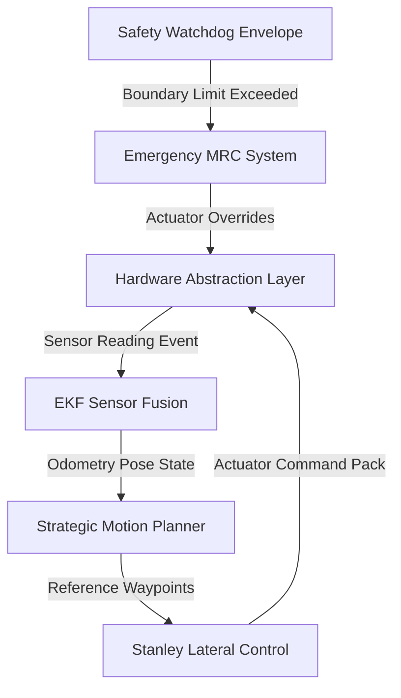
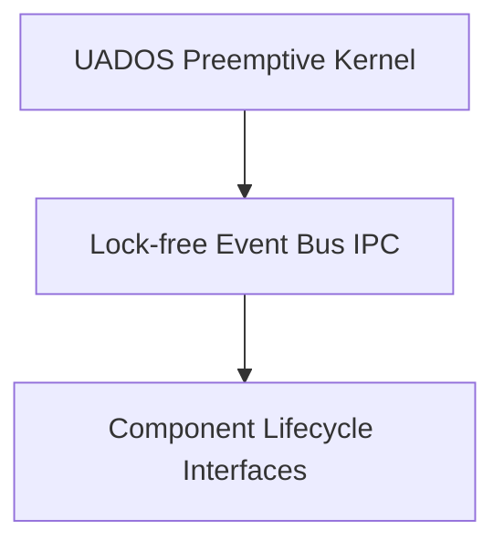

# AIPBF v2.0 — Project Architecture Blueprint

> **Verification**: VERIFIED  
> **Confidence**: HIGH  

---

## 1. High-Level Component Relationship

```mermaid
graph TD
    HAL[Hardware Abstraction Layer] -->|Sensor Reading Event| Fusion[EKF Sensor Fusion]
    Fusion -->|Odometry Pose State| Planner[Strategic Motion Planner]
    Planner -->|Reference Waypoints| Control[Stanley Lateral Control]
    Control -->|Actuator Command Pack| HAL
    
    Safety[Safety Watchdog Envelope] -->|Boundary Limit Exceeded| ERS[Emergency MRC System]
    ERS -->|Actuator Overrides| HAL
```

---

## 2. Core Service Dependency Graph

```mermaid
graph TD
    Kernel[UADOS Preemptive Kernel] --> EventBus[Lock-free Event Bus IPC]
    EventBus --> ComponentBase[Component Lifecycle Interfaces]
```
