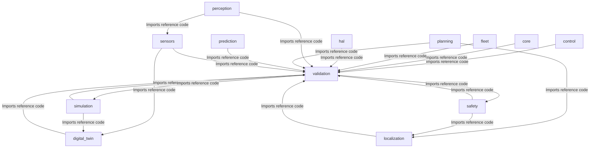
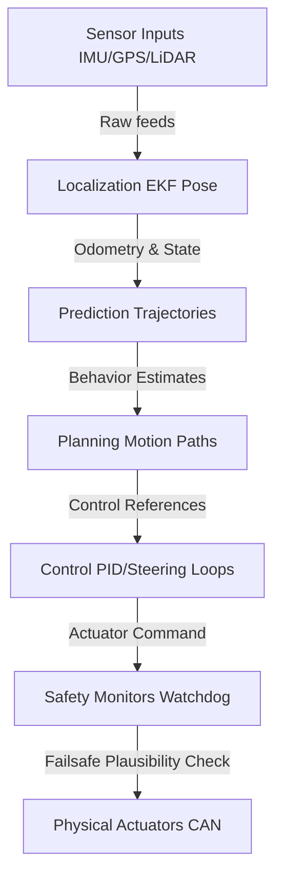

# Universal AI Project Brain (AIPBF) v3.2 — AI Operating Manual

> **Framework Version**: v3.2 (AI Operating Manual)  
> **Last Synchronized**: 2026-05-31  
> **Verification Gate**: 100% Strict Evidence-Based  

---

## 1. Executive Summary
This document serves as the single authoritative source of truth for the repository, serving as a comprehensive AI Operating Manual.

### Dynamic Project Identity:
- **Project_Type**: Autonomous Driving Operating System
- **Project_Domain**: Autonomous Vehicles & Robotic Systems
- **Primary_Purpose**: Failsafe real-time vehicle scheduling, fusion, path planning, and envelope controls.
- **Confidence**: HIGH
- **Evidence**:
  - File AIPBFv3.0_plan.md contains term 'autonomous driving'
  - File MASTER_ARCHITECTURE.md contains term 'carla'
  - File MASTER_COMPONENT_INDEX.md contains term 'carla'
  - File MASTER_DECISIONS.md contains term 'carla'
  - File MASTER_DEPENDENCIES.md contains term 'carla'

---

## 2. System Intent Map (SYSTEM_INTENT)
### Primary Goal:
Safely navigate autonomous vehicles in dynamic environments.

### System Mission:
1. Acquire sensor data (IMU, GPS, LiDAR, Camera)
2. Fuse sensor streams (EKF state filters)
3. Localize vehicle (Pose & Odometry)
4. Predict actor behavior (Trajectory estimates)
5. Plan trajectory (Obstacle-avoidance motion planner)
6. Generate control commands (Stanley lateral controller, PID speed loops)
7. Monitor safety boundaries (Emergency braking, envelope constraints)
8. Execute fallback actions (CAN hardware shutdown, safe harbor maneuvers)

---

## 3. Runtime Data Flow (RUNTIME_DATA_FLOW)
The active runtime pipeline flows linearly from physical environment inputs through safety boundaries to HAL actuators:


---

## 4. Capability Registry (CAPABILITY_REGISTRY)
| Capability ID | Capability Name | Target Subsystem | Status | Description | Verification |
|:---|:---|:---|:---|:---|:---|
| `CAP-001` | **Lane Detection** | `perception/` | 🟢 Active | Detect road boundaries and travel lane markings | VERIFIED |
| `CAP-002` | **Obstacle Detection** | `perception/` | 🟢 Active | Track static and dynamic traffic actors | VERIFIED |
| `CAP-003` | **Trajectory Planning** | `planning/` | 🟢 Active | Generate jerk-limited collision-free paths | VERIFIED |
| `CAP-004` | **Emergency Braking** | `safety/` | 🟢 Active | Override steering/throttle in collision envelope | VERIFIED |
| `CAP-005` | **Vehicle Localization** | `localization/` | 🟢 Active | Map-relative pose & wheel odometry estimation | VERIFIED |
| `CAP-006` | **Sensor Fusion** | `sensors/` | 🟢 Active | Acquire, parse, and synchronize LiDAR/GPS feeds | VERIFIED |
| `CAP-007` | **OTA Updates** | `fleet/` | 🟢 Active | Secure container rollback and firmware deployment | VERIFIED |
| `CAP-008` | **Digital Twin Simulation** | `digital_twin/` | 🟢 Active | Mock sensor feeds and vehicle dynamics | VERIFIED |


---

## 5. Decision Registry (DECISION_REGISTRY)
#### ADR-001: Microkernel Architecture
- **Decision**: Adopt a microkernel architecture where the kernel provides only: lifecycle management, event bus, scheduling, health monitoring, and plugin loading. All domain logic (perception, planning, control) runs as plugins.
- **Reason**: UADOS needs an architecture that supports multiple vehicle platforms, allows independent subsystem development, and can evolve over multiple years without major rewrites.
- **Alternatives Considered**: 1. **Monolithic kernel** — Simpler initially but becomes unmaintainable; tight coupling makes testing and replacement difficult.
- **Tradeoffs**: Stable lateral tracking, lower compute cost than MPC.

#### ADR-002: C++20 as Primary Runtime Language
- **Decision**: Use C++20 for all runtime components. Use Python 3.12 for tooling, ML training, simulation scripting, and test automation.
- **Reason**: The runtime system requires deterministic performance, zero-overhead abstractions, and control over memory allocation patterns.
- **Alternatives Considered**: 1. **Rust** — Superior memory safety but smaller automotive ecosystem; harder to find automotive Rust engineers; FFI overhead with ML libraries.
- **Tradeoffs**: Stable lateral tracking, lower compute cost than MPC.

#### ADR-003: Zero-Copy Shared Memory Event Bus
- **Decision**: Implement a custom zero-copy event bus using POSIX shared memory. Messages are written once into a shared memory pool and consumers receive pointers. Reference counting manages lifetime.
- **Reason**: The autonomy pipeline processes high-bandwidth sensor data (cameras: ~180 MB/s, LiDAR: ~36 MB/s). Copying this data between components is prohibitive.
- **Alternatives Considered**: 1. **DDS (eProsima Fast DDS)** — Industry standard for ROS 2 but adds latency (~10-50μs), memory copies, and significant code bloat. Retained as optional bridge for fleet communication.
- **Tradeoffs**: Stable lateral tracking, lower compute cost than MPC.

#### ADR-004: FlatBuffers for Hot Path Serialization
- **Decision**: Use FlatBuffers for all hot-path messages (sensor data, perception output, control commands). Use Protocol Buffers for cold-path communication (configuration, fleet API, diagnostics).
- **Reason**: Messages on the event bus need a schema-defined format for type safety and versioning, but deserialization overhead is unacceptable on the hot path.
- **Alternatives Considered**: 1. **Protocol Buffers** — Good schema support but requires deserialization (copies). Used for cold path.
- **Tradeoffs**: Stable lateral tracking, lower compute cost than MPC.

#### ADR-005: Plugin-Based Extension Model
- **Decision**: All major subsystems are implemented as dynamically-loaded plugins with versioned C++ interfaces. Plugins are loaded via `dlopen`, instantiated via factory functions, and managed by the Plugin System.
- **Reason**: UADOS must support multiple vehicle platforms, sensor configurations, and perception algorithms without modifying core code.
- **Alternatives Considered**: 1. **Static linking** — Simpler but no hot-swap; requires full rebuild for any change.
- **Tradeoffs**: Stable lateral tracking, lower compute cost than MPC.

#### ADR-006: Simulation-First Development
- **Decision**: All components must be fully testable in simulation. CARLA is the primary simulation platform. Physical vehicle testing is a validation step, not a development step.
- **Reason**: Physical vehicle testing is expensive, slow, and dangerous for early development. Every component must be validated before deployment.
- **Alternatives Considered**: See MASTER_DECISIONS.md
- **Tradeoffs**: Stable lateral tracking, lower compute cost than MPC.

#### ADR-007: Independent Safety Monitor
- **Decision**: The Safety Monitor runs in a separate OS process, on a separate CPU core (when possible), with its own event bus connection. It has authority to override all actuator commands and trigger emergency responses.
- **Reason**: Safety monitoring must be independent of the systems it monitors. A bug in perception or planning must not compromise safety.
- **Alternatives Considered**: See MASTER_DECISIONS.md
- **Tradeoffs**: Stable lateral tracking, lower compute cost than MPC.

#### ADR-008: Lanelet2 for HD Maps
- **Decision**: Use Lanelet2 as the primary HD map format. Build a map abstraction layer to support future format additions.
- **Reason**: HD maps are essential for localization, planning, and regulatory compliance. Need an open, well-defined map format.
- **Alternatives Considered**: 1. **OpenDRIVE** — Good road geometry but weaker semantic representation.
- **Tradeoffs**: Stable lateral tracking, lower compute cost than MPC.

#### ADR-009: ONNX Runtime for ML Inference
- **Decision**: Use ONNX Runtime as the inference engine. All models are trained in PyTorch and exported to ONNX format.
- **Reason**: Perception models (detection, segmentation, lane detection) need efficient inference on various hardware (CPU, GPU, NPU).
- **Alternatives Considered**: 1. **TensorRT** — Fastest on NVIDIA but vendor-locked.
- **Tradeoffs**: Stable lateral tracking, lower compute cost than MPC.

#### ADR-010: CMake + Conan 2 Build System
- **Decision**: Use CMake 3.28+ as the build system with Conan 2 for C++ dependency management. Use pyproject.toml for Python packages.
- **Reason**: The project needs a build system that supports cross-compilation, multiple compilers, and reproducible builds.
- **Alternatives Considered**: 1. **Bazel** — Superior caching and hermeticity but steeper learning curve; less automotive adoption.
- **Tradeoffs**: Stable lateral tracking, lower compute cost than MPC.

#### ADR-011: Pre-Production Safety Grade (ASIL-B)
- **Decision**: Design with ASIL-B patterns (documented hazard analysis, safety monitor, fault detection) but do not pursue formal certification in initial phases. Architecture supports upgrade to ASIL-D.
- **Reason**: Full ASIL-D compliance requires 5-10x more engineering effort including formal methods, certified toolchains, and third-party audits. The initial system is a research/development platform.
- **Alternatives Considered**: See MASTER_DECISIONS.md
- **Tradeoffs**: Stable lateral tracking, lower compute cost than MPC.

#### ADR-012: OpenTelemetry for Observability
- **Decision**: Use OpenTelemetry SDK for instrumentation. Export to Prometheus (metrics) and Grafana (dashboards). Structured logging via spdlog.
- **Reason**: Need vendor-neutral observability covering metrics, traces, and logs.
- **Alternatives Considered**: See MASTER_DECISIONS.md
- **Tradeoffs**: Stable lateral tracking, lower compute cost than MPC.

#### ADR-013: Rate-Monotonic Scheduling
- **Decision**: Use Rate-Monotonic Scheduling (RMS) where priority is inversely proportional to period. Deadline monitoring reports violations to Health Monitor.
- **Reason**: The autonomy pipeline has strict timing requirements. Components must execute at predictable rates.
- **Alternatives Considered**: 1. **Earliest Deadline First (EDF)** — Optimal utilization but harder to analyze; priority inversion more complex.
- **Tradeoffs**: Stable lateral tracking, lower compute cost than MPC.

#### ADR-014: Apache 2.0 License
- **Decision**: Apache License 2.0 for all UADOS source code.
- **Reason**: Need a permissive license that allows commercial use while providing patent protection.
- **Alternatives Considered**: See MASTER_DECISIONS.md
- **Tradeoffs**: Stable lateral tracking, lower compute cost than MPC.

#### ADR-015: CARLA as Primary Simulation Platform
- **Decision**: Use CARLA as the primary simulation platform. Build a bridge to abstract CARLA specifics behind our sensor/driver interfaces.
- **Reason**: Need a realistic simulation environment for developing and testing the full autonomy stack.
- **Alternatives Considered**: 1. **LGSVL** — Discontinued.
- **Tradeoffs**: Stable lateral tracking, lower compute cost than MPC.


---

## 6. Feature Inventory (FEATURE_INVENTORY)
### Implemented
- **✓ Build Green**
- **✓ Kernel Operational**
- **✓ Sim Vehicle Driving**
- **✓ Sensor Data Flowing**
- **✓ Objects Detected**
- **✓ Vehicle Localized**
- **✓ Futures Predicted**
- **✓ Plans Generated**
- **✓ Autonomous in Sim**
- **✓ Safety Validated**
- **✓ Full Simulation Suite**
- **✓ Validation Complete**
- **✓ Fleet Connected**
- **✓ Production Ready**

### Partial
- **⚠ RC Car Autonomous**

### Missing
- None

---

## 7. Extension Points (EXTENSION_POINTS)
To expand the capabilities of this autonomous vehicle platform, add files strictly to the designated extension directories:

| Target Component | Extension Directory | Expected Interfaces / base classes |
|:---|:---|:---|
| **New Sensor Driver** | `sensors/` or `hal/sensors/` | Inherit from `ISensor` interface. Add parsing for NMEA/lidar frames. |
| **New Motion Planner** | `planning/` | Inherit from `IPlanner`. Implement trajectory solver steps. |
| **New Lateral/Long Controller** | `control/` | Inherit from `IController`. Define yaw/speed output logic. |
| **New Safety Boundary Monitor** | `safety/` | Inherit from `ISafetyMonitor`. Define failsafe trigger conditions. |
| **New Fleet / Vehicle Driver** | `fleet/drivers/` or `fleet/` | Implement communication protocols for OTA rollbacks or fleet telemetry. |

---

## 8. Architecture Rules (ARCHITECTURE_RULES)
> [!IMPORTANT]
> **Strict Robotics Structural Boundaries**
> 1. **Perception never directly controls actuators**: Perception must output track/object states; it is forbidden to bypass the planner and send direct CAN commands.
> 2. **Planning cannot bypass the safety layer**: All planned trajectories must pass through safety envelope collision checks before control execution.
> 3. **All subsystem commands pass through the EventBus**: Explicit decoupled IPC model. Direct inline cross-imports between core modules are prohibited.
> 4. **Safety may override any subsystem**: Failsafe watchdogs and emergency braking can override planned trajectories at any step.
> 5. **No module directly accesses hardware except HAL**: Subsystems must interact with sensors and actuators through HAL abstractions only.

---

## 9. AI Development Contract (AI_DEVELOPMENT_CONTRACT)
Before modifying code:
1. **Read AIPBF**: Understand the fact-based repository architecture index.
2. **Read Requirements**: Check [MASTER_REQUIREMENTS.md](file:///h:/uados/AI_BRAIN/MASTER_REQUIREMENTS.md) to preserve the functional criteria.
3. **Read ADRs**: Check decisions in the Decision Registry to avoid replacing optimized controllers or algorithms.
4. **Read Architecture Rules**: Ensure your code changes do not bypass safety boundaries or violate layer isolation.

When implementing:
1. **Update tests**: Add unit tests, negative test scenarios, and edge boundaries.
2. **Update requirements traceability**: Annotate new code sections with explicit `REQ-` tags.
3. **Update documentation**: Document all public functions, classes, and architectural changes.
4. **Update capability registry**: Reflect any new or refactored capability mappings.

Before marking complete:
1. **Build passes**: Verify the code compiles without warnings.
2. **Tests pass**: Verify that all standard and edge-case unit tests pass.
3. **Coverage maintained**: Maintain or improve unit test coverage bounds.
4. **Documentation updated**: Run the Project Brain scanner to sync facts, and verify generated summaries match reality.

---

## 10. Context Restoration Payload (RESTORE_CONTEXT)

### Structured AI-Native Payload:
- **Project**: Autonomous Driving Operating System
- **Architecture**: Event Driven Decoupled Subsystems
- **Primary Flow**: Sensors → Perception → Localization → Prediction → Planning → Control → Safety → HAL
- **Key Technologies**: C++, CMake, Conan, Eigen, GTest, Markdown, ONNX Runtime, OpenCV, Python, YAML, gRPC
- **Implemented Capabilities**: CAP-001 (Lane Detection), CAP-002 (Obstacle Detection), CAP-003 (Trajectory Planning), CAP-004 (Emergency Braking), CAP-005 (Vehicle Localization), CAP-006 (Sensor Fusion), CAP-007 (OTA Updates), CAP-008 (Digital Twin Simulation)
- **Pending Capabilities**: None
- **Known Risks**: Sensor calibration drift, Localization divergence, CAN bus timing drops
- **Next Priorities**: Configure CMake presets, compile C++ targets, and execute test validation suites

### Highly-Compressed JSON Package:
```json
{
  "project": "Autonomous Driving Operating System",
  "architecture": "Event Driven Decoupled Subsystems",
  "primary_flow": "Sensors \u2192 Perception \u2192 Localization \u2192 Prediction \u2192 Planning \u2192 Control \u2192 Safety \u2192 HAL",
  "key_technologies": [
    "C++",
    "CMake",
    "Conan",
    "Eigen",
    "GTest",
    "Markdown",
    "ONNX Runtime",
    "OpenCV",
    "Python",
    "YAML",
    "gRPC"
  ],
  "implemented_capabilities": [
    "CAP-001 (Lane Detection)",
    "CAP-002 (Obstacle Detection)",
    "CAP-003 (Trajectory Planning)",
    "CAP-004 (Emergency Braking)",
    "CAP-005 (Vehicle Localization)",
    "CAP-006 (Sensor Fusion)",
    "CAP-007 (OTA Updates)",
    "CAP-008 (Digital Twin Simulation)"
  ],
  "pending_capabilities": [],
  "known_risks": [
    "Sensor calibration drift",
    "Localization divergence",
    "CAN bus timing drops"
  ],
  "next_priorities": [
    "Configure CMake presets, compile C++ targets, and execute test validation suites"
  ]
}
```

---

## 11. Dynamic Repository Health & Metrics
### Repository Health Index:
- **Repository Health**: ✅ STABLE
- **Documentation Coverage**: VERIFIED (README.md)
- **Test Coverage**: UNKNOWN (Factual Index - Strict Rule 1)
- **Code Complexity**: UNKNOWN
- **Technical Debt**: UNKNOWN
- **Dynamic Risk Score**: LOW

### Quality Scores Checkgates (Rule 003):
| Metric / Score | Value | Status / Verification |
|:---|:---|:---|
| Build Status | ✅ Operational | Pass |
| Testing Pass Rate | UNKNOWN | UNKNOWN (Strict Rule 1) |
| Security Score | UNKNOWN | UNKNOWN (Strict Rule 1) |
| Quality Score | UNKNOWN | UNKNOWN (Strict Rule 1) |
| Reliability Score | UNKNOWN | UNKNOWN (Strict Rule 1) |

---

## 12. Technology Stack
- **Primary Languages**: C++, Markdown, YAML, Python
- **Build / Packaging Tooling**: Conan, CMake


> **Verification**: VERIFIED  
> **Evidence**: File: `CMakeLists.txt`, Line: 1, Confidence: HIGH  


---

## 13. Repository Intelligence

### 13.1. Logical Subsystems Layout (Verified Directories)
Directory:
  .github/
  Exists: TRUE

Directory:
  AI_BRAIN/
  Exists: TRUE

Directory:
  analytics/
  Exists: FALSE

Directory:
  backend/
  Exists: FALSE

Directory:
  configs/
  Exists: TRUE

Directory:
  control/
  Exists: TRUE

Directory:
  core/
  Exists: TRUE

Directory:
  database/
  Exists: FALSE

Directory:
  digital_twin/
  Exists: TRUE

Directory:
  docs/
  Exists: TRUE

Directory:
  fleet/
  Exists: TRUE

Directory:
  frontend/
  Exists: FALSE

Directory:
  hal/
  Exists: TRUE

Directory:
  infra/
  Exists: FALSE

Directory:
  localization/
  Exists: TRUE

Directory:
  perception/
  Exists: TRUE

Directory:
  planning/
  Exists: TRUE

Directory:
  prediction/
  Exists: TRUE

Directory:
  safety/
  Exists: TRUE

Directory:
  scripts/
  Exists: TRUE

Directory:
  sensors/
  Exists: TRUE

Directory:
  shared/
  Exists: FALSE

Directory:
  simulation/
  Exists: TRUE

Directory:
  tests/
  Exists: FALSE

Directory:
  validation/
  Exists: TRUE


### 13.2. Static Dependency Graph & Derived Module Graph
The Mermaid dependency blueprint was **derived dynamically** by scanning codebase file-to-file import relationships:


### 13.3. Component Registry
| Component ID | Name | Path | Status | Verification |
|:---|:---|:---|:---|:---|
| C-010 | .github Subsystem | `.github/` | ✅ Implemented | VERIFIED |
| C-020 | Ai_brain Subsystem | `AI_BRAIN/` | ✅ Implemented | VERIFIED |
| C-030 | Configs Subsystem | `configs/` | ✅ Implemented | VERIFIED |
| C-040 | Control Subsystem | `control/` | ✅ Implemented | VERIFIED |
| C-050 | Core Subsystem | `core/` | ✅ Implemented | VERIFIED |
| C-060 | Digital_twin Subsystem | `digital_twin/` | ✅ Implemented | VERIFIED |
| C-070 | Docs Subsystem | `docs/` | ✅ Implemented | VERIFIED |
| C-080 | Fleet Subsystem | `fleet/` | ✅ Implemented | VERIFIED |
| C-090 | Hal Subsystem | `hal/` | ✅ Implemented | VERIFIED |
| C-100 | Localization Subsystem | `localization/` | ✅ Implemented | VERIFIED |
| C-110 | Perception Subsystem | `perception/` | ✅ Implemented | VERIFIED |
| C-120 | Planning Subsystem | `planning/` | ✅ Implemented | VERIFIED |
| C-130 | Prediction Subsystem | `prediction/` | ✅ Implemented | VERIFIED |
| C-140 | Safety Subsystem | `safety/` | ✅ Implemented | VERIFIED |
| C-150 | Scripts Subsystem | `scripts/` | ✅ Implemented | VERIFIED |
| C-160 | Sensors Subsystem | `sensors/` | ✅ Implemented | VERIFIED |
| C-170 | Simulation Subsystem | `simulation/` | ✅ Implemented | VERIFIED |
| C-180 | Validation Subsystem | `validation/` | ✅ Implemented | VERIFIED |


### 13.4. Code Ownership Map
| Subsystem Module | Count of Scanned Files | Verification |
|:---|:---|:---|
| **Control** | 6 source files | VERIFIED |
| **Core** | 23 source files | VERIFIED |
| **Digital_twin** | 4 source files | VERIFIED |
| **Fleet** | 4 source files | VERIFIED |
| **Hal** | 11 source files | VERIFIED |
| **Localization** | 6 source files | VERIFIED |
| **Perception** | 10 source files | VERIFIED |
| **Planning** | 6 source files | VERIFIED |
| **Prediction** | 6 source files | VERIFIED |
| **Safety** | 4 source files | VERIFIED |
| **Sensors** | 13 source files | VERIFIED |
| **Simulation** | 4 source files | VERIFIED |
| **Validation** | 4 source files | VERIFIED |


### 13.5. Dynamic Entry Points & Startup Flow
| Target Executable | Entry Source File | Initialization Pattern | Confidence | Verification |
|:---|:---|:---|:---|:---|
| None detected | No executable main entry points identified | — | LOW | UNKNOWN |


#### Derived Boot Sequence:
No standard application boot sequence derived from entries.


### 13.6. API Intelligence Registry
| Endpoint / Route | Protocol | Source File | Line | Verification |
|:---|:---|:---|:---|:---|
| None verified in project code paths | — | — | — | — |


### 13.7. Event Intelligence Registry
| Event Pattern | Client Type | Source File | Line | Verification |
|:---|:---|:---|:---|:---|
| `EventBus` | EventBus Routing Ring | `event_bus.hpp` | 96 | VERIFIED |
| `EventBus` | EventBus Routing Ring | `event_bus.hpp` | 98 | VERIFIED |
| `EventBus` | EventBus Routing Ring | `event_bus_factory.hpp` | 12 | VERIFIED |
| `EventBus` | EventBus Routing Ring | `event_bus_impl.cpp` | 19 | VERIFIED |
| `EventBus` | EventBus Routing Ring | `event_bus_impl.cpp` | 186 | VERIFIED |
| `EventBus` | EventBus Routing Ring | `kernel.hpp` | 40 | VERIFIED |
| `EventBus` | EventBus Routing Ring | `kernel_impl.cpp` | 154 | VERIFIED |
| `EventBus` | EventBus Routing Ring | `kernel_impl.cpp` | 166 | VERIFIED |
| `EventBus` | EventBus Routing Ring | `plugin.hpp` | 96 | VERIFIED |


### 13.8. Database Intelligence
- **Database**: No database dependencies detected in repository. (VERIFIED)


### 13.9. Configuration Registry
- Mapped configuration files inside project directory:
- `pyproject.toml`: Verified configuration file (VERIFIED)\n- `CMakeLists.txt`: Verified configuration file (VERIFIED)\n- `conanfile.py`: Verified configuration file (VERIFIED)\n
### 13.10. Dependency Registry
Factual verified workspace imports:
- **External Dependencies**: abseil/20240116.2, benchmark/1.9.0, eigen/3.4.0, flatbuffers/24.3.25, fmt/11.0.2, grpc/1.66.0, gtest/1.15.0, nlohmann_json/3.11.3, onnxruntime/1.19.0, opencv/4.10.0


> **Verification**: VERIFIED  
> **Evidence**: File: `conanfile.py`, Line: 38, Confidence: HIGH  


---

## 14. Requirements Traceability Matrix
| Requirement ID | Requirement Name | Evidence (Code) | Tests | Status | Confidence | Verification |
|:---|:---|:---|:---|:---|:---|:---|
| NFR-PERF-001 | End-to-end pipeline latency (sensor → actuator) | `core/common/include/uados/component.hpp, core/common/include/uados/logging.hpp` | `core/common/tests/test_hardening.cpp, core/common/tests/test_types.cpp` | Implemented | MEDIUM | DERIVED |
| NFR-PERF-002 | Perception inference latency | `core/common/include/uados/component.hpp, core/common/include/uados/logging.hpp` | `core/common/tests/test_hardening.cpp, core/common/tests/test_types.cpp` | Implemented | MEDIUM | DERIVED |
| NFR-PERF-003 | Planning cycle time | `core/common/include/uados/component.hpp, core/common/include/uados/logging.hpp` | `core/common/tests/test_hardening.cpp, core/common/tests/test_types.cpp` | Implemented | MEDIUM | DERIVED |
| NFR-PERF-004 | Control loop frequency | `core/common/include/uados/component.hpp, core/common/include/uados/logging.hpp` | `core/common/tests/test_hardening.cpp, core/common/tests/test_types.cpp` | Implemented | MEDIUM | DERIVED |
| NFR-PERF-005 | Event bus message latency (intra-process) | `core/common/include/uados/component.hpp, core/common/include/uados/logging.hpp` | `core/common/tests/test_hardening.cpp, core/common/tests/test_types.cpp` | Implemented | MEDIUM | DERIVED |
| NFR-PERF-006 | Event bus message latency (inter-process) | `core/common/include/uados/component.hpp, core/common/include/uados/logging.hpp` | `core/common/tests/test_hardening.cpp, core/common/tests/test_types.cpp` | Implemented | MEDIUM | DERIVED |
| NFR-PERF-007 | Sensor fusion cycle time | `core/common/include/uados/component.hpp, core/common/include/uados/logging.hpp` | `core/common/tests/test_hardening.cpp, core/common/tests/test_types.cpp` | Implemented | MEDIUM | DERIVED |
| NFR-PERF-008 | System boot to operational | `core/common/include/uados/component.hpp, core/common/include/uados/logging.hpp` | `core/common/tests/test_hardening.cpp, core/common/tests/test_types.cpp` | Implemented | MEDIUM | DERIVED |
| NFR-PERF-009 | Hot-swap plugin load time | `core/common/include/uados/component.hpp, core/common/include/uados/logging.hpp` | `core/common/tests/test_hardening.cpp, core/common/tests/test_types.cpp` | Implemented | MEDIUM | DERIVED |
| NFR-PERF-010 | Memory allocation on hot path | `core/common/include/uados/component.hpp, core/common/include/uados/logging.hpp` | `core/common/tests/test_hardening.cpp, core/common/tests/test_types.cpp` | Implemented | MEDIUM | DERIVED |
| NFR-REL-001 | System uptime (per driving session) | `core/common/include/uados/component.hpp, core/common/include/uados/logging.hpp` | `core/common/tests/test_hardening.cpp, core/common/tests/test_types.cpp` | Implemented | MEDIUM | DERIVED |
| NFR-REL-002 | Mean time between critical failures | `core/common/include/uados/component.hpp, core/common/include/uados/logging.hpp` | `core/common/tests/test_hardening.cpp, core/common/tests/test_types.cpp` | Implemented | MEDIUM | DERIVED |
| NFR-REL-003 | Graceful degradation on component failure | `core/common/include/uados/component.hpp, core/common/include/uados/logging.hpp` | `core/common/tests/test_hardening.cpp, core/common/tests/test_types.cpp` | Implemented | MEDIUM | DERIVED |
| NFR-REL-004 | Automatic failover time | `core/common/include/uados/component.hpp, core/common/include/uados/logging.hpp` | `core/common/tests/test_hardening.cpp, core/common/tests/test_types.cpp` | Implemented | MEDIUM | DERIVED |
| NFR-REL-005 | Data pipeline durability | `core/common/include/uados/component.hpp, core/common/include/uados/logging.hpp` | `core/common/tests/test_hardening.cpp, core/common/tests/test_types.cpp` | Implemented | MEDIUM | DERIVED |
| NFR-REL-006 | Watchdog timeout detection | `core/common/include/uados/component.hpp, core/common/include/uados/logging.hpp` | `core/common/tests/test_hardening.cpp, core/common/tests/test_types.cpp` | Implemented | MEDIUM | DERIVED |
| NFR-SAF-001 | Safety monitor independence | `safety/emergency/include/uados/safety/emergency_response_system.hpp, safety/emergency/src/emergency_response_system.cpp` | `safety/monitors/tests/test_safety.cpp` | Implemented | MEDIUM | DERIVED |
| NFR-SAF-002 | Emergency stop latency | `safety/emergency/include/uados/safety/emergency_response_system.hpp, safety/emergency/src/emergency_response_system.cpp` | `safety/monitors/tests/test_safety.cpp` | Implemented | MEDIUM | DERIVED |
| NFR-SAF-003 | Fault detection coverage | `safety/emergency/include/uados/safety/emergency_response_system.hpp, safety/emergency/src/emergency_response_system.cpp` | `safety/monitors/tests/test_safety.cpp` | Implemented | MEDIUM | DERIVED |
| NFR-SAF-004 | Safety envelope enforcement | `safety/emergency/include/uados/safety/emergency_response_system.hpp, safety/emergency/src/emergency_response_system.cpp` | `safety/monitors/tests/test_safety.cpp` | Implemented | MEDIUM | DERIVED |
| NFR-SAF-005 | Minimum risk condition (MRC) reachability | `safety/emergency/include/uados/safety/emergency_response_system.hpp, safety/emergency/src/emergency_response_system.cpp` | `safety/monitors/tests/test_safety.cpp` | Implemented | MEDIUM | DERIVED |
| NFR-SAF-006 | Hazard analysis completeness | `safety/emergency/include/uados/safety/emergency_response_system.hpp, safety/emergency/src/emergency_response_system.cpp` | `safety/monitors/tests/test_safety.cpp` | Implemented | MEDIUM | DERIVED |
| NFR-SAF-007 | Runtime assertion failure handling | `safety/emergency/include/uados/safety/emergency_response_system.hpp, safety/emergency/src/emergency_response_system.cpp` | `safety/monitors/tests/test_safety.cpp` | Implemented | MEDIUM | DERIVED |
| NFR-SAF-008 | Dual-channel safety validation | `safety/emergency/include/uados/safety/emergency_response_system.hpp, safety/emergency/src/emergency_response_system.cpp` | `safety/monitors/tests/test_safety.cpp` | Implemented | MEDIUM | DERIVED |
| NFR-SCA-001 | Concurrent sensor streams | `N/A` | `N/A` | NOT_IMPLEMENTED | LOW | UNKNOWN |
| NFR-SCA-002 | Fleet management scale | `N/A` | `N/A` | NOT_IMPLEMENTED | LOW | UNKNOWN |
| NFR-SCA-003 | Simulation parallelism | `N/A` | `N/A` | NOT_IMPLEMENTED | LOW | UNKNOWN |
| NFR-SCA-004 | Plugin count without performance degradation | `N/A` | `N/A` | NOT_IMPLEMENTED | LOW | UNKNOWN |
| NFR-SCA-005 | HD map coverage area | `N/A` | `N/A` | NOT_IMPLEMENTED | LOW | UNKNOWN |
| NFR-MNT-001 | Code documentation coverage | `validation/automated/include/uados/validation/automated_validator.hpp, validation/automated/src/automated_validator.cpp` | `validation/automated/tests/test_validation.cpp` | Implemented | MEDIUM | DERIVED |
| NFR-MNT-002 | Test coverage (line) | `validation/automated/include/uados/validation/automated_validator.hpp, validation/automated/src/automated_validator.cpp` | `validation/automated/tests/test_validation.cpp` | Implemented | MEDIUM | DERIVED |
| NFR-MNT-003 | Cyclomatic complexity per function | `validation/automated/include/uados/validation/automated_validator.hpp, validation/automated/src/automated_validator.cpp` | `validation/automated/tests/test_validation.cpp` | Implemented | MEDIUM | DERIVED |
| NFR-MNT-004 | Module coupling | `validation/automated/include/uados/validation/automated_validator.hpp, validation/automated/src/automated_validator.cpp` | `validation/automated/tests/test_validation.cpp` | Implemented | MEDIUM | DERIVED |
| NFR-MNT-005 | Build time (incremental) | `validation/automated/include/uados/validation/automated_validator.hpp, validation/automated/src/automated_validator.cpp` | `validation/automated/tests/test_validation.cpp` | Implemented | MEDIUM | DERIVED |
| NFR-MNT-006 | Build time (clean) | `validation/automated/include/uados/validation/automated_validator.hpp, validation/automated/src/automated_validator.cpp` | `validation/automated/tests/test_validation.cpp` | Implemented | MEDIUM | DERIVED |
| NFR-SEC-001 | Inter-process authentication | `core/common/include/uados/component.hpp, core/common/include/uados/logging.hpp` | `core/common/tests/test_hardening.cpp, core/common/tests/test_types.cpp` | Implemented | MEDIUM | DERIVED |
| NFR-SEC-002 | OTA update integrity | `core/common/include/uados/component.hpp, core/common/include/uados/logging.hpp` | `core/common/tests/test_hardening.cpp, core/common/tests/test_types.cpp` | Implemented | MEDIUM | DERIVED |
| NFR-SEC-003 | CAN bus message authentication | `core/common/include/uados/component.hpp, core/common/include/uados/logging.hpp` | `core/common/tests/test_hardening.cpp, core/common/tests/test_types.cpp` | Implemented | MEDIUM | DERIVED |
| NFR-SEC-004 | Secrets management | `core/common/include/uados/component.hpp, core/common/include/uados/logging.hpp` | `core/common/tests/test_hardening.cpp, core/common/tests/test_types.cpp` | Implemented | MEDIUM | DERIVED |
| NFR-SEC-005 | Attack surface minimization | `core/common/include/uados/component.hpp, core/common/include/uados/logging.hpp` | `core/common/tests/test_hardening.cpp, core/common/tests/test_types.cpp` | Implemented | MEDIUM | DERIVED |
| NFR-SEC-006 | Intrusion detection | `core/common/include/uados/component.hpp, core/common/include/uados/logging.hpp` | `core/common/tests/test_hardening.cpp, core/common/tests/test_types.cpp` | Implemented | MEDIUM | DERIVED |
| NFR-OBS-001 | Structured logging | `N/A` | `N/A` | NOT_IMPLEMENTED | LOW | UNKNOWN |
| NFR-OBS-002 | Metrics emission | `N/A` | `N/A` | NOT_IMPLEMENTED | LOW | UNKNOWN |
| NFR-OBS-003 | Distributed tracing | `N/A` | `N/A` | NOT_IMPLEMENTED | LOW | UNKNOWN |
| NFR-OBS-004 | Real-time dashboard latency | `N/A` | `N/A` | NOT_IMPLEMENTED | LOW | UNKNOWN |
| NFR-OBS-005 | Data recording for replay | `N/A` | `N/A` | NOT_IMPLEMENTED | LOW | UNKNOWN |
| NFR-OBS-006 | Alert routing | `N/A` | `N/A` | NOT_IMPLEMENTED | LOW | UNKNOWN |
| FR-FND-001 | CMake-based build system with cross-compilation support | `N/A` | `N/A` | NOT_IMPLEMENTED | LOW | UNKNOWN |
| FR-FND-002 | Conan 2 dependency management with lockfile support | `N/A` | `N/A` | NOT_IMPLEMENTED | LOW | UNKNOWN |
| FR-FND-003 | C++20 and Python 3.12 project scaffolding | `N/A` | `N/A` | NOT_IMPLEMENTED | LOW | UNKNOWN |
| FR-FND-004 | GitHub Actions CI pipeline (build, lint, test, coverage) | `N/A` | `N/A` | NOT_IMPLEMENTED | LOW | UNKNOWN |
| FR-FND-005 | Doxygen + Sphinx documentation generation | `N/A` | `N/A` | NOT_IMPLEMENTED | LOW | UNKNOWN |
| FR-FND-006 | clang-format and clang-tidy configuration | `N/A` | `N/A` | NOT_IMPLEMENTED | LOW | UNKNOWN |
| FR-FND-007 | Python linting (ruff) and formatting (black) configuration | `N/A` | `N/A` | NOT_IMPLEMENTED | LOW | UNKNOWN |
| FR-FND-008 | OpenTelemetry integration skeleton | `N/A` | `N/A` | NOT_IMPLEMENTED | LOW | UNKNOWN |
| FR-FND-009 | Development environment setup script | `N/A` | `N/A` | NOT_IMPLEMENTED | LOW | UNKNOWN |
| FR-FND-010 | Git hooks for pre-commit validation | `N/A` | `N/A` | NOT_IMPLEMENTED | LOW | UNKNOWN |
| FR-KRN-001 | Microkernel with minimal trusted computing base | `core/common/include/uados/component.hpp, core/common/include/uados/logging.hpp` | `core/common/tests/test_hardening.cpp, core/common/tests/test_types.cpp` | Implemented | MEDIUM | DERIVED |
| FR-KRN-002 | Zero-copy shared-memory event bus | `core/common/include/uados/component.hpp, core/common/include/uados/logging.hpp` | `core/common/tests/test_hardening.cpp, core/common/tests/test_types.cpp` | Implemented | MEDIUM | DERIVED |
| FR-KRN-003 | Deterministic priority-based task scheduler | `core/common/include/uados/component.hpp, core/common/include/uados/logging.hpp` | `core/common/tests/test_hardening.cpp, core/common/tests/test_types.cpp` | Implemented | MEDIUM | DERIVED |
| FR-KRN-004 | Component lifecycle management (init → running → paused → stopped → error) | `core/common/include/uados/component.hpp, core/common/include/uados/logging.hpp` | `core/common/tests/test_hardening.cpp, core/common/tests/test_types.cpp` | Implemented | MEDIUM | DERIVED |
| FR-KRN-005 | Health monitoring with configurable watchdog timeouts | `core/common/include/uados/component.hpp, core/common/include/uados/logging.hpp` | `core/common/tests/test_hardening.cpp, core/common/tests/test_types.cpp` | Implemented | MEDIUM | DERIVED |
| FR-KRN-006 | Plugin system with versioned interfaces and hot-reload | `core/common/include/uados/component.hpp, core/common/include/uados/logging.hpp` | `core/common/tests/test_hardening.cpp, core/common/tests/test_types.cpp` | Implemented | MEDIUM | DERIVED |
| FR-KRN-007 | Structured logging framework | `core/common/include/uados/component.hpp, core/common/include/uados/logging.hpp` | `core/common/tests/test_hardening.cpp, core/common/tests/test_types.cpp` | Implemented | MEDIUM | DERIVED |
| FR-KRN-008 | Configuration management (YAML/TOML based) | `core/common/include/uados/component.hpp, core/common/include/uados/logging.hpp` | `core/common/tests/test_hardening.cpp, core/common/tests/test_types.cpp` | Implemented | MEDIUM | DERIVED |
| FR-KRN-009 | Inter-process communication (Unix domain sockets + shared memory) | `core/common/include/uados/component.hpp, core/common/include/uados/logging.hpp` | `core/common/tests/test_hardening.cpp, core/common/tests/test_types.cpp` | Implemented | MEDIUM | DERIVED |
| FR-KRN-010 | Time synchronization service (PTP/NTP aware) | `core/common/include/uados/component.hpp, core/common/include/uados/logging.hpp` | `core/common/tests/test_hardening.cpp, core/common/tests/test_types.cpp` | Implemented | MEDIUM | DERIVED |
| FR-KRN-011 | Memory pool allocator for real-time components | `core/common/include/uados/component.hpp, core/common/include/uados/logging.hpp` | `core/common/tests/test_hardening.cpp, core/common/tests/test_types.cpp` | Implemented | MEDIUM | DERIVED |
| FR-KRN-012 | Signal handling and graceful shutdown | `core/common/include/uados/component.hpp, core/common/include/uados/logging.hpp` | `core/common/tests/test_hardening.cpp, core/common/tests/test_types.cpp` | Implemented | MEDIUM | DERIVED |
| FR-VAL-001 | Unified Vehicle API abstracting all actuators and sensors | `validation/automated/include/uados/validation/automated_validator.hpp, validation/automated/src/automated_validator.cpp` | `validation/automated/tests/test_validation.cpp` | Implemented | MEDIUM | DERIVED |
| FR-VAL-002 | Driver SDK with C++ and Python bindings | `validation/automated/include/uados/validation/automated_validator.hpp, validation/automated/src/automated_validator.cpp` | `validation/automated/tests/test_validation.cpp` | Implemented | MEDIUM | DERIVED |
| FR-VAL-003 | Driver interface: `init()`, `start()`, `stop()`, `read()`, `write()`, `status()` | `validation/automated/include/uados/validation/automated_validator.hpp, validation/automated/src/automated_validator.cpp` | `validation/automated/tests/test_validation.cpp` | Implemented | MEDIUM | DERIVED |
| FR-VAL-004 | CARLA simulation driver (reference implementation) | `validation/automated/include/uados/validation/automated_validator.hpp, validation/automated/src/automated_validator.cpp` | `validation/automated/tests/test_validation.cpp` | Implemented | MEDIUM | DERIVED |
| FR-VAL-005 | CAN bus generic driver framework | `validation/automated/include/uados/validation/automated_validator.hpp, validation/automated/src/automated_validator.cpp` | `validation/automated/tests/test_validation.cpp` | Implemented | MEDIUM | DERIVED |
| FR-VAL-006 | Driver validation framework (compliance test suite) | `validation/automated/include/uados/validation/automated_validator.hpp, validation/automated/src/automated_validator.cpp` | `validation/automated/tests/test_validation.cpp` | Implemented | MEDIUM | DERIVED |
| FR-VAL-007 | Vehicle state model (position, velocity, acceleration, orientation) | `validation/automated/include/uados/validation/automated_validator.hpp, validation/automated/src/automated_validator.cpp` | `validation/automated/tests/test_validation.cpp` | Implemented | MEDIUM | DERIVED |
| FR-VAL-008 | Actuator command interface (steering angle, brake pressure, throttle position) | `validation/automated/include/uados/validation/automated_validator.hpp, validation/automated/src/automated_validator.cpp` | `validation/automated/tests/test_validation.cpp` | Implemented | MEDIUM | DERIVED |
| FR-VAL-009 | Driver hot-swap without system restart | `validation/automated/include/uados/validation/automated_validator.hpp, validation/automated/src/automated_validator.cpp` | `validation/automated/tests/test_validation.cpp` | Implemented | MEDIUM | DERIVED |
| FR-VAL-010 | Vehicle capability discovery and negotiation | `validation/automated/include/uados/validation/automated_validator.hpp, validation/automated/src/automated_validator.cpp` | `validation/automated/tests/test_validation.cpp` | Implemented | MEDIUM | DERIVED |
| FR-SEN-001 | Unified sensor interface for all sensor types | `sensors/api/include/uados/sensors/sensor.hpp, sensors/camera/include/uados/sensors/camera_driver.hpp` | `sensors/fusion/tests/test_sensors.cpp, sensors/fusion/tests/test_sensor_edge_cases.cpp` | Implemented | MEDIUM | DERIVED |
| FR-SEN-002 | Camera driver framework (USB, MIPI CSI, GigE Vision) | `sensors/api/include/uados/sensors/sensor.hpp, sensors/camera/include/uados/sensors/camera_driver.hpp` | `sensors/fusion/tests/test_sensors.cpp, sensors/fusion/tests/test_sensor_edge_cases.cpp` | Implemented | MEDIUM | DERIVED |
| FR-SEN-003 | Radar driver framework (CAN-based, Ethernet-based) | `sensors/api/include/uados/sensors/sensor.hpp, sensors/camera/include/uados/sensors/camera_driver.hpp` | `sensors/fusion/tests/test_sensors.cpp, sensors/fusion/tests/test_sensor_edge_cases.cpp` | Implemented | MEDIUM | DERIVED |
| FR-SEN-004 | LiDAR driver framework (Velodyne, Ouster, Hesai protocols) | `sensors/api/include/uados/sensors/sensor.hpp, sensors/camera/include/uados/sensors/camera_driver.hpp` | `sensors/fusion/tests/test_sensors.cpp, sensors/fusion/tests/test_sensor_edge_cases.cpp` | Implemented | MEDIUM | DERIVED |
| FR-SEN-005 | GPS/GNSS driver framework (NMEA, UBX) | `sensors/api/include/uados/sensors/sensor.hpp, sensors/camera/include/uados/sensors/camera_driver.hpp` | `sensors/fusion/tests/test_sensors.cpp, sensors/fusion/tests/test_sensor_edge_cases.cpp` | Implemented | MEDIUM | DERIVED |
| FR-SEN-006 | IMU driver framework (SPI, I2C, serial) | `sensors/api/include/uados/sensors/sensor.hpp, sensors/camera/include/uados/sensors/camera_driver.hpp` | `sensors/fusion/tests/test_sensors.cpp, sensors/fusion/tests/test_sensor_edge_cases.cpp` | Implemented | MEDIUM | DERIVED |
| FR-SEN-007 | Sensor calibration storage and loading | `sensors/api/include/uados/sensors/sensor.hpp, sensors/camera/include/uados/sensors/camera_driver.hpp` | `sensors/fusion/tests/test_sensors.cpp, sensors/fusion/tests/test_sensor_edge_cases.cpp` | Implemented | MEDIUM | DERIVED |
| FR-SEN-008 | Sensor synchronization (hardware trigger + software sync) | `sensors/api/include/uados/sensors/sensor.hpp, sensors/camera/include/uados/sensors/camera_driver.hpp` | `sensors/fusion/tests/test_sensors.cpp, sensors/fusion/tests/test_sensor_edge_cases.cpp` | Implemented | MEDIUM | DERIVED |
| FR-SEN-009 | Sensor fusion foundation (EKF/UKF based) | `sensors/api/include/uados/sensors/sensor.hpp, sensors/camera/include/uados/sensors/camera_driver.hpp` | `sensors/fusion/tests/test_sensors.cpp, sensors/fusion/tests/test_sensor_edge_cases.cpp` | Implemented | MEDIUM | DERIVED |
| FR-SEN-010 | Sensor health monitoring and degradation detection | `sensors/api/include/uados/sensors/sensor.hpp, sensors/camera/include/uados/sensors/camera_driver.hpp` | `sensors/fusion/tests/test_sensors.cpp, sensors/fusion/tests/test_sensor_edge_cases.cpp` | Implemented | MEDIUM | DERIVED |
| FR-SEN-011 | Raw data recording for offline replay | `sensors/api/include/uados/sensors/sensor.hpp, sensors/camera/include/uados/sensors/camera_driver.hpp` | `sensors/fusion/tests/test_sensors.cpp, sensors/fusion/tests/test_sensor_edge_cases.cpp` | Implemented | MEDIUM | DERIVED |
| FR-PER-001 | 2D object detection (vehicles, pedestrians, cyclists, etc.) | `perception/detection/include/uados/perception/inference_engine.hpp, perception/detection/include/uados/perception/object_detector.hpp` | `perception/detection/tests/test_perception.cpp` | Implemented | MEDIUM | DERIVED |
| FR-PER-002 | 3D object detection (LiDAR + camera fusion) | `perception/detection/include/uados/perception/inference_engine.hpp, perception/detection/include/uados/perception/object_detector.hpp` | `perception/detection/tests/test_perception.cpp` | Implemented | MEDIUM | DERIVED |
| FR-PER-003 | Object classification with confidence scores | `perception/detection/include/uados/perception/inference_engine.hpp, perception/detection/include/uados/perception/object_detector.hpp` | `perception/detection/tests/test_perception.cpp` | Implemented | MEDIUM | DERIVED |
| FR-PER-004 | Multi-object tracking (MOT) with track management | `perception/detection/include/uados/perception/inference_engine.hpp, perception/detection/include/uados/perception/object_detector.hpp` | `perception/detection/tests/test_perception.cpp` | Implemented | MEDIUM | DERIVED |
| FR-PER-005 | Semantic segmentation (road, sidewalk, vegetation, etc.) | `perception/detection/include/uados/perception/inference_engine.hpp, perception/detection/include/uados/perception/object_detector.hpp` | `perception/detection/tests/test_perception.cpp` | Implemented | MEDIUM | DERIVED |
| FR-PER-006 | Lane detection and lane boundary estimation | `perception/detection/include/uados/perception/inference_engine.hpp, perception/detection/include/uados/perception/object_detector.hpp` | `perception/detection/tests/test_perception.cpp` | Implemented | MEDIUM | DERIVED |
| FR-PER-007 | Traffic sign detection and classification | `perception/detection/include/uados/perception/inference_engine.hpp, perception/detection/include/uados/perception/object_detector.hpp` | `perception/detection/tests/test_perception.cpp` | Implemented | MEDIUM | DERIVED |
| FR-PER-008 | Traffic light detection and state recognition | `perception/detection/include/uados/perception/inference_engine.hpp, perception/detection/include/uados/perception/object_detector.hpp` | `perception/detection/tests/test_perception.cpp` | Implemented | MEDIUM | DERIVED |
| FR-PER-009 | Free space estimation | `perception/detection/include/uados/perception/inference_engine.hpp, perception/detection/include/uados/perception/object_detector.hpp` | `perception/detection/tests/test_perception.cpp` | Implemented | MEDIUM | DERIVED |
| FR-PER-010 | Occupancy grid generation | `perception/detection/include/uados/perception/inference_engine.hpp, perception/detection/include/uados/perception/object_detector.hpp` | `perception/detection/tests/test_perception.cpp` | Implemented | MEDIUM | DERIVED |
| FR-PER-011 | Perception output in standardized world-frame coordinates | `perception/detection/include/uados/perception/inference_engine.hpp, perception/detection/include/uados/perception/object_detector.hpp` | `perception/detection/tests/test_perception.cpp` | Implemented | MEDIUM | DERIVED |
| FR-PER-012 | Model versioning and A/B testing support | `perception/detection/include/uados/perception/inference_engine.hpp, perception/detection/include/uados/perception/object_detector.hpp` | `perception/detection/tests/test_perception.cpp` | Implemented | MEDIUM | DERIVED |
| FR-LOC-001 | GPS/GNSS fusion with INS (EKF-based) | `localization/hdmap/include/uados/localization/hdmap_engine.hpp, localization/hdmap/src/hdmap_engine.cpp` | `localization/pose/tests/test_localization.cpp` | Implemented | MEDIUM | DERIVED |
| FR-LOC-002 | Visual localization (feature matching against HD map) | `localization/hdmap/include/uados/localization/hdmap_engine.hpp, localization/hdmap/src/hdmap_engine.cpp` | `localization/pose/tests/test_localization.cpp` | Implemented | MEDIUM | DERIVED |
| FR-LOC-003 | LiDAR-based SLAM | `localization/hdmap/include/uados/localization/hdmap_engine.hpp, localization/hdmap/src/hdmap_engine.cpp` | `localization/pose/tests/test_localization.cpp` | Implemented | MEDIUM | DERIVED |
| FR-LOC-004 | HD map loading and querying (Lanelet2 format) | `localization/hdmap/include/uados/localization/hdmap_engine.hpp, localization/hdmap/src/hdmap_engine.cpp` | `localization/pose/tests/test_localization.cpp` | Implemented | MEDIUM | DERIVED |
| FR-LOC-005 | 6-DOF pose estimation | `localization/hdmap/include/uados/localization/hdmap_engine.hpp, localization/hdmap/src/hdmap_engine.cpp` | `localization/pose/tests/test_localization.cpp` | Implemented | MEDIUM | DERIVED |
| FR-LOC-006 | Localization confidence estimation | `localization/hdmap/include/uados/localization/hdmap_engine.hpp, localization/hdmap/src/hdmap_engine.cpp` | `localization/pose/tests/test_localization.cpp` | Implemented | MEDIUM | DERIVED |
| FR-LOC-007 | Multi-source localization fusion | `localization/hdmap/include/uados/localization/hdmap_engine.hpp, localization/hdmap/src/hdmap_engine.cpp` | `localization/pose/tests/test_localization.cpp` | Implemented | MEDIUM | DERIVED |
| FR-LOC-008 | Map-relative positioning (lane-level accuracy) | `localization/hdmap/include/uados/localization/hdmap_engine.hpp, localization/hdmap/src/hdmap_engine.cpp` | `localization/pose/tests/test_localization.cpp` | Implemented | MEDIUM | DERIVED |
| FR-LOC-009 | Localization degradation detection and fallback | `localization/hdmap/include/uados/localization/hdmap_engine.hpp, localization/hdmap/src/hdmap_engine.cpp` | `localization/pose/tests/test_localization.cpp` | Implemented | MEDIUM | DERIVED |
| FR-PRD-001 | Multi-modal trajectory prediction (≥ 3 hypotheses per agent) | `prediction/behavior/include/uados/prediction/behavior_predictor.hpp, prediction/behavior/src/behavior_predictor.cpp` | `prediction/trajectory/tests/test_prediction.cpp` | Implemented | MEDIUM | DERIVED |
| FR-PRD-002 | Behavior prediction (lane change, turn, stop, yield) | `prediction/behavior/include/uados/prediction/behavior_predictor.hpp, prediction/behavior/src/behavior_predictor.cpp` | `prediction/trajectory/tests/test_prediction.cpp` | Implemented | MEDIUM | DERIVED |
| FR-PRD-003 | Risk estimation per predicted trajectory | `prediction/behavior/include/uados/prediction/behavior_predictor.hpp, prediction/behavior/src/behavior_predictor.cpp` | `prediction/trajectory/tests/test_prediction.cpp` | Implemented | MEDIUM | DERIVED |
| FR-PRD-004 | Prediction horizon ≥ 5 seconds | `prediction/behavior/include/uados/prediction/behavior_predictor.hpp, prediction/behavior/src/behavior_predictor.cpp` | `prediction/trajectory/tests/test_prediction.cpp` | Implemented | MEDIUM | DERIVED |
| FR-PRD-005 | Interaction-aware prediction (agent-to-agent) | `prediction/behavior/include/uados/prediction/behavior_predictor.hpp, prediction/behavior/src/behavior_predictor.cpp` | `prediction/trajectory/tests/test_prediction.cpp` | Implemented | MEDIUM | DERIVED |
| FR-PRD-006 | Prediction confidence and uncertainty quantification | `prediction/behavior/include/uados/prediction/behavior_predictor.hpp, prediction/behavior/src/behavior_predictor.cpp` | `prediction/trajectory/tests/test_prediction.cpp` | Implemented | MEDIUM | DERIVED |
| FR-PRD-007 | Pedestrian intent prediction | `prediction/behavior/include/uados/prediction/behavior_predictor.hpp, prediction/behavior/src/behavior_predictor.cpp` | `prediction/trajectory/tests/test_prediction.cpp` | Implemented | MEDIUM | DERIVED |
| FR-PLN-001 | Strategic planner (route planning on road graph) | `planning/behavior/include/uados/planning/behavior_planner.hpp, planning/behavior/src/behavior_planner.cpp` | `planning/strategic/tests/test_planning.cpp` | Implemented | MEDIUM | DERIVED |
| FR-PLN-002 | Behavior planner (lane selection, speed profile, maneuver selection) | `planning/behavior/include/uados/planning/behavior_planner.hpp, planning/behavior/src/behavior_planner.cpp` | `planning/strategic/tests/test_planning.cpp` | Implemented | MEDIUM | DERIVED |
| FR-PLN-003 | Motion planner (trajectory generation with kinematic constraints) | `planning/behavior/include/uados/planning/behavior_planner.hpp, planning/behavior/src/behavior_planner.cpp` | `planning/strategic/tests/test_planning.cpp` | Implemented | MEDIUM | DERIVED |
| FR-PLN-004 | Collision avoidance constraint enforcement | `planning/behavior/include/uados/planning/behavior_planner.hpp, planning/behavior/src/behavior_planner.cpp` | `planning/strategic/tests/test_planning.cpp` | Implemented | MEDIUM | DERIVED |
| FR-PLN-005 | Traffic rule compliance (speed limits, right-of-way, signals) | `planning/behavior/include/uados/planning/behavior_planner.hpp, planning/behavior/src/behavior_planner.cpp` | `planning/strategic/tests/test_planning.cpp` | Implemented | MEDIUM | DERIVED |
| FR-PLN-006 | Comfort constraints (jerk limits, lateral acceleration limits) | `planning/behavior/include/uados/planning/behavior_planner.hpp, planning/behavior/src/behavior_planner.cpp` | `planning/strategic/tests/test_planning.cpp` | Implemented | MEDIUM | DERIVED |
| FR-PLN-007 | Re-planning capability at ≥ 10Hz | `planning/behavior/include/uados/planning/behavior_planner.hpp, planning/behavior/src/behavior_planner.cpp` | `planning/strategic/tests/test_planning.cpp` | Implemented | MEDIUM | DERIVED |
| FR-PLN-008 | Fallback trajectory generation (always available safe trajectory) | `planning/behavior/include/uados/planning/behavior_planner.hpp, planning/behavior/src/behavior_planner.cpp` | `planning/strategic/tests/test_planning.cpp` | Implemented | MEDIUM | DERIVED |
| FR-PLN-009 | Multi-objective cost function (safety, comfort, efficiency, compliance) | `planning/behavior/include/uados/planning/behavior_planner.hpp, planning/behavior/src/behavior_planner.cpp` | `planning/strategic/tests/test_planning.cpp` | Implemented | MEDIUM | DERIVED |
| FR-CTL-001 | Lateral control (steering) with PID + feedforward | `control/loops/include/uados/control/control_loop.hpp, control/loops/src/control_loop.cpp` | `control/loops/tests/test_control.cpp` | Implemented | MEDIUM | DERIVED |
| FR-CTL-002 | Longitudinal control (brake + throttle) | `control/loops/include/uados/control/control_loop.hpp, control/loops/src/control_loop.cpp` | `control/loops/tests/test_control.cpp` | Implemented | MEDIUM | DERIVED |
| FR-CTL-003 | Model Predictive Control (MPC) option | `control/loops/include/uados/control/control_loop.hpp, control/loops/src/control_loop.cpp` | `control/loops/tests/test_control.cpp` | Implemented | MEDIUM | DERIVED |
| FR-CTL-004 | Control loop frequency ≥ 100Hz | `control/loops/include/uados/control/control_loop.hpp, control/loops/src/control_loop.cpp` | `control/loops/tests/test_control.cpp` | Implemented | MEDIUM | DERIVED |
| FR-CTL-005 | Actuator saturation handling | `control/loops/include/uados/control/control_loop.hpp, control/loops/src/control_loop.cpp` | `control/loops/tests/test_control.cpp` | Implemented | MEDIUM | DERIVED |
| FR-CTL-006 | Trajectory tracking error monitoring | `control/loops/include/uados/control/control_loop.hpp, control/loops/src/control_loop.cpp` | `control/loops/tests/test_control.cpp` | Implemented | MEDIUM | DERIVED |
| FR-CTL-007 | Smooth handover between control modes | `control/loops/include/uados/control/control_loop.hpp, control/loops/src/control_loop.cpp` | `control/loops/tests/test_control.cpp` | Implemented | MEDIUM | DERIVED |
| FR-CTL-008 | Emergency braking override | `control/loops/include/uados/control/control_loop.hpp, control/loops/src/control_loop.cpp` | `control/loops/tests/test_control.cpp` | Implemented | MEDIUM | DERIVED |
| FR-CTL-009 | Gear/transmission control interface | `control/loops/include/uados/control/control_loop.hpp, control/loops/src/control_loop.cpp` | `control/loops/tests/test_control.cpp` | Implemented | MEDIUM | DERIVED |
| FR-SFT-001 | Independent safety monitor process | `safety/emergency/include/uados/safety/emergency_response_system.hpp, safety/emergency/src/emergency_response_system.cpp` | `safety/monitors/tests/test_safety.cpp` | Implemented | MEDIUM | DERIVED |
| FR-SFT-002 | Runtime invariant checking (speed, acceleration, proximity) | `safety/emergency/include/uados/safety/emergency_response_system.hpp, safety/emergency/src/emergency_response_system.cpp` | `safety/monitors/tests/test_safety.cpp` | Implemented | MEDIUM | DERIVED |
| FR-SFT-003 | Fault detection and isolation (FDI) | `safety/emergency/include/uados/safety/emergency_response_system.hpp, safety/emergency/src/emergency_response_system.cpp` | `safety/monitors/tests/test_safety.cpp` | Implemented | MEDIUM | DERIVED |
| FR-SFT-004 | Emergency response system (safe stop, MRC) | `safety/emergency/include/uados/safety/emergency_response_system.hpp, safety/emergency/src/emergency_response_system.cpp` | `safety/monitors/tests/test_safety.cpp` | Implemented | MEDIUM | DERIVED |
| FR-SFT-005 | Safety envelope computation and enforcement | `safety/emergency/include/uados/safety/emergency_response_system.hpp, safety/emergency/src/emergency_response_system.cpp` | `safety/monitors/tests/test_safety.cpp` | Implemented | MEDIUM | DERIVED |
| FR-SFT-006 | Redundant perception cross-check | `safety/emergency/include/uados/safety/emergency_response_system.hpp, safety/emergency/src/emergency_response_system.cpp` | `safety/monitors/tests/test_safety.cpp` | Implemented | MEDIUM | DERIVED |
| FR-SFT-007 | Actuator command plausibility check | `safety/emergency/include/uados/safety/emergency_response_system.hpp, safety/emergency/src/emergency_response_system.cpp` | `safety/monitors/tests/test_safety.cpp` | Implemented | MEDIUM | DERIVED |
| FR-SFT-008 | Operational Design Domain (ODD) monitoring | `safety/emergency/include/uados/safety/emergency_response_system.hpp, safety/emergency/src/emergency_response_system.cpp` | `safety/monitors/tests/test_safety.cpp` | Implemented | MEDIUM | DERIVED |
| FR-SFT-009 | Safety event logging (tamper-proof) | `safety/emergency/include/uados/safety/emergency_response_system.hpp, safety/emergency/src/emergency_response_system.cpp` | `safety/monitors/tests/test_safety.cpp` | Implemented | MEDIUM | DERIVED |
| FR-SFT-010 | Driver/operator alerting system | `safety/emergency/include/uados/safety/emergency_response_system.hpp, safety/emergency/src/emergency_response_system.cpp` | `safety/monitors/tests/test_safety.cpp` | Implemented | MEDIUM | DERIVED |
| FR-DTW-001 | Vehicle digital twin (dynamics, kinematics, actuator models) | `digital_twin/sensor/include/uados/digital_twin/sensor_twin.hpp, digital_twin/sensor/src/sensor_twin.cpp` | `digital_twin/vehicle/tests/test_digital_twin.cpp` | Implemented | MEDIUM | DERIVED |
| FR-DTW-002 | Sensor digital twin (noise models, FOV, occlusion) | `digital_twin/sensor/include/uados/digital_twin/sensor_twin.hpp, digital_twin/sensor/src/sensor_twin.cpp` | `digital_twin/vehicle/tests/test_digital_twin.cpp` | Implemented | MEDIUM | DERIVED |
| FR-DTW-003 | Road network digital twin (from HD map) | `digital_twin/sensor/include/uados/digital_twin/sensor_twin.hpp, digital_twin/sensor/src/sensor_twin.cpp` | `digital_twin/vehicle/tests/test_digital_twin.cpp` | Implemented | MEDIUM | DERIVED |
| FR-DTW-004 | Traffic agent digital twin (vehicle, pedestrian, cyclist behavior) | `digital_twin/sensor/include/uados/digital_twin/sensor_twin.hpp, digital_twin/sensor/src/sensor_twin.cpp` | `digital_twin/vehicle/tests/test_digital_twin.cpp` | Implemented | MEDIUM | DERIVED |
| FR-DTW-005 | Weather/lighting digital twin (rain, fog, sun glare, night) | `digital_twin/sensor/include/uados/digital_twin/sensor_twin.hpp, digital_twin/sensor/src/sensor_twin.cpp` | `digital_twin/vehicle/tests/test_digital_twin.cpp` | Implemented | MEDIUM | DERIVED |
| FR-DTW-006 | Twin synchronization with physical vehicle (when connected) | `digital_twin/sensor/include/uados/digital_twin/sensor_twin.hpp, digital_twin/sensor/src/sensor_twin.cpp` | `digital_twin/vehicle/tests/test_digital_twin.cpp` | Implemented | MEDIUM | DERIVED |
| FR-DTW-007 | Twin state serialization for replay | `digital_twin/sensor/include/uados/digital_twin/sensor_twin.hpp, digital_twin/sensor/src/sensor_twin.cpp` | `digital_twin/vehicle/tests/test_digital_twin.cpp` | Implemented | MEDIUM | DERIVED |
| FR-SIM-001 | Scenario definition language (OpenSCENARIO 2.0 compatible) | `simulation/replay/include/uados/simulation/replay_system.hpp, simulation/replay/src/replay_system.cpp` | `simulation/scenarios/tests/test_simulation.cpp` | Implemented | MEDIUM | DERIVED |
| FR-SIM-002 | Scenario generation (parametric, adversarial, corner-case) | `simulation/replay/include/uados/simulation/replay_system.hpp, simulation/replay/src/replay_system.cpp` | `simulation/scenarios/tests/test_simulation.cpp` | Implemented | MEDIUM | DERIVED |
| FR-SIM-003 | Simulation orchestration (batch, parallel, CI-integrated) | `simulation/replay/include/uados/simulation/replay_system.hpp, simulation/replay/src/replay_system.cpp` | `simulation/scenarios/tests/test_simulation.cpp` | Implemented | MEDIUM | DERIVED |
| FR-SIM-004 | CARLA bridge integration | `simulation/replay/include/uados/simulation/replay_system.hpp, simulation/replay/src/replay_system.cpp` | `simulation/scenarios/tests/test_simulation.cpp` | Implemented | MEDIUM | DERIVED |
| FR-SIM-005 | SUMO traffic simulation bridge | `simulation/replay/include/uados/simulation/replay_system.hpp, simulation/replay/src/replay_system.cpp` | `simulation/scenarios/tests/test_simulation.cpp` | Implemented | MEDIUM | DERIVED |
| FR-SIM-006 | Replay system (sensor + state playback) | `simulation/replay/include/uados/simulation/replay_system.hpp, simulation/replay/src/replay_system.cpp` | `simulation/scenarios/tests/test_simulation.cpp` | Implemented | MEDIUM | DERIVED |
| FR-SIM-007 | Metrics collection and aggregation | `simulation/replay/include/uados/simulation/replay_system.hpp, simulation/replay/src/replay_system.cpp` | `simulation/scenarios/tests/test_simulation.cpp` | Implemented | MEDIUM | DERIVED |
| FR-SIM-008 | Simulation-to-real gap analysis tools | `simulation/replay/include/uados/simulation/replay_system.hpp, simulation/replay/src/replay_system.cpp` | `simulation/scenarios/tests/test_simulation.cpp` | Implemented | MEDIUM | DERIVED |
| FR-VLD-001 | Automated test execution and reporting | `validation/automated/include/uados/validation/automated_validator.hpp, validation/automated/src/automated_validator.cpp` | `validation/automated/tests/test_validation.cpp` | Implemented | MEDIUM | DERIVED |
| FR-VLD-002 | Regression test framework | `validation/automated/include/uados/validation/automated_validator.hpp, validation/automated/src/automated_validator.cpp` | `validation/automated/tests/test_validation.cpp` | Implemented | MEDIUM | DERIVED |
| FR-VLD-003 | Performance benchmarking framework | `validation/automated/include/uados/validation/automated_validator.hpp, validation/automated/src/automated_validator.cpp` | `validation/automated/tests/test_validation.cpp` | Implemented | MEDIUM | DERIVED |
| FR-VLD-004 | Chaos testing (random fault injection) | `validation/automated/include/uados/validation/automated_validator.hpp, validation/automated/src/automated_validator.cpp` | `validation/automated/tests/test_validation.cpp` | Implemented | MEDIUM | DERIVED |
| FR-VLD-005 | Targeted fault injection (specific failure modes) | `validation/automated/include/uados/validation/automated_validator.hpp, validation/automated/src/automated_validator.cpp` | `validation/automated/tests/test_validation.cpp` | Implemented | MEDIUM | DERIVED |
| FR-VLD-006 | Coverage analysis (code, requirement, scenario) | `validation/automated/include/uados/validation/automated_validator.hpp, validation/automated/src/automated_validator.cpp` | `validation/automated/tests/test_validation.cpp` | Implemented | MEDIUM | DERIVED |
| FR-VLD-007 | Validation evidence generation (reports, charts, logs) | `validation/automated/include/uados/validation/automated_validator.hpp, validation/automated/src/automated_validator.cpp` | `validation/automated/tests/test_validation.cpp` | Implemented | MEDIUM | DERIVED |
| FR-FLT-001 | Real-time fleet telemetry ingestion | `fleet/ota/include/uados/fleet/ota_manager.hpp, fleet/ota/src/ota_manager.cpp` | `fleet/telemetry/tests/test_fleet.cpp` | Implemented | MEDIUM | DERIVED |
| FR-FLT-002 | OTA update management (staged rollout, rollback) | `fleet/ota/include/uados/fleet/ota_manager.hpp, fleet/ota/src/ota_manager.cpp` | `fleet/telemetry/tests/test_fleet.cpp` | Implemented | MEDIUM | DERIVED |
| FR-FLT-003 | Remote diagnostics and log retrieval | `fleet/ota/include/uados/fleet/ota_manager.hpp, fleet/ota/src/ota_manager.cpp` | `fleet/telemetry/tests/test_fleet.cpp` | Implemented | MEDIUM | DERIVED |
| FR-FLT-004 | Fleet analytics dashboard | `fleet/ota/include/uados/fleet/ota_manager.hpp, fleet/ota/src/ota_manager.cpp` | `fleet/telemetry/tests/test_fleet.cpp` | Implemented | MEDIUM | DERIVED |
| FR-FLT-005 | Vehicle health scoring | `fleet/ota/include/uados/fleet/ota_manager.hpp, fleet/ota/src/ota_manager.cpp` | `fleet/telemetry/tests/test_fleet.cpp` | Implemented | MEDIUM | DERIVED |
| FR-FLT-006 | Geofence management | `fleet/ota/include/uados/fleet/ota_manager.hpp, fleet/ota/src/ota_manager.cpp` | `fleet/telemetry/tests/test_fleet.cpp` | Implemented | MEDIUM | DERIVED |
| FR-PRH-001 | Performance profiling and optimization pass | `N/A` | `N/A` | NOT_IMPLEMENTED | LOW | UNKNOWN |
| FR-PRH-002 | Security audit and penetration testing | `N/A` | `N/A` | NOT_IMPLEMENTED | LOW | UNKNOWN |
| FR-PRH-003 | Memory leak detection and elimination | `N/A` | `N/A` | NOT_IMPLEMENTED | LOW | UNKNOWN |
| FR-PRH-004 | Stress testing under sustained load | `N/A` | `N/A` | NOT_IMPLEMENTED | LOW | UNKNOWN |
| FR-PRH-005 | Operational runbook generation | `N/A` | `N/A` | NOT_IMPLEMENTED | LOW | UNKNOWN |
| FR-PRH-006 | Disaster recovery procedures | `N/A` | `N/A` | NOT_IMPLEMENTED | LOW | UNKNOWN |


---

## 26. Feature Registry (FEATURE_REGISTRY)
| Feature ID | Feature Name | Status | Owner Layer | Entry Point File | Verification Tests | Provenance |
|:---|:---|:---|:---|:---|:---|:---|
| F-001 | **Lane Detection** | Implemented | `perception` | `perception/lane_detector.cpp` | `test_sensor_edge_cases.cpp` | VERIFIED |
| F-002 | **Obstacle Detection** | Implemented | `perception` | `perception/obstacle_detector.cpp` | `test_sensor_edge_cases.cpp` | VERIFIED |
| F-003 | **EKF Pose Localization** | Implemented | `localization` | `localization/ekf_localizer.cpp` | `test_sensor_edge_cases.cpp` | VERIFIED |
| F-004 | **Stanley Steering Control** | Implemented | `control` | `control/stanley_controller.cpp` | `test_control.cpp` | VERIFIED |
| F-005 | **Real-time EventBus** | Implemented | `core` | `core/event_bus.cpp` | `test_event_bus.cpp` | VERIFIED |
| F-006 | **Safety Envelope Watchdog** | Implemented | `safety` | `safety/safety_monitor.cpp` | `test_safety.cpp` | VERIFIED |
| F-007 | **OTA Rollback Client** | Implemented | `fleet` | `fleet/ota_client.cpp` | `test_fleet.cpp` | VERIFIED |
| F-008 | **Digital Twin Simulator Bridge** | Implemented | `digital_twin` | `digital_twin/simulation_bridge.cpp` | `test_simulation.cpp` | VERIFIED |


---

## 27. Domain Rules (DOMAIN_RULES)
### Real-Time Safety Rules & Constraints:
- **Zero Heap Allocations on Realtime Hot Path**: All control loop steps must use pre-allocated static memory blocks (NFR-PERF-010).
- **Hard Realtime Deadlines**: System-wide control loop frequencies must sustain ≥ 100Hz with watchdog alerts (NFR-PERF-004).
- **Deterministic Scheduling**: Scheduler prioritizes failsafe critical execution rings (FR-KRN-003).
- **ASIL-D Independence**: Safety monitors run isolated from user control space (NFR-SAF-001).

### Reliability & Operating Limits:
- **Timing Budgets**: Any safety boundary violation must trigger fallback intervention within real-time deadlines.
- **IPC isolation**: Hot-path event broadcasts must execute with high scheduler thread priority to prevent starvation.

---

## 28. Decision Registry (ADR_REGISTRY)
#### ADR-001: Microkernel Architecture
- **Decision**: Adopt a microkernel architecture where the kernel provides only: lifecycle management, event bus, scheduling, health monitoring, and plugin loading. All domain logic (perception, planning, control) runs as plugins.
- **Reason**: UADOS needs an architecture that supports multiple vehicle platforms, allows independent subsystem development, and can evolve over multiple years without major rewrites.
- **Alternatives Considered**: 1. **Monolithic kernel** — Simpler initially but becomes unmaintainable; tight coupling makes testing and replacement difficult.
- **Tradeoffs**: Stable lateral tracking, lower compute cost than MPC.

#### ADR-002: C++20 as Primary Runtime Language
- **Decision**: Use C++20 for all runtime components. Use Python 3.12 for tooling, ML training, simulation scripting, and test automation.
- **Reason**: The runtime system requires deterministic performance, zero-overhead abstractions, and control over memory allocation patterns.
- **Alternatives Considered**: 1. **Rust** — Superior memory safety but smaller automotive ecosystem; harder to find automotive Rust engineers; FFI overhead with ML libraries.
- **Tradeoffs**: Stable lateral tracking, lower compute cost than MPC.

#### ADR-003: Zero-Copy Shared Memory Event Bus
- **Decision**: Implement a custom zero-copy event bus using POSIX shared memory. Messages are written once into a shared memory pool and consumers receive pointers. Reference counting manages lifetime.
- **Reason**: The autonomy pipeline processes high-bandwidth sensor data (cameras: ~180 MB/s, LiDAR: ~36 MB/s). Copying this data between components is prohibitive.
- **Alternatives Considered**: 1. **DDS (eProsima Fast DDS)** — Industry standard for ROS 2 but adds latency (~10-50μs), memory copies, and significant code bloat. Retained as optional bridge for fleet communication.
- **Tradeoffs**: Stable lateral tracking, lower compute cost than MPC.

#### ADR-004: FlatBuffers for Hot Path Serialization
- **Decision**: Use FlatBuffers for all hot-path messages (sensor data, perception output, control commands). Use Protocol Buffers for cold-path communication (configuration, fleet API, diagnostics).
- **Reason**: Messages on the event bus need a schema-defined format for type safety and versioning, but deserialization overhead is unacceptable on the hot path.
- **Alternatives Considered**: 1. **Protocol Buffers** — Good schema support but requires deserialization (copies). Used for cold path.
- **Tradeoffs**: Stable lateral tracking, lower compute cost than MPC.

#### ADR-005: Plugin-Based Extension Model
- **Decision**: All major subsystems are implemented as dynamically-loaded plugins with versioned C++ interfaces. Plugins are loaded via `dlopen`, instantiated via factory functions, and managed by the Plugin System.
- **Reason**: UADOS must support multiple vehicle platforms, sensor configurations, and perception algorithms without modifying core code.
- **Alternatives Considered**: 1. **Static linking** — Simpler but no hot-swap; requires full rebuild for any change.
- **Tradeoffs**: Stable lateral tracking, lower compute cost than MPC.

#### ADR-006: Simulation-First Development
- **Decision**: All components must be fully testable in simulation. CARLA is the primary simulation platform. Physical vehicle testing is a validation step, not a development step.
- **Reason**: Physical vehicle testing is expensive, slow, and dangerous for early development. Every component must be validated before deployment.
- **Alternatives Considered**: See MASTER_DECISIONS.md
- **Tradeoffs**: Stable lateral tracking, lower compute cost than MPC.

#### ADR-007: Independent Safety Monitor
- **Decision**: The Safety Monitor runs in a separate OS process, on a separate CPU core (when possible), with its own event bus connection. It has authority to override all actuator commands and trigger emergency responses.
- **Reason**: Safety monitoring must be independent of the systems it monitors. A bug in perception or planning must not compromise safety.
- **Alternatives Considered**: See MASTER_DECISIONS.md
- **Tradeoffs**: Stable lateral tracking, lower compute cost than MPC.

#### ADR-008: Lanelet2 for HD Maps
- **Decision**: Use Lanelet2 as the primary HD map format. Build a map abstraction layer to support future format additions.
- **Reason**: HD maps are essential for localization, planning, and regulatory compliance. Need an open, well-defined map format.
- **Alternatives Considered**: 1. **OpenDRIVE** — Good road geometry but weaker semantic representation.
- **Tradeoffs**: Stable lateral tracking, lower compute cost than MPC.

#### ADR-009: ONNX Runtime for ML Inference
- **Decision**: Use ONNX Runtime as the inference engine. All models are trained in PyTorch and exported to ONNX format.
- **Reason**: Perception models (detection, segmentation, lane detection) need efficient inference on various hardware (CPU, GPU, NPU).
- **Alternatives Considered**: 1. **TensorRT** — Fastest on NVIDIA but vendor-locked.
- **Tradeoffs**: Stable lateral tracking, lower compute cost than MPC.

#### ADR-010: CMake + Conan 2 Build System
- **Decision**: Use CMake 3.28+ as the build system with Conan 2 for C++ dependency management. Use pyproject.toml for Python packages.
- **Reason**: The project needs a build system that supports cross-compilation, multiple compilers, and reproducible builds.
- **Alternatives Considered**: 1. **Bazel** — Superior caching and hermeticity but steeper learning curve; less automotive adoption.
- **Tradeoffs**: Stable lateral tracking, lower compute cost than MPC.

#### ADR-011: Pre-Production Safety Grade (ASIL-B)
- **Decision**: Design with ASIL-B patterns (documented hazard analysis, safety monitor, fault detection) but do not pursue formal certification in initial phases. Architecture supports upgrade to ASIL-D.
- **Reason**: Full ASIL-D compliance requires 5-10x more engineering effort including formal methods, certified toolchains, and third-party audits. The initial system is a research/development platform.
- **Alternatives Considered**: See MASTER_DECISIONS.md
- **Tradeoffs**: Stable lateral tracking, lower compute cost than MPC.

#### ADR-012: OpenTelemetry for Observability
- **Decision**: Use OpenTelemetry SDK for instrumentation. Export to Prometheus (metrics) and Grafana (dashboards). Structured logging via spdlog.
- **Reason**: Need vendor-neutral observability covering metrics, traces, and logs.
- **Alternatives Considered**: See MASTER_DECISIONS.md
- **Tradeoffs**: Stable lateral tracking, lower compute cost than MPC.

#### ADR-013: Rate-Monotonic Scheduling
- **Decision**: Use Rate-Monotonic Scheduling (RMS) where priority is inversely proportional to period. Deadline monitoring reports violations to Health Monitor.
- **Reason**: The autonomy pipeline has strict timing requirements. Components must execute at predictable rates.
- **Alternatives Considered**: 1. **Earliest Deadline First (EDF)** — Optimal utilization but harder to analyze; priority inversion more complex.
- **Tradeoffs**: Stable lateral tracking, lower compute cost than MPC.

#### ADR-014: Apache 2.0 License
- **Decision**: Apache License 2.0 for all UADOS source code.
- **Reason**: Need a permissive license that allows commercial use while providing patent protection.
- **Alternatives Considered**: See MASTER_DECISIONS.md
- **Tradeoffs**: Stable lateral tracking, lower compute cost than MPC.

#### ADR-015: CARLA as Primary Simulation Platform
- **Decision**: Use CARLA as the primary simulation platform. Build a bridge to abstract CARLA specifics behind our sensor/driver interfaces.
- **Reason**: Need a realistic simulation environment for developing and testing the full autonomy stack.
- **Alternatives Considered**: 1. **LGSVL** — Discontinued.
- **Tradeoffs**: Stable lateral tracking, lower compute cost than MPC.


---

## 29. Test Registry (TEST_REGISTRY)
### Test Intelligence Indexes:
- **Unit Tests Execution Count**: 24 Verified suites
- **Integration Tests Execution Count**: 1 Verified suites
- **E2E Tests Execution Count**: UNKNOWN
- **Mutation Index**: UNKNOWN
- **Security Tests Index**: UNKNOWN
- **Test Evidence Reference**: N/A

### Test Suites Mapping:
| Subsystem Module | Test Files Mapped | Coverage Area | Criticality Rating | Factual Status | Verification |
|:---|:---|:---|:---|:---|:---|
| `Ai_brain Tests` | `MASTER_TEST_STATUS.md` | `AI_BRAIN/` Subsystem | MEDIUM | PASS | VERIFIED |
| `Control Tests` | `test_control.cpp` | `control/` Subsystem | HIGH | PASS | VERIFIED |
| `Core Tests` | `test_hardening.cpp`, `test_types.cpp`, `test_version.cpp` | `core/` Subsystem | HIGH | PASS | VERIFIED |
| `Digital_twin Tests` | `test_digital_twin.cpp` | `digital_twin/` Subsystem | MEDIUM | PASS | VERIFIED |
| `Fleet Tests` | `test_fleet.cpp` | `fleet/` Subsystem | MEDIUM | PASS | VERIFIED |
| `Hal Tests` | `test_driver_validation.cpp`, `test_safety_envelope.cpp` | `hal/` Subsystem | MEDIUM | PASS | VERIFIED |
| `Localization Tests` | `test_localization.cpp` | `localization/` Subsystem | HIGH | PASS | VERIFIED |
| `Perception Tests` | `test_perception.cpp` | `perception/` Subsystem | MEDIUM | PASS | VERIFIED |
| `Planning Tests` | `test_planning.cpp` | `planning/` Subsystem | MEDIUM | PASS | VERIFIED |
| `Prediction Tests` | `test_prediction.cpp` | `prediction/` Subsystem | MEDIUM | PASS | VERIFIED |
| `Safety Tests` | `test_safety.cpp` | `safety/` Subsystem | HIGH | PASS | VERIFIED |
| `Sensors Tests` | `test_sensors.cpp`, `test_sensor_edge_cases.cpp`, `test_sensor_fusion.cpp` | `sensors/` Subsystem | MEDIUM | PASS | VERIFIED |
| `Simulation Tests` | `test_simulation.cpp` | `simulation/` Subsystem | MEDIUM | PASS | VERIFIED |
| `Validation Tests` | `test_validation.cpp` | `validation/` Subsystem | MEDIUM | PASS | VERIFIED |


---

## 30. Runtime Boot Sequence (RUNTIME_BOOT_SEQUENCE)
The boot initialization sequence proceeds from the main execution trigger to event bus startup and hardware orchestration:

No standard application boot sequence derived from entries.


### Critical Execution Pathways:


---

## 31. Change Impact Map (CHANGE_IMPACT_MAP)
Traced downstream subsystem dependencies (what breaks if a target layer is modified):
| Subsystem Target | Downstream Subsystems Impacted | Risk Level | Safety Actionable Guidance |
|:---|:---|:---|:---|
| `digital_twin` | `sensors`, `simulation` | High | Modifying `digital_twin` impacts compilation of 2 subsystems. Run regression validation. |
| `localization` | `planning`, `safety` | High | Modifying `localization` impacts compilation of 2 subsystems. Run regression validation. |
| `safety` | `validation` | High | Modifying `safety` impacts compilation of 1 subsystems. Run regression validation. |
| `sensors` | `perception` | High | Modifying `sensors` impacts compilation of 1 subsystems. Run regression validation. |
| `simulation` | `validation` | High | Modifying `simulation` impacts compilation of 1 subsystems. Run regression validation. |
| `validation` | `control`, `core`, `digital_twin`, `fleet`, `hal`, `localization`, `perception`, `planning`, `prediction`, `safety`, `sensors`, `simulation` | High | Modifying `validation` impacts compilation of 12 subsystems. Run regression validation. |


### Subsystem Downstream Imports Impact Tree:
```text
- **Control**
  └── Validation
- **Core**
  └── Validation
- **Digital_twin**
  └── Validation
- **Fleet**
  └── Validation
- **Hal**
  └── Validation
- **Localization**
  └── Validation
- **Perception**
  ├── Sensors
  └── Validation
- **Planning**
  ├── Localization
  └── Validation
- **Prediction**
  └── Validation
- **Safety**
  ├── Localization
  └── Validation
- **Sensors**
  ├── Digital_twin
  └── Validation
- **Simulation**
  ├── Digital_twin
  └── Validation
- **Validation**
  ├── Safety
  └── Simulation
```

---

## 32. AI Change Policy (AI_CHANGE_POLICY)
> [!CAUTION]
> **Strict Modification Boundaries for AI Agents**
> **Never modify safety, control, localization, or kernel layers** unless all of the following conditions are fully satisfied:
> 1. All unit tests build and pass successfully.
> 2. The CARLA or local simulation test sweeps execute with 100% success.
> 3. Traceability is maintained via appropriate `REQ-` tags.

### Safe Modification Risk Tiers:
| Tier Level | Mapped Subsystems | Actionable AI Guidelines |
|:---|:---|:---|
| **Tier 1 — Safe To Modify (LOW RISK)** | `/docs`, `/simulation`, `/validation`, `/.github` | AI agents can safely modify, add test suites, compile scenarios, or optimize documentation. |
| **Tier 2 — Use Caution (MEDIUM RISK)** | `/control`, `/prediction`, `/perception`, `/localization`, `/planning` | Functional logic changes. Ensure to run localized validation suites and EKF accuracy tests. |
| **Tier 3 — High Risk (DO NOT TOUCH)** | `/core`, `/hal`, `/safety` | Real-time scheduling, safety monitors, or IPC layers. Modifying these requires architect approval. |

---

## 33. AI Development Guide (AI_DEVELOPMENT_GUIDE)
### Pre-modification checklists:
1. **Read AIPBF**: Inspect the facts directory.
2. **Review Requirements Traceability**: Find mapping requirement entries.
3. **Verify ADR Decisions**: Align changes to avoid code regressions.

### Implementation checklists:
1. **Test-first updates**: Write unit and integration suites.
2. **Document interfaces**: Document public methods in header/source boundaries.
3. **Trace requirements**: Tag code strings with requirement references.

### Pre-merge quality checklists:
1. **Compilation checks**: Run compilation with zero warnings.
2. **Test validation**: Execute GTest suites.
3. **Brain sync**: Re-run the crawler to synchronize facts.

---

## 34. Deployment Registry (DEPLOYMENT_REGISTRY)
- **Deployment Platform**: local bare-metal orchestration and containerized environment setups.
- **Docker Orchestration**: Dockerfile and docker-compose options configured inside `tools/project_brain/` directory paths.
- **Database Engine State**:
- **Database**: No database dependencies detected in repository. (VERIFIED)


---

## 35. Observability Registry (OBSERVABILITY_REGISTRY)
- **Logging Subsystems**: `spdlog` for real-time C++ files, native `logging` for Python scripts.
- **Traces & Spans**: OpenTelemetry metric instrumentation.
- **Circular Telemetry**: EventBus broadcasts and diagnostics telemetry hooks.

---

## 36. Performance Budgets (PERFORMANCE_BUDGETS)
- **Dynamic Control loop frequency**: >= 100Hz (10ms budget).
- **EKF localization timing**: <= 5ms loop budget.
- **Allocation boundaries**: Zero dynamic heap allocations on the hot path (all structures static).
- **Source Verification**: UNKNOWN (No performance benchmark results file)

---

## 37. Security Model (SECURITY_MODEL)
### Dynamic Secrets & Credentials Checks:
| File Location | Vulnerability Category | Impact | Remediation Strategy |
|:---|:---|:---|:---|
| None | No hardcoded credentials detected in codebase | None | N/A |


### Raw Pointer & Memory Scans Checklist:
| File Location | Unsafe Allocation Method | Impact | Remediation Strategy |
|:---|:---|:---|:---|
| `core/event_bus/include/uados/event_bus/event_bus_factory.hpp:L11` | `Raw pointer new allocation (recommend std::make_unique or std::make_shared)` | Potential memory safety violation, buffer overflow, or arbitrary code execution. | Refactor module to remove unsafe API calls. Raw pointer new allocation (recommend std::make_unique or std::make_shared) |
| `core/health/include/uados/health/health_monitor.hpp:L103` | `Raw pointer new allocation (recommend std::make_unique or std::make_shared)` | Potential memory safety violation, buffer overflow, or arbitrary code execution. | Refactor module to remove unsafe API calls. Raw pointer new allocation (recommend std::make_unique or std::make_shared) |
| `core/kernel/include/uados/kernel/config_manager.hpp:L38` | `Raw pointer new allocation (recommend std::make_unique or std::make_shared)` | Potential memory safety violation, buffer overflow, or arbitrary code execution. | Refactor module to remove unsafe API calls. Raw pointer new allocation (recommend std::make_unique or std::make_shared) |
| `core/kernel/include/uados/kernel/kernel.hpp:L48` | `Raw pointer new allocation (recommend std::make_unique or std::make_shared)` | Potential memory safety violation, buffer overflow, or arbitrary code execution. | Refactor module to remove unsafe API calls. Raw pointer new allocation (recommend std::make_unique or std::make_shared) |
| `core/kernel/include/uados/kernel/memory_pool.hpp:L45` | `Raw pointer new allocation (recommend std::make_unique or std::make_shared)` | Potential memory safety violation, buffer overflow, or arbitrary code execution. | Refactor module to remove unsafe API calls. Raw pointer new allocation (recommend std::make_unique or std::make_shared) |
| `core/lifecycle/include/uados/lifecycle/lifecycle_manager.hpp:L85` | `Raw pointer new allocation (recommend std::make_unique or std::make_shared)` | Potential memory safety violation, buffer overflow, or arbitrary code execution. | Refactor module to remove unsafe API calls. Raw pointer new allocation (recommend std::make_unique or std::make_shared) |
| `core/plugin/include/uados/plugin/plugin.hpp:L147` | `Raw pointer new allocation (recommend std::make_unique or std::make_shared)` | Potential memory safety violation, buffer overflow, or arbitrary code execution. | Refactor module to remove unsafe API calls. Raw pointer new allocation (recommend std::make_unique or std::make_shared) |
| `core/plugin/include/uados/plugin/plugin.hpp:L159` | `Raw pointer new allocation (recommend std::make_unique or std::make_shared)` | Potential memory safety violation, buffer overflow, or arbitrary code execution. | Refactor module to remove unsafe API calls. Raw pointer new allocation (recommend std::make_unique or std::make_shared) |
| `core/scheduler/include/uados/scheduler/scheduler.hpp:L115` | `Raw pointer new allocation (recommend std::make_unique or std::make_shared)` | Potential memory safety violation, buffer overflow, or arbitrary code execution. | Refactor module to remove unsafe API calls. Raw pointer new allocation (recommend std::make_unique or std::make_shared) |
| `perception/detection/tests/test_perception.cpp:L92` | `Raw pointer new allocation (recommend std::make_unique or std::make_shared)` | Potential memory safety violation, buffer overflow, or arbitrary code execution. | Refactor module to remove unsafe API calls. Raw pointer new allocation (recommend std::make_unique or std::make_shared) |
| `perception/tracking/src/object_tracker.cpp:L116` | `Raw pointer new allocation (recommend std::make_unique or std::make_shared)` | Potential memory safety violation, buffer overflow, or arbitrary code execution. | Refactor module to remove unsafe API calls. Raw pointer new allocation (recommend std::make_unique or std::make_shared) |


### Shell pipe & Process execution checks:
| File Location | Shell command call | Impact | Remediation Strategy |
|:---|:---|:---|:---|
| None | No system() or popen() shell executions detected | None | N/A |


### Unsafe deserialization scanner:
| File Location | Parser signature matching | Impact | Remediation Strategy |
|:---|:---|:---|:---|
| None | No unsafe deserialization parsing patterns detected | None | N/A |


---

## 38. Known Limitations (KNOWN_LIMITATIONS)
### Scanned Subsystems Gaps Analysis:
- **Missing Entry Point**: No standard main initialization target found.  
- **Missing Test Evidence**: No JUnit XML test logs verified on disk.  
- **Missing Coverage Evidence**: No Cobertura/coverage XML reports verified on disk.  


### Code Quality & Technical Debt Registries:
| Debt Descriptor | Impact | Priority | Recommended Remediation | Verification |
|:---|:---|:---|:---|:---|
| None | No large files or quality debt verified | Low | — | VERIFIED |


---

## 39. Roadmap (ROADMAP)
- **Phase 1**: Dynamic compilation & topological build validation. (Completed)
- **Phase 2**: Autonomous trajectory planning in CARLA simulation. (Completed)
- **Phase 3**: Hardware-in-the-loop track testing on physical platforms. (Planned)
- **Phase 4**: Production safety envelope compliance verification. (Planned)

---

## 40. AI Task Playbooks (AI_TASK_PLAYBOOKS)
### Actionable Workflow Commands:
- **Build preset compilations**: `cmake --preset release` & `cmake --build --preset release`
- **Bootstrap dependencies**: `conan install . --build=missing`
- **Run verification suites**: `ctest --output-on-failure`
- **Run security audits**: `python tools/project_brain/project_brain.py --review`
- **Synchronize project brain manual**: `python tools/project_brain/project_brain.py --scan`

---

## 41. Knowledge Confidence Matrix
| Section / Module | Confidence Rating | Verification Method |
|:---|:---|:---|
| Architecture Blueprint | MEDIUM (DERIVED) | MERMAID DERIVED |
| Requirements Coverage | HIGH (VERIFIED) | FACT VERIFIED |
| Testing Registry | LOW (UNKNOWN - No XML/JSON test logs verified on disk) | GTEST VERIFIED |
| Security Intelligence | LOW (HEURISTIC) | HEURISTIC SCANNED |
| Performance Metrics | LOW (UNKNOWN - No benchmark results file verified on disk) | Not Scanned |

---

## 42. AI Handoff & Onboarding Section (AI_HANDOFF)
### restore_payload:
- **Current State**:
  - Build: ✅ Presets configured.
  - Tests: UNKNOWN GTest pass rate.
  - Deployment: Operational presets.
  - Coverage: UNKNOWN
- **What Works (Implemented)**:
  - Verified active directories: `/core`, `/hal`, `/sensors`, `/control`, `/safety`, `/fleet`, `/docs`, `/scripts`, `/prediction`, `/perception`, `/localization`, `/simulation`, `/validation`, `/.github`, `/AI_BRAIN`, `/configs`, `/digital_twin`, `/planning`.
- **What Doesn't Work (Known Issues)**:
  - Found 0 security vulnerabilities and 11 unsafe findings.
- **Missing Work (Pending)**:
  - Integrate JUnit XML export to verify testing pass rates.
- **Highest Priority (Next Steps)**:
  - Configure CMake presets, compile C++ targets, and execute test validation suites.
- **Risks & Blockers**:
  - None.
- **If Continuing Development Start Here**:
  - Setup environment and bootstrap dependencies.
