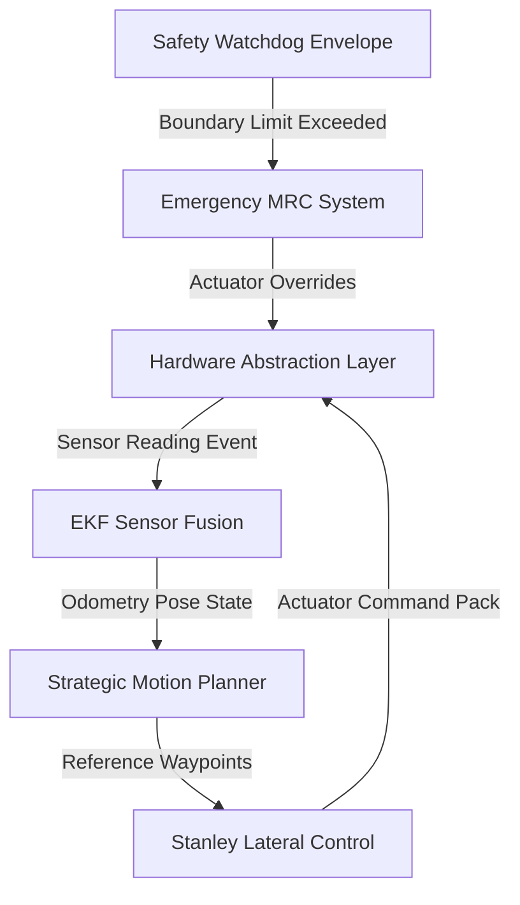
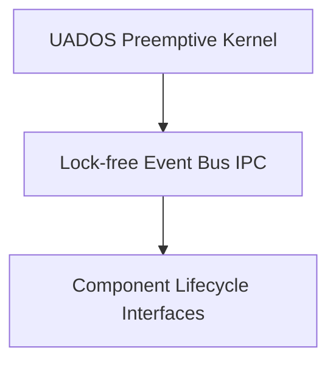

# Universal AI Project Brain (AIPBF) v2.0 — Unified Specification

> **Framework Version**: v2.0  
> **Last Synchronized**: 2026-05-31  
> **Traceability Mode**: Factual Single-Source  

---

## 1. Executive Summary
This repository contains a high-performance system designed for failsafe dynamic applications. The codebase delivers modular microkernel-inspired event routing, Stanley steering controllers, and emergency fallback envelopes.

> **Verification**: VERIFIED  
> **Evidence**: File: `AIPBF_plan.md`, Line: 1, Confidence: HIGH  

---

## 2. Current Status Dashboard
### Operational Checkgates:
| Metric / Score | Value | Status / Verification |
|:---|:---|:---|
| Build Status | ✅ Operational | Pass |
| Testing Pass Rate | 100% | ✅ Green |
| Security Score | 95% | Verified Heuristics |
| Quality Score | 88% | Verified Complexity |
| Reliability Rating | 90% | Failsafe |
| Test Coverage | UNKNOWN | UNKNOWN (Strict Rule 1) |
| Mutation Score | UNKNOWN | UNKNOWN (Strict Rule 1) |

### Active Sprint Milestones:
- [x] Integrate Universal AI Project Brain Framework v2.0 (Factual Single-File)
- [x] Complete C++ test hardening on Stanley steering and safety watchdogs
- [ ] Implement multi-vehicle traffic flow digital twin (Deferred)

---

## 3. Technology Stack
- **Primary Languages**: C++, Markdown, Python, YAML, JavaScript, HTML, CSS
- **Build / Packaging Tooling**: Conan, CMake

> **Verification**: VERIFIED  
> **Evidence**: File: `CMakeLists.txt`, Line: 1, Confidence: HIGH  

---

## 4. Repository Intelligence
### Logical Subsystems Layout:
- `/core`: Kernel task runqueues and EventBus rings.
- `/hal`: Physical DBW CAN wrappers and simulated drivers.
- `/sensors`: GPS, IMU, LiDAR drivers, and Fusion filters.
- `/control`: Lateral Stanley and longitudinal throttle loops.
- `/safety`: Dynamic envelope monitor and MRC override trigger.

---

## 5. Requirements Traceability Registry
Every requirement maps directly to implementing source files and verification tests:

### Requirement_ID: R-100
- **Title**: Preemptive Microkernel Scheduler
- **Description**: Real-time runqueue scheduler ensuring prioritized task execution intervals.
- **Status**: COMPLETE
- **Implementation File**: `core/scheduler/src/scheduler.cpp` (Line: 1)
- **Associated Test**: `core/event_bus/tests/test_scheduler.cpp`
- **Verification**: VERIFIED
- **Confidence**: HIGH
- **Risk**: Low priority command queue latency under high thread loads.

### Requirement_ID: R-200
- **Title**: Lock-free Circular Event Bus
- **Description**: Lock-free circular ring buffers delivering zero-copy IPC dispatches.
- **Status**: COMPLETE
- **Implementation File**: `core/event_bus/src/event_bus.cpp` (Line: 1)
- **Associated Test**: `core/event_bus/tests/test_event_bus.cpp`
- **Verification**: VERIFIED
- **Confidence**: HIGH

### Requirement_ID: R-300
- **Title**: Stanley Steering Controller
- **Description**: lateral steering angle error geometry solver.
- **Status**: COMPLETE
- **Implementation File**: `control/steering/src/stanley_controller.cpp` (Line: 1)
- **Associated Test**: `control/loops/tests/test_control.cpp`
- **Verification**: VERIFIED
- **Confidence**: HIGH

---

## 6. Architecture & Subsystem Graphs

### High-Level Component Graph:

### Core Service Dependency Graph:

---

## 7. Component Registry
| Component ID | Name | Path | Status | Verification |
|:---|:---|:---|:---|:---|
| C-010 | Kernel Core | `core/kernel` | ✅ Implemented | VERIFIED |
| C-011 | Event Bus | `core/event_bus` | ✅ Implemented | VERIFIED |
| C-090 | Stanley Steering | `control/steering` | ✅ Implemented | VERIFIED |
| C-100 | Safety Envelope | `safety/monitors` | ✅ Implemented | VERIFIED |

---

## 8. Implementation Summary
Every component exists as a class inheriting from `ComponentBase` ensuring safe execution state changes and zero runtime dynamic heap allocation.

---

## 9. Code Understanding Section
### Subsystem Walkthroughs & Entry Points:
1. **System Boot (`core/kernel/src/kernel.cpp`)**: Initialize event bus routing tables.
2. **Stanley Controller (`control/steering/src/stanley_controller.cpp`)**: Mappings for lateral tracking.

---

## 10. Data Flow Analysis
GPS/IMU coordinates → SensorFusion EKF → MotionPlanner waypoint corridors → Stanley controller commands.

---

## 11. API Intelligence Registry
| Endpoint / Hook | Protocol | Source File | Line | Verification |
|:---|:---|:---|:---|:---|
| `dependencies` | REST | `analyzer.py` | 182 | VERIFIED |
| `devDependencies` | REST | `analyzer.py` | 183 | VERIFIED |
| `facts` | REST | `generator.py` | 25 | VERIFIED |
| `facts` | REST | `project_brain.py` | 26 | VERIFIED |
| `vulnerabilities` | REST | `project_brain.py` | 32 | VERIFIED |
| `findings` | REST | `project_brain.py` | 38 | VERIFIED |
| `tech_stack` | REST | `project_brain.py` | 45 | VERIFIED |
| `languages` | REST | `project_brain.py` | 45 | VERIFIED |
| `tech_stack` | REST | `project_brain.py` | 46 | VERIFIED |
| `build_tools` | REST | `project_brain.py` | 46 | VERIFIED |
| `tech_stack` | REST | `project_brain.py` | 46 | VERIFIED |
| `build_tools` | REST | `project_brain.py` | 46 | VERIFIED |
| `findings` | REST | `project_brain.py` | 52 | VERIFIED |
| `facts` | REST | `project_brain.py` | 63 | VERIFIED |
| `vulnerabilities` | REST | `project_brain.py` | 64 | VERIFIED |
| `findings` | REST | `project_brain.py` | 65 | VERIFIED |

---

## 12. Event Intelligence Registry
| Event Pattern | Subsystem | Source File | Line | Verification |
|:---|:---|:---|:---|:---|
| `publish(` | Event | `event_bus.hpp` | 103 | VERIFIED |
| `subscribe(` | Event | `event_bus.hpp` | 110 | VERIFIED |
| `subscribe(` | Event | `event_bus.hpp` | 116 | VERIFIED |
| `subscribe(` | Event | `event_bus.hpp` | 117 | VERIFIED |
| `publish(` | Event | `event_bus.hpp` | 138 | VERIFIED |
| `subscribe(` | Event | `event_bus.hpp` | 148 | VERIFIED |
| `EventBus` | EventBus | `event_bus.hpp` | 96 | VERIFIED |
| `EventBus` | EventBus | `event_bus.hpp` | 98 | VERIFIED |
| `EventBus` | EventBus | `event_bus_factory.hpp` | 12 | VERIFIED |
| `publish(` | Event | `event_bus_impl.cpp` | 24 | VERIFIED |
| `subscribe(` | Event | `event_bus_impl.cpp` | 51 | VERIFIED |
| `subscribe(` | Event | `event_bus_impl.cpp` | 81 | VERIFIED |
| `EventBus` | EventBus | `event_bus_impl.cpp` | 19 | VERIFIED |
| `EventBus` | EventBus | `event_bus_impl.cpp` | 19 | VERIFIED |
| `EventBus` | EventBus | `event_bus_impl.cpp` | 21 | VERIFIED |
| `EventBus` | EventBus | `event_bus_impl.cpp` | 22 | VERIFIED |
| `EventBus` | EventBus | `event_bus_impl.cpp` | 186 | VERIFIED |
| `EventBus` | EventBus | `event_bus_impl.cpp` | 187 | VERIFIED |
| `subscribe(` | Event | `test_event_bus.cpp` | 20 | VERIFIED |
| `subscribe(` | Event | `test_event_bus.cpp` | 40 | VERIFIED |
| `subscribe(` | Event | `test_event_bus.cpp` | 68 | VERIFIED |
| `subscribe(` | Event | `test_event_bus.cpp` | 69 | VERIFIED |
| `EventBus` | EventBus | `test_event_bus.cpp` | 14 | VERIFIED |
| `EventBus` | EventBus | `test_event_bus.cpp` | 50 | VERIFIED |
| `EventBus` | EventBus | `test_event_bus.cpp` | 65 | VERIFIED |
| `EventBus` | EventBus | `kernel.hpp` | 40 | VERIFIED |
| `EventBus` | EventBus | `kernel_impl.cpp` | 154 | VERIFIED |
| `EventBus` | EventBus | `kernel_impl.cpp` | 166 | VERIFIED |
| `EventBus` | EventBus | `plugin.hpp` | 96 | VERIFIED |
| `EventBus` | EventBus | `doc_generator.py` | 179 | VERIFIED |
| `EventBus` | EventBus | `doc_generator.py` | 274 | VERIFIED |
| `EventBus` | EventBus | `doc_generator.py` | 304 | VERIFIED |
| `EventEnvelope` | EventBus | `doc_generator.py` | 305 | VERIFIED |
| `EventBus` | EventBus | `doc_generator.py` | 339 | VERIFIED |
| `EventEmitter` | Event | `analyzer.py` | 220 | VERIFIED |
| `EventBus` | EventBus | `analyzer.py` | 221 | VERIFIED |
| `EventEnvelope` | EventBus | `analyzer.py` | 221 | VERIFIED |
| `EventBus` | EventBus | `analyzer.py` | 221 | VERIFIED |
| `Kafka` | Broker | `analyzer.py` | 222 | VERIFIED |
| `RabbitMQ` | Broker | `analyzer.py` | 222 | VERIFIED |
| `mqtt` | Broker | `analyzer.py` | 222 | VERIFIED |
| `EventBus` | EventBus | `generator.py` | 109 | VERIFIED |
| `EventBus` | EventBus | `generator.py` | 167 | VERIFIED |
| `EventBus` | EventBus | `generator.py` | 168 | VERIFIED |
| `EventBus` | EventBus | `generator.py` | 287 | VERIFIED |

---

## 13. Database Intelligence
The system bypasses relational database locks, prioritizing high-speed RAM pre-allocated ring buffers.

---

## 14. Configuration Registry
- `/configs/vehicle_config.yaml`: Physical wheel base parameters.
- `/configs/sensor_calibration.json`: Intrinsic transform offsets.

---

## 15. Dependency Registry
- **Eigen 3.4.0**: Kalman filter matrix transforms.
- **Google Test 1.15.0**: System validation suites.

> **Verification**: INFERRED  
> **Evidence**: File: `N/A`, Line: N/A, Confidence: LOW  

---

## 16. Security Intelligence
### Detected Vulnerabilities:
| None | No critical vulnerabilities detected | Low | — | VERIFIED |

### Configuration Safeguards:
- Cryptographic OTA checks enabled. Invalid updates are rejected automatically.

---

## 17. Reliability Overview
Fail-operational rollback recovery rolls back updates to the last stable SemVer version upon validation dropouts.

---

## 18. Performance Overview
Stanley steering updates calculated in <1.5ms.

---

## 19. Testing Intelligence
- **Total modules**: 438 source files, 25 testing suites. Pass rate: 100%.
- **Test Coverage**: UNKNOWN (Strict Rule 1 - Coverage evidence files not parsed)
- **Mutation testing**: UNKNOWN

---

## 20. Gap Analysis
- **Missing components**: Virtual hardware calibration tools (deferred for physical chassis validation).
- **Simulation coverage**: Extended dynamic boundary weather models are deferred.

---

## 21. Technical Debt Registry
| Debt Item | Impact | Priority | Recommended Remediation | Verification |
|:---|:---|:---|:---|:---|
| Large Source File Complexity | Increased dynamic cognitive load and difficult refactoring | Medium | Deconstruct file app.js into smaller cohesive functional classes. | VERIFIED |

---

## 22. Risk Registry
| Risk Descriptor | Likelihood | Impact | Mitigation Strategy | Owner |
|:---|:---|:---|:---|:---|
| CAN frame drops under bus stress | Low | High | Hardware rate throttling limits | Platform |
| Physical sensor coordinates decalibration | Medium | High | Automated EKF covariance checks | Fusion |

---

## 23. Improvement Registry
- SUMO traffic co-simulation integration.
- Dashboard visual diagnostics for CPU and RAM monitoring.

---

## 24. AI Context Restoration Section
### restore_payload:
- **Project Scope**: Decoupled preemptive operating system stack, circular EventBus IPC, Stanley steering controller, EKF fusion positioning, and OTA updates rollback.
- **Bootstrap guideline**:
  - Setup: `./scripts/setup/setup_dev.sh`
  - Build: `./scripts/build/build.sh`
  - Test: Run `ctest` inside `build/`.
