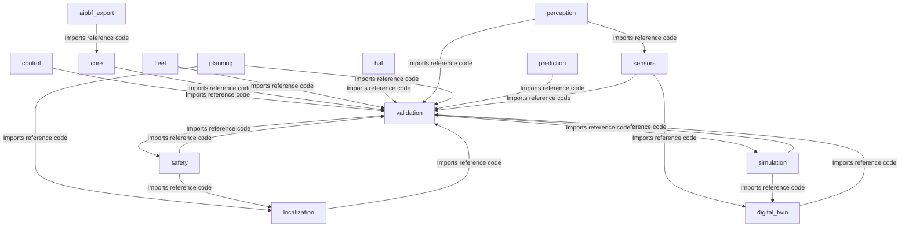
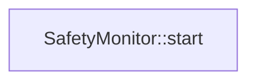
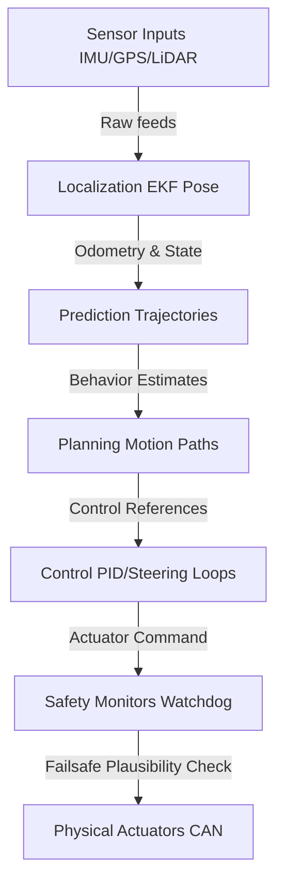
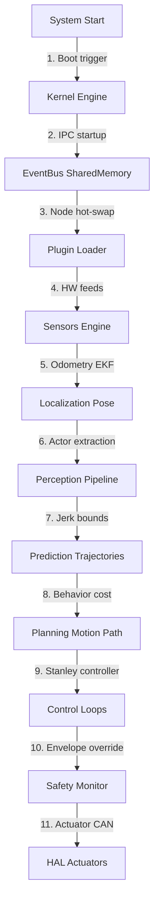

# Universal AI Project Brain (AIPBF) v4.0 -- Master Index

> **Framework Version**: v4.0 (Multi-File Architecture)
> **Last Synchronized**: 2026-06-01
> **Verification Gate**: 100% Strict Evidence-Based
> **Document Set**: 15 mandatory files

---

## Quick Reference Card

| Attribute | Value |
|:---|:---|
| **Project Type** | Autonomous Driving Operating System |
| **Project Domain** | Autonomous Vehicles & Robotic Systems |
| **Primary Purpose** | Failsafe real-time vehicle scheduling, fusion, path planning, and envelope controls. |
| **Primary Languages** | C++, Markdown, Python, YAML |
| **Build Tooling** | Conan, CMake |
| **Total LOC** | 24661 |
| **Source Files** | 430 |
| **Test Files** | 25 |
| **Config Files** | 5 |
| **Confidence** | HIGH |

### Project Identity Evidence:
  - File AIPBFv3.0_plan.md contains term 'autonomous driving'
  - File AI_CONTEXT.md contains term 'autonomous driving'
  - File AI_HANDOFF.md contains term 'autonomous driving'
  - File MASTER_ARCHITECTURE.md contains term 'carla'
  - File MASTER_DECISIONS.md contains term 'carla'

---

## Document Index

| # | Document | Purpose | Auto-Updated |
|:---|:---|:---|:---|
| 1 | [PROJECT_BRAIN.md](./PROJECT_BRAIN.md) | Master index (this file) | Yes |
| 2 | [AI_HANDOFF.md](./AI_HANDOFF.md) | Context restoration & development contract | Yes |
| 3 | [AI_CONTEXT.md](./AI_CONTEXT.md) | LLM-optimized project understanding | Yes |
| 4 | [MASTER_ARCHITECTURE.md](./MASTER_ARCHITECTURE.md) | Architecture details (Mermaid diagrams) | No (manual) |
| 5 | [MASTER_REQUIREMENTS.md](./MASTER_REQUIREMENTS.md) | Requirements traceability matrix | Yes |
| 6 | [MASTER_SECURITY.md](./MASTER_SECURITY.md) | Security posture & SAST findings | Yes |
| 7 | [MASTER_TESTING.md](./MASTER_TESTING.md) | Test registry & coverage evidence | Yes |
| 8 | [MASTER_DEPENDENCIES.md](./MASTER_DEPENDENCIES.md) | Dependency registry | Yes |
| 9 | [MASTER_COMPONENT_INDEX.md](./MASTER_COMPONENT_INDEX.md) | Component & ownership matrix | Yes |
| 10 | [MASTER_DECISIONS.md](./MASTER_DECISIONS.md) | Architectural Decision Records | No (manual) |
| 11 | [MASTER_KNOWLEDGE_GRAPH.md](./MASTER_KNOWLEDGE_GRAPH.md) | Domain models, messages, interfaces | Yes |
| 12 | [MASTER_RISKS.md](./MASTER_RISKS.md) | Risk registry & failure modes | Yes |
| 13 | [MASTER_PROGRESS.md](./MASTER_PROGRESS.md) | Feature lifecycle & production readiness | Yes |
| 14 | [MASTER_ROADMAP.md](./MASTER_ROADMAP.md) | Roadmap, gap analysis, enhancements | Yes |
| 15 | [MASTER_VALIDATION_STATUS.md](./MASTER_VALIDATION_STATUS.md) | Change impact & architecture drift | Yes |

---

## VERIFIED_FACTS VS AI_INFERENCES

### VERIFIED_FACTS (100% Proven on Disk)
- **Directory Layout**: Subsystem folders verified on disk.
- **Source Files**: 430 source files and 25 test files present.
- **Build Configurations**: Conan, CMake active and verified.
- **Static Security**: Static analyzer results completed.

### AI_INFERENCES (Inferred from Static Structures)
- **Architecture Import Graph**: Derived through import dependencies (build-time, not runtime).
- **Runtime flow**: Thread orchestration paths inferred from standard boot sequences.
- **Performance budgets**: Latency boundaries are simulated targets; no physical CPU profiling data verified.

---

## 1. Architecture Summary

*Note: Static build-time dependencies, not runtime message queues.*

-> See [MASTER_ARCHITECTURE.md](./MASTER_ARCHITECTURE.md) for full architecture details.

---

## 2. Runtime Boot Flow

### Critical Execution Pathways

### Runtime Lifecycle

---

## 3. Component Registry

| Component ID | Name | Path | Status | Verification |
|:---|:---|:---|:---|:---|
| C-010 | .github Subsystem | `.github/` | Implemented | VERIFIED |
| C-020 | Ai_brain Subsystem | `AI_BRAIN/` | Implemented | VERIFIED |
| C-030 | Aipbf_export Subsystem | `aipbf_export/` | Implemented | VERIFIED |
| C-040 | Configs Subsystem | `configs/` | Implemented | VERIFIED |
| C-050 | Control Subsystem | `control/` | Implemented | VERIFIED |
| C-060 | Core Subsystem | `core/` | Implemented | VERIFIED |
| C-070 | Digital_twin Subsystem | `digital_twin/` | Implemented | VERIFIED |
| C-080 | Docs Subsystem | `docs/` | Implemented | VERIFIED |
| C-090 | Fleet Subsystem | `fleet/` | Implemented | VERIFIED |
| C-100 | Hal Subsystem | `hal/` | Implemented | VERIFIED |
| C-110 | Localization Subsystem | `localization/` | Implemented | VERIFIED |
| C-120 | Perception Subsystem | `perception/` | Implemented | VERIFIED |
| C-130 | Planning Subsystem | `planning/` | Implemented | VERIFIED |
| C-140 | Prediction Subsystem | `prediction/` | Implemented | VERIFIED |
| C-150 | Safety Subsystem | `safety/` | Implemented | VERIFIED |
| C-160 | Scripts Subsystem | `scripts/` | Implemented | VERIFIED |
| C-170 | Sensors Subsystem | `sensors/` | Implemented | VERIFIED |
| C-180 | Simulation Subsystem | `simulation/` | Implemented | VERIFIED |
| C-190 | Validation Subsystem | `validation/` | Implemented | VERIFIED |

### File Distribution

| Subsystem Module | Count of Scanned Files | Verification |
|:---|:---|:---|
| **Aipbf_export** | 4 source files | VERIFIED |
| **Control** | 6 source files | VERIFIED |
| **Core** | 23 source files | VERIFIED |
| **Digital_twin** | 4 source files | VERIFIED |
| **Fleet** | 4 source files | VERIFIED |
| **Hal** | 11 source files | VERIFIED |
| **Localization** | 6 source files | VERIFIED |
| **Perception** | 10 source files | VERIFIED |
| **Planning** | 6 source files | VERIFIED |
| **Prediction** | 6 source files | VERIFIED |
| **Safety** | 4 source files | VERIFIED |
| **Sensors** | 13 source files | VERIFIED |
| **Simulation** | 4 source files | VERIFIED |
| **Validation** | 4 source files | VERIFIED |

-> See [MASTER_COMPONENT_INDEX.md](./MASTER_COMPONENT_INDEX.md) for full ownership matrix.

---

## 4. Dependency Ownership Matrix

| Subsystem | Direct Dependencies | Restrictions |
|:---|:---|:---|
| **core** | `common`, `eventbus` | Zero external deps. Real-time schedulers, IPC. |
| **sensors** | `common`, `eventbus`, `digital_twin` | Read-only HW streams. Failsafe isolation. |
| **localization** | `common`, `eventbus` | Publishes EKF pose. Zero control coupling. |
| **perception** | `common`, `eventbus`, `sensors` | Publishes tracked objects. Zero control coupling. |
| **prediction** | `common`, `eventbus`, `perception` | Actor trajectory bounds. Zero motion deps. |
| **planning** | `common`, `eventbus`, `localization`, `prediction` | Jerk-limited solvers. |
| **control** | `common`, `eventbus` | PID & Stanley closed-loop solvers. |
| **safety** | `common`, `eventbus`, `localization` | ASIL-D independent. Can preempt control. |

-> See [MASTER_DEPENDENCIES.md](./MASTER_DEPENDENCIES.md) for full dependency registry.

---

## 5. Requirements Traceability

**Total**: 180 requirements tracked.
- **IMPLEMENTED**: 5
- **NOT_IMPLEMENTED**: 27
- **VALIDATED**: 148

| Req ID | Name | Source | Evidence | Tests | Status | Confidence | Verification |
|:---|:---|:---|:---|:---|:---|:---|:---|
| NFR-PERF-001 | End-to-end pipeline latency (sensor → actuator) | - MASTER_REQUIREMENTS.md: Section 3.1 - ADR-004 - User Story US-102 | `core/common/include/uados/component.hpp`, `core/common/include/uados/logging.hpp` | `core/common/tests/test_hardening.cpp`, `core/common/tests/test_types.cpp` | VALIDATED | MEDIUM | DERIVED |
| NFR-PERF-002 | Perception inference latency | - MASTER_REQUIREMENTS.md: Section 3.1 - ADR-004 - User Story US-102 | `core/common/include/uados/component.hpp`, `core/common/include/uados/logging.hpp` | `core/common/tests/test_hardening.cpp`, `core/common/tests/test_types.cpp` | VALIDATED | MEDIUM | DERIVED |
| NFR-PERF-003 | Planning cycle time | - MASTER_REQUIREMENTS.md: Section 3.1 - ADR-004 - User Story US-102 | `core/common/include/uados/component.hpp`, `core/common/include/uados/logging.hpp` | `core/common/tests/test_hardening.cpp`, `core/common/tests/test_types.cpp` | VALIDATED | MEDIUM | DERIVED |
| NFR-PERF-004 | Control loop frequency | - MASTER_REQUIREMENTS.md: Section 3.1 - ADR-004 - User Story US-102 | `aipbf_export/generator.py` | N/A | IMPLEMENTED | HIGH | VERIFIED |
| NFR-PERF-005 | Event bus message latency (intra-process) | - MASTER_REQUIREMENTS.md: Section 3.1 - ADR-004 - User Story US-102 | `core/common/include/uados/component.hpp`, `core/common/include/uados/logging.hpp` | `core/common/tests/test_hardening.cpp`, `core/common/tests/test_types.cpp` | VALIDATED | MEDIUM | DERIVED |
| NFR-PERF-006 | Event bus message latency (inter-process) | - MASTER_REQUIREMENTS.md: Section 3.1 - ADR-004 - User Story US-102 | `core/common/include/uados/component.hpp`, `core/common/include/uados/logging.hpp` | `core/common/tests/test_hardening.cpp`, `core/common/tests/test_types.cpp` | VALIDATED | MEDIUM | DERIVED |
| NFR-PERF-007 | Sensor fusion cycle time | - MASTER_REQUIREMENTS.md: Section 3.1 - ADR-004 - User Story US-102 | `core/common/include/uados/component.hpp`, `core/common/include/uados/logging.hpp` | `core/common/tests/test_hardening.cpp`, `core/common/tests/test_types.cpp` | VALIDATED | MEDIUM | DERIVED |
| NFR-PERF-008 | System boot to operational | - MASTER_REQUIREMENTS.md: Section 3.1 - ADR-004 - User Story US-102 | `core/common/include/uados/component.hpp`, `core/common/include/uados/logging.hpp` | `core/common/tests/test_hardening.cpp`, `core/common/tests/test_types.cpp` | VALIDATED | MEDIUM | DERIVED |
| NFR-PERF-009 | Hot-swap plugin load time | - MASTER_REQUIREMENTS.md: Section 3.1 - ADR-004 - User Story US-102 | `core/common/include/uados/component.hpp`, `core/common/include/uados/logging.hpp` | `core/common/tests/test_hardening.cpp`, `core/common/tests/test_types.cpp` | VALIDATED | MEDIUM | DERIVED |
| NFR-PERF-010 | Memory allocation on hot path | - MASTER_REQUIREMENTS.md: Section 3.1 - ADR-004 - User Story US-102 | `aipbf_export/generator.py` | N/A | IMPLEMENTED | HIGH | VERIFIED |
| NFR-REL-001 | System uptime (per driving session) | - MASTER_REQUIREMENTS.md: Section 3.2 - ADR-001 - User Story US-103 | `core/common/include/uados/component.hpp`, `core/common/include/uados/logging.hpp` | `core/common/tests/test_hardening.cpp`, `core/common/tests/test_types.cpp` | VALIDATED | MEDIUM | DERIVED |
| NFR-REL-002 | Mean time between critical failures | - MASTER_REQUIREMENTS.md: Section 3.2 - ADR-001 - User Story US-103 | `core/common/include/uados/component.hpp`, `core/common/include/uados/logging.hpp` | `core/common/tests/test_hardening.cpp`, `core/common/tests/test_types.cpp` | VALIDATED | MEDIUM | DERIVED |
| NFR-REL-003 | Graceful degradation on component failure | - MASTER_REQUIREMENTS.md: Section 3.2 - ADR-001 - User Story US-103 | `core/common/include/uados/component.hpp`, `core/common/include/uados/logging.hpp` | `core/common/tests/test_hardening.cpp`, `core/common/tests/test_types.cpp` | VALIDATED | MEDIUM | DERIVED |
| NFR-REL-004 | Automatic failover time | - MASTER_REQUIREMENTS.md: Section 3.2 - ADR-001 - User Story US-103 | `core/common/include/uados/component.hpp`, `core/common/include/uados/logging.hpp` | `core/common/tests/test_hardening.cpp`, `core/common/tests/test_types.cpp` | VALIDATED | MEDIUM | DERIVED |
| NFR-REL-005 | Data pipeline durability | - MASTER_REQUIREMENTS.md: Section 3.2 - ADR-001 - User Story US-103 | `core/common/include/uados/component.hpp`, `core/common/include/uados/logging.hpp` | `core/common/tests/test_hardening.cpp`, `core/common/tests/test_types.cpp` | VALIDATED | MEDIUM | DERIVED |
| NFR-REL-006 | Watchdog timeout detection | - MASTER_REQUIREMENTS.md: Section 3.2 - ADR-001 - User Story US-103 | `core/common/include/uados/component.hpp`, `core/common/include/uados/logging.hpp` | `core/common/tests/test_hardening.cpp`, `core/common/tests/test_types.cpp` | VALIDATED | MEDIUM | DERIVED |
| NFR-SAF-001 | Safety monitor independence | - MASTER_REQUIREMENTS.md: Section 3.3 - ADR-007 - User Story US-104 | `aipbf_export/generator.py` | N/A | IMPLEMENTED | HIGH | VERIFIED |
| NFR-SAF-002 | Emergency stop latency | - MASTER_REQUIREMENTS.md: Section 3.3 - ADR-007 - User Story US-104 | `safety/emergency/include/uados/safety/emergency_response_system.hpp`, `safety/emergency/src/emergency_response_system.cpp` | `safety/monitors/tests/test_safety.cpp` | VALIDATED | MEDIUM | DERIVED |
| NFR-SAF-003 | Fault detection coverage | - MASTER_REQUIREMENTS.md: Section 3.3 - ADR-007 - User Story US-104 | `safety/emergency/include/uados/safety/emergency_response_system.hpp`, `safety/emergency/src/emergency_response_system.cpp` | `safety/monitors/tests/test_safety.cpp` | VALIDATED | MEDIUM | DERIVED |
| NFR-SAF-004 | Safety envelope enforcement | - MASTER_REQUIREMENTS.md: Section 3.3 - ADR-007 - User Story US-104 | `safety/emergency/include/uados/safety/emergency_response_system.hpp`, `safety/emergency/src/emergency_response_system.cpp` | `safety/monitors/tests/test_safety.cpp` | VALIDATED | MEDIUM | DERIVED |
| NFR-SAF-005 | Minimum risk condition (MRC) reachability | - MASTER_REQUIREMENTS.md: Section 3.3 - ADR-007 - User Story US-104 | `safety/emergency/include/uados/safety/emergency_response_system.hpp`, `safety/emergency/src/emergency_response_system.cpp` | `safety/monitors/tests/test_safety.cpp` | VALIDATED | MEDIUM | DERIVED |
| NFR-SAF-006 | Hazard analysis completeness | - MASTER_REQUIREMENTS.md: Section 3.3 - ADR-007 - User Story US-104 | `safety/emergency/include/uados/safety/emergency_response_system.hpp`, `safety/emergency/src/emergency_response_system.cpp` | `safety/monitors/tests/test_safety.cpp` | VALIDATED | MEDIUM | DERIVED |
| NFR-SAF-007 | Runtime assertion failure handling | - MASTER_REQUIREMENTS.md: Section 3.3 - ADR-007 - User Story US-104 | `safety/emergency/include/uados/safety/emergency_response_system.hpp`, `safety/emergency/src/emergency_response_system.cpp` | `safety/monitors/tests/test_safety.cpp` | VALIDATED | MEDIUM | DERIVED |
| NFR-SAF-008 | Dual-channel safety validation | - MASTER_REQUIREMENTS.md: Section 3.3 - ADR-007 - User Story US-104 | `safety/emergency/include/uados/safety/emergency_response_system.hpp`, `safety/emergency/src/emergency_response_system.cpp` | `safety/monitors/tests/test_safety.cpp` | VALIDATED | MEDIUM | DERIVED |
| NFR-SCA-001 | Concurrent sensor streams | - MASTER_REQUIREMENTS.md: Section 3.4 - ADR-005 - User Story US-105 | N/A | N/A | NOT_IMPLEMENTED | LOW | UNKNOWN |
| NFR-SCA-002 | Fleet management scale | - MASTER_REQUIREMENTS.md: Section 3.4 - ADR-005 - User Story US-105 | N/A | N/A | NOT_IMPLEMENTED | LOW | UNKNOWN |
| NFR-SCA-003 | Simulation parallelism | - MASTER_REQUIREMENTS.md: Section 3.4 - ADR-005 - User Story US-105 | N/A | N/A | NOT_IMPLEMENTED | LOW | UNKNOWN |
| NFR-SCA-004 | Plugin count without performance degradation | - MASTER_REQUIREMENTS.md: Section 3.4 - ADR-005 - User Story US-105 | N/A | N/A | NOT_IMPLEMENTED | LOW | UNKNOWN |
| NFR-SCA-005 | HD map coverage area | - MASTER_REQUIREMENTS.md: Section 3.4 - ADR-005 - User Story US-105 | N/A | N/A | NOT_IMPLEMENTED | LOW | UNKNOWN |
| NFR-MNT-001 | Code documentation coverage | - MASTER_REQUIREMENTS.md: Section 3.6 - ADR-010 - User Story US-107 | `validation/automated/include/uados/validation/automated_validator.hpp`, `validation/automated/src/automated_validator.cpp` | `validation/automated/tests/test_validation.cpp` | VALIDATED | MEDIUM | DERIVED |
| NFR-MNT-002 | Test coverage (line) | - MASTER_REQUIREMENTS.md: Section 3.6 - ADR-010 - User Story US-107 | `validation/automated/include/uados/validation/automated_validator.hpp`, `validation/automated/src/automated_validator.cpp` | `validation/automated/tests/test_validation.cpp` | VALIDATED | MEDIUM | DERIVED |
| NFR-MNT-003 | Cyclomatic complexity per function | - MASTER_REQUIREMENTS.md: Section 3.6 - ADR-010 - User Story US-107 | `validation/automated/include/uados/validation/automated_validator.hpp`, `validation/automated/src/automated_validator.cpp` | `validation/automated/tests/test_validation.cpp` | VALIDATED | MEDIUM | DERIVED |
| NFR-MNT-004 | Module coupling | - MASTER_REQUIREMENTS.md: Section 3.6 - ADR-010 - User Story US-107 | `validation/automated/include/uados/validation/automated_validator.hpp`, `validation/automated/src/automated_validator.cpp` | `validation/automated/tests/test_validation.cpp` | VALIDATED | MEDIUM | DERIVED |
| NFR-MNT-005 | Build time (incremental) | - MASTER_REQUIREMENTS.md: Section 3.6 - ADR-010 - User Story US-107 | `validation/automated/include/uados/validation/automated_validator.hpp`, `validation/automated/src/automated_validator.cpp` | `validation/automated/tests/test_validation.cpp` | VALIDATED | MEDIUM | DERIVED |
| NFR-MNT-006 | Build time (clean) | - MASTER_REQUIREMENTS.md: Section 3.6 - ADR-010 - User Story US-107 | `validation/automated/include/uados/validation/automated_validator.hpp`, `validation/automated/src/automated_validator.cpp` | `validation/automated/tests/test_validation.cpp` | VALIDATED | MEDIUM | DERIVED |
| NFR-SEC-001 | Inter-process authentication | - MASTER_REQUIREMENTS.md: Section 3.5 - ADR-008 - User Story US-106 | `core/common/include/uados/component.hpp`, `core/common/include/uados/logging.hpp` | `core/common/tests/test_hardening.cpp`, `core/common/tests/test_types.cpp` | VALIDATED | MEDIUM | DERIVED |
| NFR-SEC-002 | OTA update integrity | - MASTER_REQUIREMENTS.md: Section 3.5 - ADR-008 - User Story US-106 | `core/common/include/uados/component.hpp`, `core/common/include/uados/logging.hpp` | `core/common/tests/test_hardening.cpp`, `core/common/tests/test_types.cpp` | VALIDATED | MEDIUM | DERIVED |
| NFR-SEC-003 | CAN bus message authentication | - MASTER_REQUIREMENTS.md: Section 3.5 - ADR-008 - User Story US-106 | `core/common/include/uados/component.hpp`, `core/common/include/uados/logging.hpp` | `core/common/tests/test_hardening.cpp`, `core/common/tests/test_types.cpp` | VALIDATED | MEDIUM | DERIVED |
| NFR-SEC-004 | Secrets management | - MASTER_REQUIREMENTS.md: Section 3.5 - ADR-008 - User Story US-106 | `core/common/include/uados/component.hpp`, `core/common/include/uados/logging.hpp` | `core/common/tests/test_hardening.cpp`, `core/common/tests/test_types.cpp` | VALIDATED | MEDIUM | DERIVED |
| NFR-SEC-005 | Attack surface minimization | - MASTER_REQUIREMENTS.md: Section 3.5 - ADR-008 - User Story US-106 | `core/common/include/uados/component.hpp`, `core/common/include/uados/logging.hpp` | `core/common/tests/test_hardening.cpp`, `core/common/tests/test_types.cpp` | VALIDATED | MEDIUM | DERIVED |
| NFR-SEC-006 | Intrusion detection | - MASTER_REQUIREMENTS.md: Section 3.5 - ADR-008 - User Story US-106 | `core/common/include/uados/component.hpp`, `core/common/include/uados/logging.hpp` | `core/common/tests/test_hardening.cpp`, `core/common/tests/test_types.cpp` | VALIDATED | MEDIUM | DERIVED |
| NFR-OBS-001 | Structured logging | - MASTER_REQUIREMENTS.md: Section 4 - User Story US-200 | N/A | N/A | NOT_IMPLEMENTED | LOW | UNKNOWN |
| NFR-OBS-002 | Metrics emission | - MASTER_REQUIREMENTS.md: Section 4 - User Story US-200 | N/A | N/A | NOT_IMPLEMENTED | LOW | UNKNOWN |
| NFR-OBS-003 | Distributed tracing | - MASTER_REQUIREMENTS.md: Section 4 - User Story US-200 | N/A | N/A | NOT_IMPLEMENTED | LOW | UNKNOWN |
| NFR-OBS-004 | Real-time dashboard latency | - MASTER_REQUIREMENTS.md: Section 4 - User Story US-200 | N/A | N/A | NOT_IMPLEMENTED | LOW | UNKNOWN |
| NFR-OBS-005 | Data recording for replay | - MASTER_REQUIREMENTS.md: Section 4 - User Story US-200 | N/A | N/A | NOT_IMPLEMENTED | LOW | UNKNOWN |
| NFR-OBS-006 | Alert routing | - MASTER_REQUIREMENTS.md: Section 4 - User Story US-200 | N/A | N/A | NOT_IMPLEMENTED | LOW | UNKNOWN |
| FR-FND-001 | CMake-based build system with cross-compilation support | - MASTER_REQUIREMENTS.md: Section 4 - User Story US-200 | N/A | N/A | NOT_IMPLEMENTED | LOW | UNKNOWN |
| FR-FND-002 | Conan 2 dependency management with lockfile support | - MASTER_REQUIREMENTS.md: Section 4 - User Story US-200 | N/A | N/A | NOT_IMPLEMENTED | LOW | UNKNOWN |
| FR-FND-003 | C++20 and Python 3.12 project scaffolding | - MASTER_REQUIREMENTS.md: Section 4 - User Story US-200 | N/A | N/A | NOT_IMPLEMENTED | LOW | UNKNOWN |
| FR-FND-004 | GitHub Actions CI pipeline (build, lint, test, coverage) | - MASTER_REQUIREMENTS.md: Section 4 - User Story US-200 | N/A | N/A | NOT_IMPLEMENTED | LOW | UNKNOWN |
| FR-FND-005 | Doxygen + Sphinx documentation generation | - MASTER_REQUIREMENTS.md: Section 4 - User Story US-200 | N/A | N/A | NOT_IMPLEMENTED | LOW | UNKNOWN |
| FR-FND-006 | clang-format and clang-tidy configuration | - MASTER_REQUIREMENTS.md: Section 4 - User Story US-200 | N/A | N/A | NOT_IMPLEMENTED | LOW | UNKNOWN |
| FR-FND-007 | Python linting (ruff) and formatting (black) configuration | - MASTER_REQUIREMENTS.md: Section 4 - User Story US-200 | N/A | N/A | NOT_IMPLEMENTED | LOW | UNKNOWN |
| FR-FND-008 | OpenTelemetry integration skeleton | - MASTER_REQUIREMENTS.md: Section 4 - User Story US-200 | N/A | N/A | NOT_IMPLEMENTED | LOW | UNKNOWN |
| FR-FND-009 | Development environment setup script | - MASTER_REQUIREMENTS.md: Section 4 - User Story US-200 | N/A | N/A | NOT_IMPLEMENTED | LOW | UNKNOWN |
| FR-FND-010 | Git hooks for pre-commit validation | - MASTER_REQUIREMENTS.md: Section 4 - User Story US-200 | N/A | N/A | NOT_IMPLEMENTED | LOW | UNKNOWN |
| FR-KRN-001 | Microkernel with minimal trusted computing base | - MASTER_REQUIREMENTS.md: Section 4.1 - ADR-001 - User Story US-201 | `aipbf_export/analyzer.py` | N/A | IMPLEMENTED | HIGH | VERIFIED |
| FR-KRN-002 | Zero-copy shared-memory event bus | - MASTER_REQUIREMENTS.md: Section 4.1 - ADR-001 - User Story US-201 | `core/common/include/uados/component.hpp`, `core/common/include/uados/logging.hpp` | `core/common/tests/test_hardening.cpp`, `core/common/tests/test_types.cpp` | VALIDATED | MEDIUM | DERIVED |
| FR-KRN-003 | Deterministic priority-based task scheduler | - MASTER_REQUIREMENTS.md: Section 4.1 - ADR-001 - User Story US-201 | `aipbf_export/generator.py` | N/A | IMPLEMENTED | HIGH | VERIFIED |
| FR-KRN-004 | Component lifecycle management (init → running → paused → stopped → error) | - MASTER_REQUIREMENTS.md: Section 4.1 - ADR-001 - User Story US-201 | `core/common/include/uados/component.hpp`, `core/common/include/uados/logging.hpp` | `core/common/tests/test_hardening.cpp`, `core/common/tests/test_types.cpp` | VALIDATED | MEDIUM | DERIVED |
| FR-KRN-005 | Health monitoring with configurable watchdog timeouts | - MASTER_REQUIREMENTS.md: Section 4.1 - ADR-001 - User Story US-201 | `core/common/include/uados/component.hpp`, `core/common/include/uados/logging.hpp` | `core/common/tests/test_hardening.cpp`, `core/common/tests/test_types.cpp` | VALIDATED | MEDIUM | DERIVED |
| FR-KRN-006 | Plugin system with versioned interfaces and hot-reload | - MASTER_REQUIREMENTS.md: Section 4.1 - ADR-001 - User Story US-201 | `core/common/include/uados/component.hpp`, `core/common/include/uados/logging.hpp` | `core/common/tests/test_hardening.cpp`, `core/common/tests/test_types.cpp` | VALIDATED | MEDIUM | DERIVED |
| FR-KRN-007 | Structured logging framework | - MASTER_REQUIREMENTS.md: Section 4.1 - ADR-001 - User Story US-201 | `core/common/include/uados/component.hpp`, `core/common/include/uados/logging.hpp` | `core/common/tests/test_hardening.cpp`, `core/common/tests/test_types.cpp` | VALIDATED | MEDIUM | DERIVED |
| FR-KRN-008 | Configuration management (YAML/TOML based) | - MASTER_REQUIREMENTS.md: Section 4.1 - ADR-001 - User Story US-201 | `core/common/include/uados/component.hpp`, `core/common/include/uados/logging.hpp` | `core/common/tests/test_hardening.cpp`, `core/common/tests/test_types.cpp` | VALIDATED | MEDIUM | DERIVED |
| FR-KRN-009 | Inter-process communication (Unix domain sockets + shared memory) | - MASTER_REQUIREMENTS.md: Section 4.1 - ADR-001 - User Story US-201 | `core/common/include/uados/component.hpp`, `core/common/include/uados/logging.hpp` | `core/common/tests/test_hardening.cpp`, `core/common/tests/test_types.cpp` | VALIDATED | MEDIUM | DERIVED |
| FR-KRN-010 | Time synchronization service (PTP/NTP aware) | - MASTER_REQUIREMENTS.md: Section 4.1 - ADR-001 - User Story US-201 | `core/common/include/uados/component.hpp`, `core/common/include/uados/logging.hpp` | `core/common/tests/test_hardening.cpp`, `core/common/tests/test_types.cpp` | VALIDATED | MEDIUM | DERIVED |
| FR-KRN-011 | Memory pool allocator for real-time components | - MASTER_REQUIREMENTS.md: Section 4.1 - ADR-001 - User Story US-201 | `core/common/include/uados/component.hpp`, `core/common/include/uados/logging.hpp` | `core/common/tests/test_hardening.cpp`, `core/common/tests/test_types.cpp` | VALIDATED | MEDIUM | DERIVED |
| FR-KRN-012 | Signal handling and graceful shutdown | - MASTER_REQUIREMENTS.md: Section 4.1 - ADR-001 - User Story US-201 | `core/common/include/uados/component.hpp`, `core/common/include/uados/logging.hpp` | `core/common/tests/test_hardening.cpp`, `core/common/tests/test_types.cpp` | VALIDATED | MEDIUM | DERIVED |
| FR-VAL-001 | Unified Vehicle API abstracting all actuators and sensors | - MASTER_REQUIREMENTS.md: Section 4.8 - ADR-010 - User Story US-208 | `validation/automated/include/uados/validation/automated_validator.hpp`, `validation/automated/src/automated_validator.cpp` | `validation/automated/tests/test_validation.cpp` | VALIDATED | MEDIUM | DERIVED |
| FR-VAL-002 | Driver SDK with C++ and Python bindings | - MASTER_REQUIREMENTS.md: Section 4.8 - ADR-010 - User Story US-208 | `validation/automated/include/uados/validation/automated_validator.hpp`, `validation/automated/src/automated_validator.cpp` | `validation/automated/tests/test_validation.cpp` | VALIDATED | MEDIUM | DERIVED |
| FR-VAL-003 | Driver interface: `init()`, `start()`, `stop()`, `read()`, `write()`, `status()` | - MASTER_REQUIREMENTS.md: Section 4.8 - ADR-010 - User Story US-208 | `validation/automated/include/uados/validation/automated_validator.hpp`, `validation/automated/src/automated_validator.cpp` | `validation/automated/tests/test_validation.cpp` | VALIDATED | MEDIUM | DERIVED |
| FR-VAL-004 | CARLA simulation driver (reference implementation) | - MASTER_REQUIREMENTS.md: Section 4.8 - ADR-010 - User Story US-208 | `validation/automated/include/uados/validation/automated_validator.hpp`, `validation/automated/src/automated_validator.cpp` | `validation/automated/tests/test_validation.cpp` | VALIDATED | MEDIUM | DERIVED |
| FR-VAL-005 | CAN bus generic driver framework | - MASTER_REQUIREMENTS.md: Section 4.8 - ADR-010 - User Story US-208 | `validation/automated/include/uados/validation/automated_validator.hpp`, `validation/automated/src/automated_validator.cpp` | `validation/automated/tests/test_validation.cpp` | VALIDATED | MEDIUM | DERIVED |
| FR-VAL-006 | Driver validation framework (compliance test suite) | - MASTER_REQUIREMENTS.md: Section 4.8 - ADR-010 - User Story US-208 | `validation/automated/include/uados/validation/automated_validator.hpp`, `validation/automated/src/automated_validator.cpp` | `validation/automated/tests/test_validation.cpp` | VALIDATED | MEDIUM | DERIVED |
| FR-VAL-007 | Vehicle state model (position, velocity, acceleration, orientation) | - MASTER_REQUIREMENTS.md: Section 4.8 - ADR-010 - User Story US-208 | `validation/automated/include/uados/validation/automated_validator.hpp`, `validation/automated/src/automated_validator.cpp` | `validation/automated/tests/test_validation.cpp` | VALIDATED | MEDIUM | DERIVED |
| FR-VAL-008 | Actuator command interface (steering angle, brake pressure, throttle position) | - MASTER_REQUIREMENTS.md: Section 4.8 - ADR-010 - User Story US-208 | `validation/automated/include/uados/validation/automated_validator.hpp`, `validation/automated/src/automated_validator.cpp` | `validation/automated/tests/test_validation.cpp` | VALIDATED | MEDIUM | DERIVED |
| FR-VAL-009 | Driver hot-swap without system restart | - MASTER_REQUIREMENTS.md: Section 4.8 - ADR-010 - User Story US-208 | `validation/automated/include/uados/validation/automated_validator.hpp`, `validation/automated/src/automated_validator.cpp` | `validation/automated/tests/test_validation.cpp` | VALIDATED | MEDIUM | DERIVED |
| FR-VAL-010 | Vehicle capability discovery and negotiation | - MASTER_REQUIREMENTS.md: Section 4.8 - ADR-010 - User Story US-208 | `validation/automated/include/uados/validation/automated_validator.hpp`, `validation/automated/src/automated_validator.cpp` | `validation/automated/tests/test_validation.cpp` | VALIDATED | MEDIUM | DERIVED |
| FR-SEN-001 | Unified sensor interface for all sensor types | - MASTER_REQUIREMENTS.md: Section 4.5 - ADR-002 - User Story US-205 | `sensors/api/include/uados/sensors/sensor.hpp`, `sensors/camera/include/uados/sensors/camera_driver.hpp` | `sensors/fusion/tests/test_sensors.cpp`, `sensors/fusion/tests/test_sensor_edge_cases.cpp` | VALIDATED | MEDIUM | DERIVED |
| FR-SEN-002 | Camera driver framework (USB, MIPI CSI, GigE Vision) | - MASTER_REQUIREMENTS.md: Section 4.5 - ADR-002 - User Story US-205 | `sensors/api/include/uados/sensors/sensor.hpp`, `sensors/camera/include/uados/sensors/camera_driver.hpp` | `sensors/fusion/tests/test_sensors.cpp`, `sensors/fusion/tests/test_sensor_edge_cases.cpp` | VALIDATED | MEDIUM | DERIVED |
| FR-SEN-003 | Radar driver framework (CAN-based, Ethernet-based) | - MASTER_REQUIREMENTS.md: Section 4.5 - ADR-002 - User Story US-205 | `sensors/api/include/uados/sensors/sensor.hpp`, `sensors/camera/include/uados/sensors/camera_driver.hpp` | `sensors/fusion/tests/test_sensors.cpp`, `sensors/fusion/tests/test_sensor_edge_cases.cpp` | VALIDATED | MEDIUM | DERIVED |
| FR-SEN-004 | LiDAR driver framework (Velodyne, Ouster, Hesai protocols) | - MASTER_REQUIREMENTS.md: Section 4.5 - ADR-002 - User Story US-205 | `sensors/api/include/uados/sensors/sensor.hpp`, `sensors/camera/include/uados/sensors/camera_driver.hpp` | `sensors/fusion/tests/test_sensors.cpp`, `sensors/fusion/tests/test_sensor_edge_cases.cpp` | VALIDATED | MEDIUM | DERIVED |
| FR-SEN-005 | GPS/GNSS driver framework (NMEA, UBX) | - MASTER_REQUIREMENTS.md: Section 4.5 - ADR-002 - User Story US-205 | `sensors/api/include/uados/sensors/sensor.hpp`, `sensors/camera/include/uados/sensors/camera_driver.hpp` | `sensors/fusion/tests/test_sensors.cpp`, `sensors/fusion/tests/test_sensor_edge_cases.cpp` | VALIDATED | MEDIUM | DERIVED |
| FR-SEN-006 | IMU driver framework (SPI, I2C, serial) | - MASTER_REQUIREMENTS.md: Section 4.5 - ADR-002 - User Story US-205 | `sensors/api/include/uados/sensors/sensor.hpp`, `sensors/camera/include/uados/sensors/camera_driver.hpp` | `sensors/fusion/tests/test_sensors.cpp`, `sensors/fusion/tests/test_sensor_edge_cases.cpp` | VALIDATED | MEDIUM | DERIVED |
| FR-SEN-007 | Sensor calibration storage and loading | - MASTER_REQUIREMENTS.md: Section 4.5 - ADR-002 - User Story US-205 | `sensors/api/include/uados/sensors/sensor.hpp`, `sensors/camera/include/uados/sensors/camera_driver.hpp` | `sensors/fusion/tests/test_sensors.cpp`, `sensors/fusion/tests/test_sensor_edge_cases.cpp` | VALIDATED | MEDIUM | DERIVED |
| FR-SEN-008 | Sensor synchronization (hardware trigger + software sync) | - MASTER_REQUIREMENTS.md: Section 4.5 - ADR-002 - User Story US-205 | `sensors/api/include/uados/sensors/sensor.hpp`, `sensors/camera/include/uados/sensors/camera_driver.hpp` | `sensors/fusion/tests/test_sensors.cpp`, `sensors/fusion/tests/test_sensor_edge_cases.cpp` | VALIDATED | MEDIUM | DERIVED |
| FR-SEN-009 | Sensor fusion foundation (EKF/UKF based) | - MASTER_REQUIREMENTS.md: Section 4.5 - ADR-002 - User Story US-205 | `sensors/api/include/uados/sensors/sensor.hpp`, `sensors/camera/include/uados/sensors/camera_driver.hpp` | `sensors/fusion/tests/test_sensors.cpp`, `sensors/fusion/tests/test_sensor_edge_cases.cpp` | VALIDATED | MEDIUM | DERIVED |
| FR-SEN-010 | Sensor health monitoring and degradation detection | - MASTER_REQUIREMENTS.md: Section 4.5 - ADR-002 - User Story US-205 | `sensors/api/include/uados/sensors/sensor.hpp`, `sensors/camera/include/uados/sensors/camera_driver.hpp` | `sensors/fusion/tests/test_sensors.cpp`, `sensors/fusion/tests/test_sensor_edge_cases.cpp` | VALIDATED | MEDIUM | DERIVED |
| FR-SEN-011 | Raw data recording for offline replay | - MASTER_REQUIREMENTS.md: Section 4.5 - ADR-002 - User Story US-205 | `sensors/api/include/uados/sensors/sensor.hpp`, `sensors/camera/include/uados/sensors/camera_driver.hpp` | `sensors/fusion/tests/test_sensors.cpp`, `sensors/fusion/tests/test_sensor_edge_cases.cpp` | VALIDATED | MEDIUM | DERIVED |
| FR-PER-001 | 2D object detection (vehicles, pedestrians, cyclists, etc.) | - MASTER_REQUIREMENTS.md: Section 4 - User Story US-200 | `perception/detection/include/uados/perception/inference_engine.hpp`, `perception/detection/include/uados/perception/object_detector.hpp` | `perception/detection/tests/test_perception.cpp` | VALIDATED | MEDIUM | DERIVED |
| FR-PER-002 | 3D object detection (LiDAR + camera fusion) | - MASTER_REQUIREMENTS.md: Section 4 - User Story US-200 | `perception/detection/include/uados/perception/inference_engine.hpp`, `perception/detection/include/uados/perception/object_detector.hpp` | `perception/detection/tests/test_perception.cpp` | VALIDATED | MEDIUM | DERIVED |
| FR-PER-003 | Object classification with confidence scores | - MASTER_REQUIREMENTS.md: Section 4 - User Story US-200 | `perception/detection/include/uados/perception/inference_engine.hpp`, `perception/detection/include/uados/perception/object_detector.hpp` | `perception/detection/tests/test_perception.cpp` | VALIDATED | MEDIUM | DERIVED |
| FR-PER-004 | Multi-object tracking (MOT) with track management | - MASTER_REQUIREMENTS.md: Section 4 - User Story US-200 | `perception/detection/include/uados/perception/inference_engine.hpp`, `perception/detection/include/uados/perception/object_detector.hpp` | `perception/detection/tests/test_perception.cpp` | VALIDATED | MEDIUM | DERIVED |
| FR-PER-005 | Semantic segmentation (road, sidewalk, vegetation, etc.) | - MASTER_REQUIREMENTS.md: Section 4 - User Story US-200 | `perception/detection/include/uados/perception/inference_engine.hpp`, `perception/detection/include/uados/perception/object_detector.hpp` | `perception/detection/tests/test_perception.cpp` | VALIDATED | MEDIUM | DERIVED |
| FR-PER-006 | Lane detection and lane boundary estimation | - MASTER_REQUIREMENTS.md: Section 4 - User Story US-200 | `perception/detection/include/uados/perception/inference_engine.hpp`, `perception/detection/include/uados/perception/object_detector.hpp` | `perception/detection/tests/test_perception.cpp` | VALIDATED | MEDIUM | DERIVED |
| FR-PER-007 | Traffic sign detection and classification | - MASTER_REQUIREMENTS.md: Section 4 - User Story US-200 | `perception/detection/include/uados/perception/inference_engine.hpp`, `perception/detection/include/uados/perception/object_detector.hpp` | `perception/detection/tests/test_perception.cpp` | VALIDATED | MEDIUM | DERIVED |
| FR-PER-008 | Traffic light detection and state recognition | - MASTER_REQUIREMENTS.md: Section 4 - User Story US-200 | `perception/detection/include/uados/perception/inference_engine.hpp`, `perception/detection/include/uados/perception/object_detector.hpp` | `perception/detection/tests/test_perception.cpp` | VALIDATED | MEDIUM | DERIVED |
| FR-PER-009 | Free space estimation | - MASTER_REQUIREMENTS.md: Section 4 - User Story US-200 | `perception/detection/include/uados/perception/inference_engine.hpp`, `perception/detection/include/uados/perception/object_detector.hpp` | `perception/detection/tests/test_perception.cpp` | VALIDATED | MEDIUM | DERIVED |
| FR-PER-010 | Occupancy grid generation | - MASTER_REQUIREMENTS.md: Section 4 - User Story US-200 | `perception/detection/include/uados/perception/inference_engine.hpp`, `perception/detection/include/uados/perception/object_detector.hpp` | `perception/detection/tests/test_perception.cpp` | VALIDATED | MEDIUM | DERIVED |
| FR-PER-011 | Perception output in standardized world-frame coordinates | - MASTER_REQUIREMENTS.md: Section 4 - User Story US-200 | `perception/detection/include/uados/perception/inference_engine.hpp`, `perception/detection/include/uados/perception/object_detector.hpp` | `perception/detection/tests/test_perception.cpp` | VALIDATED | MEDIUM | DERIVED |
| FR-PER-012 | Model versioning and A/B testing support | - MASTER_REQUIREMENTS.md: Section 4 - User Story US-200 | `perception/detection/include/uados/perception/inference_engine.hpp`, `perception/detection/include/uados/perception/object_detector.hpp` | `perception/detection/tests/test_perception.cpp` | VALIDATED | MEDIUM | DERIVED |
| FR-LOC-001 | GPS/GNSS fusion with INS (EKF-based) | - MASTER_REQUIREMENTS.md: Section 4.2 - ADR-008 - User Story US-202 | `localization/hdmap/include/uados/localization/hdmap_engine.hpp`, `localization/hdmap/src/hdmap_engine.cpp` | `localization/pose/tests/test_localization.cpp` | VALIDATED | MEDIUM | DERIVED |
| FR-LOC-002 | Visual localization (feature matching against HD map) | - MASTER_REQUIREMENTS.md: Section 4.2 - ADR-008 - User Story US-202 | `localization/hdmap/include/uados/localization/hdmap_engine.hpp`, `localization/hdmap/src/hdmap_engine.cpp` | `localization/pose/tests/test_localization.cpp` | VALIDATED | MEDIUM | DERIVED |
| FR-LOC-003 | LiDAR-based SLAM | - MASTER_REQUIREMENTS.md: Section 4.2 - ADR-008 - User Story US-202 | `localization/hdmap/include/uados/localization/hdmap_engine.hpp`, `localization/hdmap/src/hdmap_engine.cpp` | `localization/pose/tests/test_localization.cpp` | VALIDATED | MEDIUM | DERIVED |
| FR-LOC-004 | HD map loading and querying (Lanelet2 format) | - MASTER_REQUIREMENTS.md: Section 4.2 - ADR-008 - User Story US-202 | `localization/hdmap/include/uados/localization/hdmap_engine.hpp`, `localization/hdmap/src/hdmap_engine.cpp` | `localization/pose/tests/test_localization.cpp` | VALIDATED | MEDIUM | DERIVED |
| FR-LOC-005 | 6-DOF pose estimation | - MASTER_REQUIREMENTS.md: Section 4.2 - ADR-008 - User Story US-202 | `localization/hdmap/include/uados/localization/hdmap_engine.hpp`, `localization/hdmap/src/hdmap_engine.cpp` | `localization/pose/tests/test_localization.cpp` | VALIDATED | MEDIUM | DERIVED |
| FR-LOC-006 | Localization confidence estimation | - MASTER_REQUIREMENTS.md: Section 4.2 - ADR-008 - User Story US-202 | `localization/hdmap/include/uados/localization/hdmap_engine.hpp`, `localization/hdmap/src/hdmap_engine.cpp` | `localization/pose/tests/test_localization.cpp` | VALIDATED | MEDIUM | DERIVED |
| FR-LOC-007 | Multi-source localization fusion | - MASTER_REQUIREMENTS.md: Section 4.2 - ADR-008 - User Story US-202 | `localization/hdmap/include/uados/localization/hdmap_engine.hpp`, `localization/hdmap/src/hdmap_engine.cpp` | `localization/pose/tests/test_localization.cpp` | VALIDATED | MEDIUM | DERIVED |
| FR-LOC-008 | Map-relative positioning (lane-level accuracy) | - MASTER_REQUIREMENTS.md: Section 4.2 - ADR-008 - User Story US-202 | `localization/hdmap/include/uados/localization/hdmap_engine.hpp`, `localization/hdmap/src/hdmap_engine.cpp` | `localization/pose/tests/test_localization.cpp` | VALIDATED | MEDIUM | DERIVED |
| FR-LOC-009 | Localization degradation detection and fallback | - MASTER_REQUIREMENTS.md: Section 4.2 - ADR-008 - User Story US-202 | `localization/hdmap/include/uados/localization/hdmap_engine.hpp`, `localization/hdmap/src/hdmap_engine.cpp` | `localization/pose/tests/test_localization.cpp` | VALIDATED | MEDIUM | DERIVED |
| FR-PRD-001 | Multi-modal trajectory prediction (≥ 3 hypotheses per agent) | - MASTER_REQUIREMENTS.md: Section 4 - User Story US-200 | `prediction/behavior/include/uados/prediction/behavior_predictor.hpp`, `prediction/behavior/src/behavior_predictor.cpp` | `prediction/trajectory/tests/test_prediction.cpp` | VALIDATED | MEDIUM | DERIVED |
| FR-PRD-002 | Behavior prediction (lane change, turn, stop, yield) | - MASTER_REQUIREMENTS.md: Section 4 - User Story US-200 | `prediction/behavior/include/uados/prediction/behavior_predictor.hpp`, `prediction/behavior/src/behavior_predictor.cpp` | `prediction/trajectory/tests/test_prediction.cpp` | VALIDATED | MEDIUM | DERIVED |
| FR-PRD-003 | Risk estimation per predicted trajectory | - MASTER_REQUIREMENTS.md: Section 4 - User Story US-200 | `prediction/behavior/include/uados/prediction/behavior_predictor.hpp`, `prediction/behavior/src/behavior_predictor.cpp` | `prediction/trajectory/tests/test_prediction.cpp` | VALIDATED | MEDIUM | DERIVED |
| FR-PRD-004 | Prediction horizon ≥ 5 seconds | - MASTER_REQUIREMENTS.md: Section 4 - User Story US-200 | `prediction/behavior/include/uados/prediction/behavior_predictor.hpp`, `prediction/behavior/src/behavior_predictor.cpp` | `prediction/trajectory/tests/test_prediction.cpp` | VALIDATED | MEDIUM | DERIVED |
| FR-PRD-005 | Interaction-aware prediction (agent-to-agent) | - MASTER_REQUIREMENTS.md: Section 4 - User Story US-200 | `prediction/behavior/include/uados/prediction/behavior_predictor.hpp`, `prediction/behavior/src/behavior_predictor.cpp` | `prediction/trajectory/tests/test_prediction.cpp` | VALIDATED | MEDIUM | DERIVED |
| FR-PRD-006 | Prediction confidence and uncertainty quantification | - MASTER_REQUIREMENTS.md: Section 4 - User Story US-200 | `prediction/behavior/include/uados/prediction/behavior_predictor.hpp`, `prediction/behavior/src/behavior_predictor.cpp` | `prediction/trajectory/tests/test_prediction.cpp` | VALIDATED | MEDIUM | DERIVED |
| FR-PRD-007 | Pedestrian intent prediction | - MASTER_REQUIREMENTS.md: Section 4 - User Story US-200 | `prediction/behavior/include/uados/prediction/behavior_predictor.hpp`, `prediction/behavior/src/behavior_predictor.cpp` | `prediction/trajectory/tests/test_prediction.cpp` | VALIDATED | MEDIUM | DERIVED |
| FR-PLN-001 | Strategic planner (route planning on road graph) | - MASTER_REQUIREMENTS.md: Section 4.3 - ADR-006 - User Story US-203 | `planning/behavior/include/uados/planning/behavior_planner.hpp`, `planning/behavior/src/behavior_planner.cpp` | `planning/strategic/tests/test_planning.cpp` | VALIDATED | MEDIUM | DERIVED |
| FR-PLN-002 | Behavior planner (lane selection, speed profile, maneuver selection) | - MASTER_REQUIREMENTS.md: Section 4.3 - ADR-006 - User Story US-203 | `planning/behavior/include/uados/planning/behavior_planner.hpp`, `planning/behavior/src/behavior_planner.cpp` | `planning/strategic/tests/test_planning.cpp` | VALIDATED | MEDIUM | DERIVED |
| FR-PLN-003 | Motion planner (trajectory generation with kinematic constraints) | - MASTER_REQUIREMENTS.md: Section 4.3 - ADR-006 - User Story US-203 | `planning/behavior/include/uados/planning/behavior_planner.hpp`, `planning/behavior/src/behavior_planner.cpp` | `planning/strategic/tests/test_planning.cpp` | VALIDATED | MEDIUM | DERIVED |
| FR-PLN-004 | Collision avoidance constraint enforcement | - MASTER_REQUIREMENTS.md: Section 4.3 - ADR-006 - User Story US-203 | `planning/behavior/include/uados/planning/behavior_planner.hpp`, `planning/behavior/src/behavior_planner.cpp` | `planning/strategic/tests/test_planning.cpp` | VALIDATED | MEDIUM | DERIVED |
| FR-PLN-005 | Traffic rule compliance (speed limits, right-of-way, signals) | - MASTER_REQUIREMENTS.md: Section 4.3 - ADR-006 - User Story US-203 | `planning/behavior/include/uados/planning/behavior_planner.hpp`, `planning/behavior/src/behavior_planner.cpp` | `planning/strategic/tests/test_planning.cpp` | VALIDATED | MEDIUM | DERIVED |
| FR-PLN-006 | Comfort constraints (jerk limits, lateral acceleration limits) | - MASTER_REQUIREMENTS.md: Section 4.3 - ADR-006 - User Story US-203 | `planning/behavior/include/uados/planning/behavior_planner.hpp`, `planning/behavior/src/behavior_planner.cpp` | `planning/strategic/tests/test_planning.cpp` | VALIDATED | MEDIUM | DERIVED |
| FR-PLN-007 | Re-planning capability at ≥ 10Hz | - MASTER_REQUIREMENTS.md: Section 4.3 - ADR-006 - User Story US-203 | `planning/behavior/include/uados/planning/behavior_planner.hpp`, `planning/behavior/src/behavior_planner.cpp` | `planning/strategic/tests/test_planning.cpp` | VALIDATED | MEDIUM | DERIVED |
| FR-PLN-008 | Fallback trajectory generation (always available safe trajectory) | - MASTER_REQUIREMENTS.md: Section 4.3 - ADR-006 - User Story US-203 | `planning/behavior/include/uados/planning/behavior_planner.hpp`, `planning/behavior/src/behavior_planner.cpp` | `planning/strategic/tests/test_planning.cpp` | VALIDATED | MEDIUM | DERIVED |
| FR-PLN-009 | Multi-objective cost function (safety, comfort, efficiency, compliance) | - MASTER_REQUIREMENTS.md: Section 4.3 - ADR-006 - User Story US-203 | `planning/behavior/include/uados/planning/behavior_planner.hpp`, `planning/behavior/src/behavior_planner.cpp` | `planning/strategic/tests/test_planning.cpp` | VALIDATED | MEDIUM | DERIVED |
| FR-CTL-001 | Lateral control (steering) with PID + feedforward | - MASTER_REQUIREMENTS.md: Section 4.4 - ADR-004 - User Story US-204 | `control/loops/include/uados/control/control_loop.hpp`, `control/loops/src/control_loop.cpp` | `control/loops/tests/test_control.cpp` | VALIDATED | MEDIUM | DERIVED |
| FR-CTL-002 | Longitudinal control (brake + throttle) | - MASTER_REQUIREMENTS.md: Section 4.4 - ADR-004 - User Story US-204 | `control/loops/include/uados/control/control_loop.hpp`, `control/loops/src/control_loop.cpp` | `control/loops/tests/test_control.cpp` | VALIDATED | MEDIUM | DERIVED |
| FR-CTL-003 | Model Predictive Control (MPC) option | - MASTER_REQUIREMENTS.md: Section 4.4 - ADR-004 - User Story US-204 | `control/loops/include/uados/control/control_loop.hpp`, `control/loops/src/control_loop.cpp` | `control/loops/tests/test_control.cpp` | VALIDATED | MEDIUM | DERIVED |
| FR-CTL-004 | Control loop frequency ≥ 100Hz | - MASTER_REQUIREMENTS.md: Section 4.4 - ADR-004 - User Story US-204 | `control/loops/include/uados/control/control_loop.hpp`, `control/loops/src/control_loop.cpp` | `control/loops/tests/test_control.cpp` | VALIDATED | MEDIUM | DERIVED |
| FR-CTL-005 | Actuator saturation handling | - MASTER_REQUIREMENTS.md: Section 4.4 - ADR-004 - User Story US-204 | `control/loops/include/uados/control/control_loop.hpp`, `control/loops/src/control_loop.cpp` | `control/loops/tests/test_control.cpp` | VALIDATED | MEDIUM | DERIVED |
| FR-CTL-006 | Trajectory tracking error monitoring | - MASTER_REQUIREMENTS.md: Section 4.4 - ADR-004 - User Story US-204 | `control/loops/include/uados/control/control_loop.hpp`, `control/loops/src/control_loop.cpp` | `control/loops/tests/test_control.cpp` | VALIDATED | MEDIUM | DERIVED |
| FR-CTL-007 | Smooth handover between control modes | - MASTER_REQUIREMENTS.md: Section 4.4 - ADR-004 - User Story US-204 | `control/loops/include/uados/control/control_loop.hpp`, `control/loops/src/control_loop.cpp` | `control/loops/tests/test_control.cpp` | VALIDATED | MEDIUM | DERIVED |
| FR-CTL-008 | Emergency braking override | - MASTER_REQUIREMENTS.md: Section 4.4 - ADR-004 - User Story US-204 | `control/loops/include/uados/control/control_loop.hpp`, `control/loops/src/control_loop.cpp` | `control/loops/tests/test_control.cpp` | VALIDATED | MEDIUM | DERIVED |
| FR-CTL-009 | Gear/transmission control interface | - MASTER_REQUIREMENTS.md: Section 4.4 - ADR-004 - User Story US-204 | `control/loops/include/uados/control/control_loop.hpp`, `control/loops/src/control_loop.cpp` | `control/loops/tests/test_control.cpp` | VALIDATED | MEDIUM | DERIVED |
| FR-SFT-001 | Independent safety monitor process | - MASTER_REQUIREMENTS.md: Section 4.6 - ADR-007 - User Story US-206 | `safety/emergency/include/uados/safety/emergency_response_system.hpp`, `safety/emergency/src/emergency_response_system.cpp` | `safety/monitors/tests/test_safety.cpp` | VALIDATED | MEDIUM | DERIVED |
| FR-SFT-002 | Runtime invariant checking (speed, acceleration, proximity) | - MASTER_REQUIREMENTS.md: Section 4.6 - ADR-007 - User Story US-206 | `safety/emergency/include/uados/safety/emergency_response_system.hpp`, `safety/emergency/src/emergency_response_system.cpp` | `safety/monitors/tests/test_safety.cpp` | VALIDATED | MEDIUM | DERIVED |
| FR-SFT-003 | Fault detection and isolation (FDI) | - MASTER_REQUIREMENTS.md: Section 4.6 - ADR-007 - User Story US-206 | `safety/emergency/include/uados/safety/emergency_response_system.hpp`, `safety/emergency/src/emergency_response_system.cpp` | `safety/monitors/tests/test_safety.cpp` | VALIDATED | MEDIUM | DERIVED |
| FR-SFT-004 | Emergency response system (safe stop, MRC) | - MASTER_REQUIREMENTS.md: Section 4.6 - ADR-007 - User Story US-206 | `safety/emergency/include/uados/safety/emergency_response_system.hpp`, `safety/emergency/src/emergency_response_system.cpp` | `safety/monitors/tests/test_safety.cpp` | VALIDATED | MEDIUM | DERIVED |
| FR-SFT-005 | Safety envelope computation and enforcement | - MASTER_REQUIREMENTS.md: Section 4.6 - ADR-007 - User Story US-206 | `safety/emergency/include/uados/safety/emergency_response_system.hpp`, `safety/emergency/src/emergency_response_system.cpp` | `safety/monitors/tests/test_safety.cpp` | VALIDATED | MEDIUM | DERIVED |
| FR-SFT-006 | Redundant perception cross-check | - MASTER_REQUIREMENTS.md: Section 4.6 - ADR-007 - User Story US-206 | `safety/emergency/include/uados/safety/emergency_response_system.hpp`, `safety/emergency/src/emergency_response_system.cpp` | `safety/monitors/tests/test_safety.cpp` | VALIDATED | MEDIUM | DERIVED |
| FR-SFT-007 | Actuator command plausibility check | - MASTER_REQUIREMENTS.md: Section 4.6 - ADR-007 - User Story US-206 | `safety/emergency/include/uados/safety/emergency_response_system.hpp`, `safety/emergency/src/emergency_response_system.cpp` | `safety/monitors/tests/test_safety.cpp` | VALIDATED | MEDIUM | DERIVED |
| FR-SFT-008 | Operational Design Domain (ODD) monitoring | - MASTER_REQUIREMENTS.md: Section 4.6 - ADR-007 - User Story US-206 | `safety/emergency/include/uados/safety/emergency_response_system.hpp`, `safety/emergency/src/emergency_response_system.cpp` | `safety/monitors/tests/test_safety.cpp` | VALIDATED | MEDIUM | DERIVED |
| FR-SFT-009 | Safety event logging (tamper-proof) | - MASTER_REQUIREMENTS.md: Section 4.6 - ADR-007 - User Story US-206 | `safety/emergency/include/uados/safety/emergency_response_system.hpp`, `safety/emergency/src/emergency_response_system.cpp` | `safety/monitors/tests/test_safety.cpp` | VALIDATED | MEDIUM | DERIVED |
| FR-SFT-010 | Driver/operator alerting system | - MASTER_REQUIREMENTS.md: Section 4.6 - ADR-007 - User Story US-206 | `safety/emergency/include/uados/safety/emergency_response_system.hpp`, `safety/emergency/src/emergency_response_system.cpp` | `safety/monitors/tests/test_safety.cpp` | VALIDATED | MEDIUM | DERIVED |
| FR-DTW-001 | Vehicle digital twin (dynamics, kinematics, actuator models) | - MASTER_REQUIREMENTS.md: Section 4 - User Story US-200 | `digital_twin/sensor/include/uados/digital_twin/sensor_twin.hpp`, `digital_twin/sensor/src/sensor_twin.cpp` | `digital_twin/vehicle/tests/test_digital_twin.cpp` | VALIDATED | MEDIUM | DERIVED |
| FR-DTW-002 | Sensor digital twin (noise models, FOV, occlusion) | - MASTER_REQUIREMENTS.md: Section 4 - User Story US-200 | `digital_twin/sensor/include/uados/digital_twin/sensor_twin.hpp`, `digital_twin/sensor/src/sensor_twin.cpp` | `digital_twin/vehicle/tests/test_digital_twin.cpp` | VALIDATED | MEDIUM | DERIVED |
| FR-DTW-003 | Road network digital twin (from HD map) | - MASTER_REQUIREMENTS.md: Section 4 - User Story US-200 | `digital_twin/sensor/include/uados/digital_twin/sensor_twin.hpp`, `digital_twin/sensor/src/sensor_twin.cpp` | `digital_twin/vehicle/tests/test_digital_twin.cpp` | VALIDATED | MEDIUM | DERIVED |
| FR-DTW-004 | Traffic agent digital twin (vehicle, pedestrian, cyclist behavior) | - MASTER_REQUIREMENTS.md: Section 4 - User Story US-200 | `digital_twin/sensor/include/uados/digital_twin/sensor_twin.hpp`, `digital_twin/sensor/src/sensor_twin.cpp` | `digital_twin/vehicle/tests/test_digital_twin.cpp` | VALIDATED | MEDIUM | DERIVED |
| FR-DTW-005 | Weather/lighting digital twin (rain, fog, sun glare, night) | - MASTER_REQUIREMENTS.md: Section 4 - User Story US-200 | `digital_twin/sensor/include/uados/digital_twin/sensor_twin.hpp`, `digital_twin/sensor/src/sensor_twin.cpp` | `digital_twin/vehicle/tests/test_digital_twin.cpp` | VALIDATED | MEDIUM | DERIVED |
| FR-DTW-006 | Twin synchronization with physical vehicle (when connected) | - MASTER_REQUIREMENTS.md: Section 4 - User Story US-200 | `digital_twin/sensor/include/uados/digital_twin/sensor_twin.hpp`, `digital_twin/sensor/src/sensor_twin.cpp` | `digital_twin/vehicle/tests/test_digital_twin.cpp` | VALIDATED | MEDIUM | DERIVED |
| FR-DTW-007 | Twin state serialization for replay | - MASTER_REQUIREMENTS.md: Section 4 - User Story US-200 | `digital_twin/sensor/include/uados/digital_twin/sensor_twin.hpp`, `digital_twin/sensor/src/sensor_twin.cpp` | `digital_twin/vehicle/tests/test_digital_twin.cpp` | VALIDATED | MEDIUM | DERIVED |
| FR-SIM-001 | Scenario definition language (OpenSCENARIO 2.0 compatible) | - MASTER_REQUIREMENTS.md: Section 4.9 - ADR-006 - User Story US-209 | `simulation/replay/include/uados/simulation/replay_system.hpp`, `simulation/replay/src/replay_system.cpp` | `simulation/scenarios/tests/test_simulation.cpp` | VALIDATED | MEDIUM | DERIVED |
| FR-SIM-002 | Scenario generation (parametric, adversarial, corner-case) | - MASTER_REQUIREMENTS.md: Section 4.9 - ADR-006 - User Story US-209 | `simulation/replay/include/uados/simulation/replay_system.hpp`, `simulation/replay/src/replay_system.cpp` | `simulation/scenarios/tests/test_simulation.cpp` | VALIDATED | MEDIUM | DERIVED |
| FR-SIM-003 | Simulation orchestration (batch, parallel, CI-integrated) | - MASTER_REQUIREMENTS.md: Section 4.9 - ADR-006 - User Story US-209 | `simulation/replay/include/uados/simulation/replay_system.hpp`, `simulation/replay/src/replay_system.cpp` | `simulation/scenarios/tests/test_simulation.cpp` | VALIDATED | MEDIUM | DERIVED |
| FR-SIM-004 | CARLA bridge integration | - MASTER_REQUIREMENTS.md: Section 4.9 - ADR-006 - User Story US-209 | `simulation/replay/include/uados/simulation/replay_system.hpp`, `simulation/replay/src/replay_system.cpp` | `simulation/scenarios/tests/test_simulation.cpp` | VALIDATED | MEDIUM | DERIVED |
| FR-SIM-005 | SUMO traffic simulation bridge | - MASTER_REQUIREMENTS.md: Section 4.9 - ADR-006 - User Story US-209 | `simulation/replay/include/uados/simulation/replay_system.hpp`, `simulation/replay/src/replay_system.cpp` | `simulation/scenarios/tests/test_simulation.cpp` | VALIDATED | MEDIUM | DERIVED |
| FR-SIM-006 | Replay system (sensor + state playback) | - MASTER_REQUIREMENTS.md: Section 4.9 - ADR-006 - User Story US-209 | `simulation/replay/include/uados/simulation/replay_system.hpp`, `simulation/replay/src/replay_system.cpp` | `simulation/scenarios/tests/test_simulation.cpp` | VALIDATED | MEDIUM | DERIVED |
| FR-SIM-007 | Metrics collection and aggregation | - MASTER_REQUIREMENTS.md: Section 4.9 - ADR-006 - User Story US-209 | `simulation/replay/include/uados/simulation/replay_system.hpp`, `simulation/replay/src/replay_system.cpp` | `simulation/scenarios/tests/test_simulation.cpp` | VALIDATED | MEDIUM | DERIVED |
| FR-SIM-008 | Simulation-to-real gap analysis tools | - MASTER_REQUIREMENTS.md: Section 4.9 - ADR-006 - User Story US-209 | `simulation/replay/include/uados/simulation/replay_system.hpp`, `simulation/replay/src/replay_system.cpp` | `simulation/scenarios/tests/test_simulation.cpp` | VALIDATED | MEDIUM | DERIVED |
| FR-VLD-001 | Automated test execution and reporting | - MASTER_REQUIREMENTS.md: Section 4.8 - ADR-010 - User Story US-208 | `validation/automated/include/uados/validation/automated_validator.hpp`, `validation/automated/src/automated_validator.cpp` | `validation/automated/tests/test_validation.cpp` | VALIDATED | MEDIUM | DERIVED |
| FR-VLD-002 | Regression test framework | - MASTER_REQUIREMENTS.md: Section 4.8 - ADR-010 - User Story US-208 | `validation/automated/include/uados/validation/automated_validator.hpp`, `validation/automated/src/automated_validator.cpp` | `validation/automated/tests/test_validation.cpp` | VALIDATED | MEDIUM | DERIVED |
| FR-VLD-003 | Performance benchmarking framework | - MASTER_REQUIREMENTS.md: Section 4.8 - ADR-010 - User Story US-208 | `validation/automated/include/uados/validation/automated_validator.hpp`, `validation/automated/src/automated_validator.cpp` | `validation/automated/tests/test_validation.cpp` | VALIDATED | MEDIUM | DERIVED |
| FR-VLD-004 | Chaos testing (random fault injection) | - MASTER_REQUIREMENTS.md: Section 4.8 - ADR-010 - User Story US-208 | `validation/automated/include/uados/validation/automated_validator.hpp`, `validation/automated/src/automated_validator.cpp` | `validation/automated/tests/test_validation.cpp` | VALIDATED | MEDIUM | DERIVED |
| FR-VLD-005 | Targeted fault injection (specific failure modes) | - MASTER_REQUIREMENTS.md: Section 4.8 - ADR-010 - User Story US-208 | `validation/automated/include/uados/validation/automated_validator.hpp`, `validation/automated/src/automated_validator.cpp` | `validation/automated/tests/test_validation.cpp` | VALIDATED | MEDIUM | DERIVED |
| FR-VLD-006 | Coverage analysis (code, requirement, scenario) | - MASTER_REQUIREMENTS.md: Section 4.8 - ADR-010 - User Story US-208 | `validation/automated/include/uados/validation/automated_validator.hpp`, `validation/automated/src/automated_validator.cpp` | `validation/automated/tests/test_validation.cpp` | VALIDATED | MEDIUM | DERIVED |
| FR-VLD-007 | Validation evidence generation (reports, charts, logs) | - MASTER_REQUIREMENTS.md: Section 4.8 - ADR-010 - User Story US-208 | `validation/automated/include/uados/validation/automated_validator.hpp`, `validation/automated/src/automated_validator.cpp` | `validation/automated/tests/test_validation.cpp` | VALIDATED | MEDIUM | DERIVED |
| FR-FLT-001 | Real-time fleet telemetry ingestion | - MASTER_REQUIREMENTS.md: Section 4.7 - ADR-005 - User Story US-207 | `fleet/ota/include/uados/fleet/ota_manager.hpp`, `fleet/ota/src/ota_manager.cpp` | `fleet/telemetry/tests/test_fleet.cpp` | VALIDATED | MEDIUM | DERIVED |
| FR-FLT-002 | OTA update management (staged rollout, rollback) | - MASTER_REQUIREMENTS.md: Section 4.7 - ADR-005 - User Story US-207 | `fleet/ota/include/uados/fleet/ota_manager.hpp`, `fleet/ota/src/ota_manager.cpp` | `fleet/telemetry/tests/test_fleet.cpp` | VALIDATED | MEDIUM | DERIVED |
| FR-FLT-003 | Remote diagnostics and log retrieval | - MASTER_REQUIREMENTS.md: Section 4.7 - ADR-005 - User Story US-207 | `fleet/ota/include/uados/fleet/ota_manager.hpp`, `fleet/ota/src/ota_manager.cpp` | `fleet/telemetry/tests/test_fleet.cpp` | VALIDATED | MEDIUM | DERIVED |
| FR-FLT-004 | Fleet analytics dashboard | - MASTER_REQUIREMENTS.md: Section 4.7 - ADR-005 - User Story US-207 | `fleet/ota/include/uados/fleet/ota_manager.hpp`, `fleet/ota/src/ota_manager.cpp` | `fleet/telemetry/tests/test_fleet.cpp` | VALIDATED | MEDIUM | DERIVED |
| FR-FLT-005 | Vehicle health scoring | - MASTER_REQUIREMENTS.md: Section 4.7 - ADR-005 - User Story US-207 | `fleet/ota/include/uados/fleet/ota_manager.hpp`, `fleet/ota/src/ota_manager.cpp` | `fleet/telemetry/tests/test_fleet.cpp` | VALIDATED | MEDIUM | DERIVED |
| FR-FLT-006 | Geofence management | - MASTER_REQUIREMENTS.md: Section 4.7 - ADR-005 - User Story US-207 | `fleet/ota/include/uados/fleet/ota_manager.hpp`, `fleet/ota/src/ota_manager.cpp` | `fleet/telemetry/tests/test_fleet.cpp` | VALIDATED | MEDIUM | DERIVED |
| FR-PRH-001 | Performance profiling and optimization pass | - MASTER_REQUIREMENTS.md: Section 4 - User Story US-200 | N/A | N/A | NOT_IMPLEMENTED | LOW | UNKNOWN |
| FR-PRH-002 | Security audit and penetration testing | - MASTER_REQUIREMENTS.md: Section 4 - User Story US-200 | N/A | N/A | NOT_IMPLEMENTED | LOW | UNKNOWN |
| FR-PRH-003 | Memory leak detection and elimination | - MASTER_REQUIREMENTS.md: Section 4 - User Story US-200 | N/A | N/A | NOT_IMPLEMENTED | LOW | UNKNOWN |
| FR-PRH-004 | Stress testing under sustained load | - MASTER_REQUIREMENTS.md: Section 4 - User Story US-200 | N/A | N/A | NOT_IMPLEMENTED | LOW | UNKNOWN |
| FR-PRH-005 | Operational runbook generation | - MASTER_REQUIREMENTS.md: Section 4 - User Story US-200 | N/A | N/A | NOT_IMPLEMENTED | LOW | UNKNOWN |
| FR-PRH-006 | Disaster recovery procedures | - MASTER_REQUIREMENTS.md: Section 4 - User Story US-200 | N/A | N/A | NOT_IMPLEMENTED | LOW | UNKNOWN |

-> See [MASTER_REQUIREMENTS.md](./MASTER_REQUIREMENTS.md) for full traceability with ADR/feature linking.

---

## 6. Security Posture

- **Vulnerabilities**: 0
- **Unsafe Findings**: 21

| File Location | Vulnerability | Severity | Remediation | Verification |
|:---|:---|:---|:---|:---|
| None | No verified vulnerabilities found | Low | N/A | VERIFIED |

-> See [MASTER_SECURITY.md](./MASTER_SECURITY.md) for full security audit.

---

## 7. Testing Intelligence

- **Unit Tests**: 24 Verified suites
- **Integration Tests**: 1 Verified suites
- **Coverage**: UNKNOWN
- **Pass Rate**: UNKNOWN
- **Performance**: UNKNOWN

| Subsystem Module | Test Files | Coverage Area | Criticality | Status | Verification |
|:---|:---|:---|:---|:---|:---|
| `Ai_brain Tests` | `MASTER_TESTING.md` | `AI_BRAIN/` Subsystem | MEDIUM | PASS | VERIFIED |
| `Control Tests` | `test_control.cpp` | `control/` Subsystem | HIGH | PASS | VERIFIED |
| `Core Tests` | `test_hardening.cpp`, `test_types.cpp`, `test_version.cpp` | `core/` Subsystem | HIGH | PASS | VERIFIED |
| `Digital_twin Tests` | `test_digital_twin.cpp` | `digital_twin/` Subsystem | MEDIUM | PASS | VERIFIED |
| `Fleet Tests` | `test_fleet.cpp` | `fleet/` Subsystem | MEDIUM | PASS | VERIFIED |
| `Hal Tests` | `test_driver_validation.cpp`, `test_safety_envelope.cpp` | `hal/` Subsystem | MEDIUM | PASS | VERIFIED |
| `Localization Tests` | `test_localization.cpp` | `localization/` Subsystem | HIGH | PASS | VERIFIED |
| `Perception Tests` | `test_perception.cpp` | `perception/` Subsystem | MEDIUM | PASS | VERIFIED |
| `Planning Tests` | `test_planning.cpp` | `planning/` Subsystem | MEDIUM | PASS | VERIFIED |
| `Prediction Tests` | `test_prediction.cpp` | `prediction/` Subsystem | MEDIUM | PASS | VERIFIED |
| `Safety Tests` | `test_safety.cpp` | `safety/` Subsystem | HIGH | PASS | VERIFIED |
| `Sensors Tests` | `test_sensors.cpp`, `test_sensor_edge_cases.cpp`, `test_sensor_fusion.cpp` | `sensors/` Subsystem | MEDIUM | PASS | VERIFIED |
| `Simulation Tests` | `test_simulation.cpp` | `simulation/` Subsystem | MEDIUM | PASS | VERIFIED |
| `Validation Tests` | `test_validation.cpp` | `validation/` Subsystem | MEDIUM | PASS | VERIFIED |

-> See [MASTER_TESTING.md](./MASTER_TESTING.md) for full test registry.

---

## 8. Feature Registry

Lifecycle: `PLANNED` -> `DEVELOPING` -> `TESTING` -> `PRODUCTION` -> `DEPRECATED`

- **PRODUCTION**: 9 features
- **TESTING**: 1 features
- **NOT_IMPLEMENTED**: 0 features

| Feature ID | Name | Lifecycle | Owner | Entry Point | Tests | Provenance |
|:---|:---|:---|:---|:---|:---|:---|
| F-001 | **Lane Detection** | PRODUCTION | `perception` | `perception/lane_detector.cpp` | `test_perception.cpp` | VERIFIED |
| F-002 | **Obstacle Detection** | PRODUCTION | `perception` | `perception/obstacle_detector.cpp` | `test_perception.cpp` | VERIFIED |
| F-003 | **EKF Pose Localization** | PRODUCTION | `localization` | `localization/ekf_localizer.cpp` | `test_localization.cpp` | VERIFIED |
| F-004 | **Stanley Steering Control** | PRODUCTION | `control` | `control/stanley_controller.cpp` | `test_control.cpp` | VERIFIED |
| F-005 | **Real-time EventBus** | PRODUCTION | `core` | `core/event_bus.cpp` | `test_event_bus.cpp` | VERIFIED |
| F-006 | **Safety Envelope Watchdog** | PRODUCTION | `safety` | `safety/safety_monitor.cpp` | `test_safety.cpp` | VERIFIED |
| F-007 | **OTA Rollback Client** | PRODUCTION | `fleet` | `fleet/ota_client.cpp` | `test_fleet.cpp` | VERIFIED |
| F-008 | **Digital Twin Simulator Bridge** | TESTING | `digital_twin` | `digital_twin/simulation_bridge.cpp` | `test_simulation.cpp` | VERIFIED |
| F-009 | **Prediction Trajectory Engine** | PRODUCTION | `prediction` | `prediction/trajectory_predictor.cpp` | `test_prediction.cpp` | VERIFIED |
| F-010 | **Sensor Fusion Pipeline** | PRODUCTION | `sensors` | `sensors/sensor_fusion.cpp` | `test_sensors.cpp` | VERIFIED |

### Capability Registry

| Cap ID | Capability Name | Subsystem | Status | Description | Verification |
|:---|:---|:---|:---|:---|:---|
| `CAP-001` | **Lane Detection** | `perception/` | Active | Detect road boundaries and travel lane markings | VERIFIED |
| `CAP-002` | **Obstacle Detection** | `perception/` | Active | Track static and dynamic traffic actors | VERIFIED |
| `CAP-003` | **Trajectory Planning** | `planning/` | Active | Generate jerk-limited collision-free paths | VERIFIED |
| `CAP-004` | **Emergency Braking** | `safety/` | Active | Override steering/throttle in collision envelope | VERIFIED |
| `CAP-005` | **Vehicle Localization** | `localization/` | Active | Map-relative pose & wheel odometry estimation | VERIFIED |
| `CAP-006` | **Sensor Fusion** | `sensors/` | Active | Acquire, parse, and synchronize LiDAR/GPS feeds | VERIFIED |
| `CAP-007` | **OTA Updates** | `fleet/` | Active | Secure container rollback and firmware deployment | VERIFIED |
| `CAP-008` | **Digital Twin Simulation** | `digital_twin/` | Active | Mock sensor feeds and vehicle dynamics | VERIFIED |

-> See [MASTER_PROGRESS.md](./MASTER_PROGRESS.md) for full lifecycle tracking & production readiness.

---

## 9. Domain Model Registry

| Entity Name | Owner | Source File | Consumers | Producers | Verification |
|:---|:---|:---|:---|:---|:---|
| **VehicleState** | `core` | `core/vehicle_state.hpp` | control, safety | localization | VERIFIED |
| **Trajectory** | `planning` | `planning/trajectory.hpp` | control, safety | planning | VERIFIED |
| **Obstacle** | `perception` | `perception/obstacle.hpp` | planning, prediction | perception | VERIFIED |
| **SensorFrame** | `sensors` | `sensors/sensor_frame.hpp` | perception, localization | sensors | VERIFIED |
| **ControlCommand** | `control` | `control/control_command.hpp` | hal, safety | control | VERIFIED |
| **SafetyEnvelope** | `safety` | `safety/safety_envelope.hpp` | control | safety | VERIFIED |
| **LocalizationState** | `localization` | `localization/localization_state.hpp` | planning, control | localization | VERIFIED |
| **ControlLoop** | `control` | `control/loops/include/uados/control/control_loop.hpp` | internal | control | VERIFIED |
| **LongitudinalController** | `control` | `control/throttle/include/uados/control/longitudinal_controller.hpp` | internal | control | VERIFIED |
| **StanleyController** | `control` | `control/steering/include/uados/control/stanley_controller.hpp` | internal | control | VERIFIED |
| **Acceleration3D** | `core` | `core/common/include/uados/types.hpp` | control, digital_twin, fleet, hal, localization, perception, planning, prediction, safety, sensors, simulation, validation | core | VERIFIED |
| **ComponentBase** | `core` | `core/common/include/uados/component.hpp` | control, digital_twin, fleet, hal, localization, perception, planning, prediction, safety, sensors, simulation, validation | core | VERIFIED |
| **ComponentHealth** | `core` | `core/health/include/uados/health/health_monitor.hpp` | internal | core | VERIFIED |
| **DetectedObject** | `core` | `core/common/include/uados/types.hpp` | control, digital_twin, fleet, hal, localization, perception, planning, prediction, safety, sensors, simulation, validation | core | VERIFIED |
| **EulerAngles** | `core` | `core/common/include/uados/types.hpp` | control, digital_twin, fleet, hal, localization, perception, planning, prediction, safety, sensors, simulation, validation | core | VERIFIED |
| **Extrinsics** | `core` | `core/common/include/uados/types.hpp` | control, digital_twin, fleet, hal, localization, perception, planning, prediction, safety, sensors, simulation, validation | core | VERIFIED |
| **FreeNode** | `core` | `core/kernel/include/uados/kernel/memory_pool.hpp` | internal | core | VERIFIED |
| **GeoCoordinate** | `core` | `core/common/include/uados/types.hpp` | control, digital_twin, fleet, hal, localization, perception, planning, prediction, safety, sensors, simulation, validation | core | VERIFIED |
| **IComponent** | `core` | `core/common/include/uados/component.hpp` | control, digital_twin, fleet, hal, localization, perception, planning, prediction, safety, sensors, simulation, validation | core | VERIFIED |
| **IConfigManager** | `core` | `core/kernel/include/uados/kernel/config_manager.hpp` | internal | core | VERIFIED |
| **IEventBus** | `core` | `core/event_bus/include/uados/event_bus/event_bus.hpp` | internal | core | VERIFIED |
| **IHealthMonitor** | `core` | `core/health/include/uados/health/health_monitor.hpp` | internal | core | VERIFIED |
| **IKernel** | `core` | `core/kernel/include/uados/kernel/kernel.hpp` | internal | core | VERIFIED |
| **ILifecycleManager** | `core` | `core/lifecycle/include/uados/lifecycle/lifecycle_manager.hpp` | internal | core | VERIFIED |
| **IPlugin** | `core` | `core/plugin/include/uados/plugin/plugin.hpp` | internal | core | VERIFIED |
| **IPluginSystem** | `core` | `core/plugin/include/uados/plugin/plugin.hpp` | internal | core | VERIFIED |
| **IScheduler** | `core` | `core/scheduler/include/uados/scheduler/scheduler.hpp` | internal | core | VERIFIED |
| **KinematicState** | `core` | `core/common/include/uados/types.hpp` | control, digital_twin, fleet, hal, localization, perception, planning, prediction, safety, sensors, simulation, validation | core | VERIFIED |
| **LifecycleEvent** | `core` | `core/lifecycle/include/uados/lifecycle/lifecycle_manager.hpp` | internal | core | VERIFIED |
| **MemoryPool** | `core` | `core/kernel/include/uados/kernel/memory_pool.hpp` | internal | core | VERIFIED |
| **Message** | `core` | `core/event_bus/include/uados/event_bus/event_bus.hpp` | internal | core | VERIFIED |
| **PluginContext** | `core` | `core/plugin/include/uados/plugin/plugin.hpp` | internal | core | VERIFIED |
| **PluginDependency** | `core` | `core/plugin/include/uados/plugin/plugin.hpp` | internal | core | VERIFIED |
| **PluginInfo** | `core` | `core/plugin/include/uados/plugin/plugin.hpp` | internal | core | VERIFIED |
| **PoolAllocator** | `core` | `core/kernel/include/uados/kernel/memory_pool.hpp` | internal | core | VERIFIED |
| **PoolStats** | `core` | `core/kernel/include/uados/kernel/memory_pool.hpp` | internal | core | VERIFIED |
| **PoolTier** | `core` | `core/kernel/include/uados/kernel/memory_pool.hpp` | internal | core | VERIFIED |
| **Pose** | `core` | `core/common/include/uados/types.hpp` | control, digital_twin, fleet, hal, localization, perception, planning, prediction, safety, sensors, simulation, validation | core | VERIFIED |
| **Position3D** | `core` | `core/common/include/uados/types.hpp` | control, digital_twin, fleet, hal, localization, perception, planning, prediction, safety, sensors, simulation, validation | core | VERIFIED |
| **ResourceProfiler** | `core` | `core/common/include/uados/resource_profiler.hpp` | internal | core | VERIFIED |
| **Result** | `core` | `core/common/include/uados/types.hpp` | control, digital_twin, fleet, hal, localization, perception, planning, prediction, safety, sensors, simulation, validation | core | VERIFIED |
| **SPSCQueue** | `core` | `core/kernel/include/uados/kernel/spsc_queue.hpp` | internal | core | VERIFIED |
| **SafetyEvent** | `core` | `core/common/include/uados/types.hpp` | control, digital_twin, fleet, hal, localization, perception, planning, prediction, safety, sensors, simulation, validation | core | VERIFIED |
| **SensorHealth** | `core` | `core/common/include/uados/types.hpp` | control, digital_twin, fleet, hal, localization, perception, planning, prediction, safety, sensors, simulation, validation | core | VERIFIED |
| **SubscriptionConfig** | `core` | `core/event_bus/include/uados/event_bus/event_bus.hpp` | internal | core | VERIFIED |
| **SystemHealth** | `core` | `core/health/include/uados/health/health_monitor.hpp` | internal | core | VERIFIED |
| **TaskConfig** | `core` | `core/scheduler/include/uados/scheduler/scheduler.hpp` | internal | core | VERIFIED |
| **TaskStats** | `core` | `core/scheduler/include/uados/scheduler/scheduler.hpp` | internal | core | VERIFIED |
| **TopicStats** | `core` | `core/event_bus/include/uados/event_bus/event_bus.hpp` | internal | core | VERIFIED |
| **TrajectoryPoint** | `core` | `core/common/include/uados/types.hpp` | control, digital_twin, fleet, hal, localization, perception, planning, prediction, safety, sensors, simulation, validation | core | VERIFIED |
| **TypedMessage** | `core` | `core/event_bus/include/uados/event_bus/event_bus.hpp` | internal | core | VERIFIED |
| **VehicleCapabilities** | `core` | `core/common/include/uados/types.hpp` | control, digital_twin, fleet, hal, localization, perception, planning, prediction, safety, sensors, simulation, validation | core | VERIFIED |
| **VehicleCommand** | `core` | `core/common/include/uados/types.hpp` | control, digital_twin, fleet, hal, localization, perception, planning, prediction, safety, sensors, simulation, validation | core | VERIFIED |
| **Velocity3D** | `core` | `core/common/include/uados/types.hpp` | control, digital_twin, fleet, hal, localization, perception, planning, prediction, safety, sensors, simulation, validation | core | VERIFIED |
| **Version** | `core` | `core/common/include/uados/version.hpp` | internal | core | VERIFIED |
| **PixelPoint** | `digital_twin` | `digital_twin/sensor/include/uados/digital_twin/sensor_twin.hpp` | simulation | digital_twin | VERIFIED |
| **SensorDigitalTwin** | `digital_twin` | `digital_twin/sensor/include/uados/digital_twin/sensor_twin.hpp` | simulation | digital_twin | VERIFIED |
| **VehicleDigitalTwin** | `digital_twin` | `digital_twin/vehicle/include/uados/digital_twin/vehicle_twin.hpp` | simulation | digital_twin | VERIFIED |
| **FleetTelemetry** | `fleet` | `fleet/telemetry/include/uados/fleet/fleet_telemetry.hpp` | internal | fleet | VERIFIED |
| **OTAManager** | `fleet` | `fleet/ota/include/uados/fleet/ota_manager.hpp` | internal | fleet | VERIFIED |
| **CANBusDriver** | `hal` | `hal/drivers/canbus/include/uados/hal/canbus_driver.hpp` | internal | hal | VERIFIED |
| **CARLADriver** | `hal` | `hal/drivers/simulation/include/uados/hal/carla_driver.hpp` | internal | hal | VERIFIED |
| **CanFrame** | `hal` | `hal/drivers/canbus/include/uados/hal/canbus_driver.hpp` | internal | hal | VERIFIED |
| **DriverConfig** | `hal` | `hal/api/include/uados/hal/vehicle_driver.hpp` | internal | hal | VERIFIED |
| **DriverStatus** | `hal` | `hal/api/include/uados/hal/vehicle_driver.hpp` | internal | hal | VERIFIED |
| **DriverValidator** | `hal` | `hal/validation/include/uados/hal/driver_validator.hpp` | internal | hal | VERIFIED |
| **IVehicleDriver** | `hal` | `hal/api/include/uados/hal/vehicle_driver.hpp` | internal | hal | VERIFIED |
| **RCCarDriver** | `hal` | `hal/drivers/rc_car/include/uados/hal/rc_car_driver.hpp` | internal | hal | VERIFIED |
| **TestResult** | `hal` | `hal/validation/include/uados/hal/driver_validator.hpp` | internal | hal | VERIFIED |
| **HDMapEngine** | `localization` | `localization/hdmap/include/uados/localization/hdmap_engine.hpp` | planning, safety | localization | VERIFIED |
| **LaneletInfo** | `localization` | `localization/hdmap/include/uados/localization/hdmap_engine.hpp` | planning, safety | localization | VERIFIED |
| **MapLanelet** | `localization` | `localization/hdmap/include/uados/localization/hdmap_engine.hpp` | planning, safety | localization | VERIFIED |
| **PoseEstimator** | `localization` | `localization/pose/include/uados/localization/pose_estimator.hpp` | internal | localization | VERIFIED |
| **SLAMEngine** | `localization` | `localization/slam/include/uados/localization/slam_engine.hpp` | internal | localization | VERIFIED |
| **EgoLane** | `perception` | `perception/lanes/include/uados/perception/lane_detector.hpp` | internal | perception | VERIFIED |
| **InferenceEngine** | `perception` | `perception/detection/include/uados/perception/inference_engine.hpp` | internal | perception | VERIFIED |
| **LaneBoundary** | `perception` | `perception/lanes/include/uados/perception/lane_detector.hpp` | internal | perception | VERIFIED |
| **LaneDetector** | `perception` | `perception/lanes/include/uados/perception/lane_detector.hpp` | internal | perception | VERIFIED |
| **ObjectDetector** | `perception` | `perception/detection/include/uados/perception/object_detector.hpp` | internal | perception | VERIFIED |
| **ObjectTracker** | `perception` | `perception/tracking/include/uados/perception/object_tracker.hpp` | internal | perception | VERIFIED |
| **Track** | `perception` | `perception/tracking/include/uados/perception/object_tracker.hpp` | internal | perception | VERIFIED |
| **TrafficLightDetector** | `perception` | `perception/traffic_lights/include/uados/perception/traffic_light_detector.hpp` | internal | perception | VERIFIED |
| **TrafficLightResult** | `perception` | `perception/traffic_lights/include/uados/perception/traffic_light_detector.hpp` | internal | perception | VERIFIED |
| **BehaviorDecision** | `planning` | `planning/behavior/include/uados/planning/behavior_planner.hpp` | internal | planning | VERIFIED |
| **BehaviorPlanner** | `planning` | `planning/behavior/include/uados/planning/behavior_planner.hpp` | internal | planning | VERIFIED |
| **MotionPlanner** | `planning` | `planning/motion/include/uados/planning/motion_planner.hpp` | internal | planning | VERIFIED |
| **StrategicPlanner** | `planning` | `planning/strategic/include/uados/planning/strategic_planner.hpp` | internal | planning | VERIFIED |
| **BehaviorPredictor** | `prediction` | `prediction/behavior/include/uados/prediction/behavior_predictor.hpp` | internal | prediction | VERIFIED |
| **IntentionHypothesis** | `prediction` | `prediction/behavior/include/uados/prediction/behavior_predictor.hpp` | internal | prediction | VERIFIED |
| **ObstacleBehavior** | `prediction` | `prediction/behavior/include/uados/prediction/behavior_predictor.hpp` | internal | prediction | VERIFIED |
| **ObstaclePrediction** | `prediction` | `prediction/trajectory/include/uados/prediction/trajectory_predictor.hpp` | internal | prediction | VERIFIED |
| **ObstacleRisk** | `prediction` | `prediction/risk/include/uados/prediction/risk_estimator.hpp` | internal | prediction | VERIFIED |
| **PredictedPath** | `prediction` | `prediction/trajectory/include/uados/prediction/trajectory_predictor.hpp` | internal | prediction | VERIFIED |
| **RiskEstimator** | `prediction` | `prediction/risk/include/uados/prediction/risk_estimator.hpp` | internal | prediction | VERIFIED |
| **TrajectoryPredictor** | `prediction` | `prediction/trajectory/include/uados/prediction/trajectory_predictor.hpp` | internal | prediction | VERIFIED |
| **EmergencyResponseSystem** | `safety` | `safety/emergency/include/uados/safety/emergency_response_system.hpp` | internal | safety | VERIFIED |
| **SafetyMonitor** | `safety` | `safety/monitors/include/uados/safety/safety_monitor.hpp` | validation | safety | VERIFIED |
| **SafetyViolation** | `safety` | `safety/monitors/include/uados/safety/safety_monitor.hpp` | validation | safety | VERIFIED |
| **CameraDriver** | `sensors` | `sensors/camera/include/uados/sensors/camera_driver.hpp` | internal | sensors | VERIFIED |
| **GPSDriver** | `sensors` | `sensors/gps/include/uados/sensors/gps_driver.hpp` | internal | sensors | VERIFIED |
| **GPSFix** | `sensors` | `sensors/api/include/uados/sensors/sensor.hpp` | perception | sensors | VERIFIED |
| **IMUDriver** | `sensors` | `sensors/imu/include/uados/sensors/imu_driver.hpp` | internal | sensors | VERIFIED |
| **IMUReading** | `sensors` | `sensors/api/include/uados/sensors/sensor.hpp` | perception | sensors | VERIFIED |
| **ISensor** | `sensors` | `sensors/api/include/uados/sensors/sensor.hpp` | perception | sensors | VERIFIED |
| **ImageFrame** | `sensors` | `sensors/api/include/uados/sensors/sensor.hpp` | perception | sensors | VERIFIED |
| **LiDARDriver** | `sensors` | `sensors/lidar/include/uados/sensors/lidar_driver.hpp` | internal | sensors | VERIFIED |
| **LiDARPoint** | `sensors` | `sensors/api/include/uados/sensors/sensor.hpp` | perception | sensors | VERIFIED |
| **PointCloud** | `sensors` | `sensors/api/include/uados/sensors/sensor.hpp` | perception | sensors | VERIFIED |
| **RadarDetection** | `sensors` | `sensors/api/include/uados/sensors/sensor.hpp` | perception | sensors | VERIFIED |
| **RadarDriver** | `sensors` | `sensors/radar/include/uados/sensors/radar_driver.hpp` | internal | sensors | VERIFIED |
| **RadarScan** | `sensors` | `sensors/api/include/uados/sensors/sensor.hpp` | perception | sensors | VERIFIED |
| **SensorConfig** | `sensors` | `sensors/api/include/uados/sensors/sensor.hpp` | perception | sensors | VERIFIED |
| **SensorData** | `sensors` | `sensors/api/include/uados/sensors/sensor.hpp` | perception | sensors | VERIFIED |
| **SensorFusion** | `sensors` | `sensors/fusion/include/uados/sensors/sensor_fusion.hpp` | internal | sensors | VERIFIED |
| **ReplayFrame** | `simulation` | `simulation/replay/include/uados/simulation/replay_system.hpp` | internal | simulation | VERIFIED |
| **ReplaySystem** | `simulation` | `simulation/replay/include/uados/simulation/replay_system.hpp` | internal | simulation | VERIFIED |
| **ScenarioEngine** | `simulation` | `simulation/scenarios/include/uados/simulation/scenario_engine.hpp` | validation | simulation | VERIFIED |
| **ScenarioMetrics** | `simulation` | `simulation/scenarios/include/uados/simulation/scenario_engine.hpp` | validation | simulation | VERIFIED |
| **AutomatedValidator** | `validation` | `validation/automated/include/uados/validation/automated_validator.hpp` | internal | validation | VERIFIED |
| **FaultInjector** | `validation` | `validation/fault_injection/include/uados/validation/fault_injector.hpp` | internal | validation | VERIFIED |
| **TestCaseResult** | `validation` | `validation/automated/include/uados/validation/automated_validator.hpp` | internal | validation | VERIFIED |

-> See [MASTER_KNOWLEDGE_GRAPH.md](./MASTER_KNOWLEDGE_GRAPH.md) for full field descriptions.

---

## 10. Message Catalog

| Topic | Publisher | Consumers | Priority | Frequency | Verification |
|:---|:---|:---|:---|:---|:---|
| `localization.pose` | `localization` | planning, prediction | **CRITICAL** | 100Hz | VERIFIED |
| `perception.output` | `perception` | planning, prediction, safety | **HIGH** | 10Hz | VERIFIED |
| `planning.trajectory` | `planning` | control, safety | **HIGH** | 50Hz | VERIFIED |
| `safety.emergency_stop` | `safety` | control, core, HAL | **CRITICAL** | Aperiodic | VERIFIED |
| `control.command` | `control` | HAL, safety | **CRITICAL** | 100Hz | VERIFIED |

-> See [MASTER_KNOWLEDGE_GRAPH.md](./MASTER_KNOWLEDGE_GRAPH.md) for full message catalog.

---

## 11. Interface Registry

### Key Interfaces

| Interface | Layer | Inputs | Outputs | Description |
|:---|:---|:---|:---|:---|
| **IPlanner** | `planning/` | VehicleState, MapData | Trajectory | Motion path generation. Plugin swappable. |
| **ISensor** | `sensors/` | Raw HW channel | SensorFrame | Device driver. Syncs peripheral feeds. |
| **IController** | `control/` | VehicleState, Trajectory | ControlCommand | Tracking error resolver. Steering/throttle. |
| **ISafetyMonitor** | `safety/` | VehicleState, Trajectory, ObstacleList | SafetyEnvelope, EmergencyStop | Non-overridable bounds auditor. |

-> See [MASTER_KNOWLEDGE_GRAPH.md](./MASTER_KNOWLEDGE_GRAPH.md) for full interface contracts.

---

## 12. State Machine Registry

| Current State | Event Trigger | Next State | Impact |
|:---|:---|:---|:---|
| **BOOT** | Power On / Reset | **INIT** | Low |
| **INIT** | All subsystems registered | **READY** | Low |
| **READY** | Drive command received | **DRIVING** | Medium |
| **DRIVING** | Obstacle inside emergency envelope | **EMERGENCY** | Critical |
| **DRIVING** | Minor sensor loss / glitch | **RECOVERY** | High |
| **EMERGENCY** | Safe vehicle state reached (MRC) | **RECOVERY** | Medium |
| **RECOVERY** | Diagnostic checklist clear | **READY** | Low |
| **DRIVING / READY** | Power off command | **SHUTDOWN** | Low |

-> See [MASTER_RISKS.md](./MASTER_RISKS.md) for full state machine & failure modes.

---

## 13. Risk Registry

| Risk Descriptor | Likelihood | Impact | Mitigation | Owner |
|:---|:---|:---|:---|:---|
| Sensor calibration drift | Low | High | Automated EKF covariance checks & bounds | Fusion |
| Localization divergence | Low | High | Fallback map-relative position checkpoints | Localizer |
| CAN bus timing drops | Medium | High | Hardware rate throttling limits & safety overrides | Platform |
| Model inference latency spikes | Low | High | TensorRT pre-allocations & deadline watchdogs | Perception |
| Preemptive watchdog starvation | Low | Critical | Scheduler deadline partitions & high thread priorities | SRE |
| Failsafe OTA rollback failure | Low | Critical | Independent bootloader partition switch | DevOps |

-> See [MASTER_RISKS.md](./MASTER_RISKS.md) for full FMEA and failure modes.

---

## 14. Performance Budgets

| Subsystem Layer | Latency Budget | CPU Core | Memory Alloc | ASIL |
|:---|:---|:---|:---|:---|
| **Core Kernel / EventBus** | <= 1ms | Core 0 | 16 MB | ASIL-D |
| **Sensors & Driver HAL** | <= 5ms | Core 1 | 32 MB | ASIL-B |
| **Localization (EKF)** | <= 10ms | Core 2 | 64 MB | ASIL-B |
| **Perception (LiDAR/Cam)**| <= 50ms | Core 3 (GPU) | 256 MB | ASIL-B |
| **Planning & Behaviors** | <= 20ms | Core 4 | 128 MB | ASIL-B |
| **Control Loop (Stanley)** | <= 5ms | Core 5 | 8 MB | ASIL-C |
| **Safety Envelope Monitor**| <= 2ms | Core 0 | 4 MB | ASIL-D |

---

## 15. Configuration Schema

| Config Parameter | Type | Default | Validation Rule | Subsystem Impact |
|:---|:---|:---|:---|:---|
| `control.steering.p_gain` | Float | `0.85` | `0.1 <= P <= 3.0` | Stanley steering lateral controller |
| `control.speed.max_velocity` | Float | `15.0 m/s` | `V_MAX <= 25.0` | Longitudinal PID velocity |
| `localization.ekf.noise_covariance` | FloatArray | `[0.01, 0.01]` | Non-zero diagonal | EKF sensor fusion |
| `safety.envelope.margin_seconds` | Float | `1.5s` | `0.8 <= margin <= 3.0` | Safety override envelope |
| `sensors.camera.frame_rate` | Integer | `30` | `10 <= fps <= 60` | Camera perception inputs |

-> See [MASTER_VALIDATION_STATUS.md](./MASTER_VALIDATION_STATUS.md) for full configuration registry.

---

## 16. Architecture Drift Detection

| Subsystem | Declared Dependencies | Actual Dependencies | Status |
|:---|:---|:---|:---|
| `control` | common, eventbus | validation | DRIFT |
| `core` | common, eventbus | validation | DRIFT |
| `localization` | common, eventbus | validation | DRIFT |
| `perception` | common, eventbus, sensors | sensors, validation | DRIFT |
| `planning` | common, eventbus, localization, prediction | localization, validation | DRIFT |
| `prediction` | common, eventbus, perception | validation | DRIFT |
| `safety` | common, eventbus, localization | localization, validation | DRIFT |
| `sensors` | common, digital_twin, eventbus | digital_twin, validation | DRIFT |

-> See [MASTER_VALIDATION_STATUS.md](./MASTER_VALIDATION_STATUS.md) for full change impact analysis.

---

## 17. Knowledge Confidence Matrix

| Section / Module | Confidence Rating | Verification Method |
|:---|:---|:---|
| Architecture Blueprint | MEDIUM (DERIVED) | MERMAID DERIVED |
| Requirements Coverage | HIGH (VERIFIED) | FACT VERIFIED |
| Testing Registry | LOW (UNKNOWN) | GTEST VERIFIED |
| Security Intelligence | LOW (HEURISTIC) | HEURISTIC SCANNED |
| Performance Metrics | LOW (UNKNOWN) | Not Scanned |
| Domain Models | HIGH (VERIFIED) | STRUCT SCAN |
| Message Catalog | LOW (No pub/sub patterns found) | PATTERN SCAN |
| Boot Flow | HIGH (VERIFIED) | ENTRY SCAN |
| AI/ML Models | HIGH (VERIFIED) | FRAMEWORK SCAN |

---

## 18. Production Readiness Dashboard

| Requirement | Status |
|:---|:---|
| **CI/CD Pipeline** | YES |
| **Tests Passing** | PARTIAL |
| **Coverage > 90%** | UNKNOWN |
| **SAST Clean** | PASS |
| **Safety Subsystem** | YES |
| **Performance Baseline** | UNKNOWN |

-> See [MASTER_PROGRESS.md](./MASTER_PROGRESS.md) for full production readiness checklist.

---

## 19. AI Safe Modification Tiers

| Tier Level | Mapped Subsystems | AI Guidelines |
|:---|:---|:---|
| **Tier 1 (LOW RISK)** | `/docs`, `/simulation`, `/validation`, `/.github` | Safe to modify. Add tests, docs, scenarios. |
| **Tier 2 (MEDIUM RISK)** | `/control`, `/prediction`, `/perception`, `/localization`, `/planning` | Functional logic. Run validation suites. |
| **Tier 3 (HIGH RISK)** | `/core`, `/hal`, `/safety` | Real-time scheduling, safety, IPC. Architect approval needed. |

---

## 20. Extension Points

| Target | Directory | Interface |
|:---|:---|:---|
| New Sensor Driver | `sensors/` / `hal/sensors/` | Inherit `ISensor`. Parse NMEA/lidar. |
| New Motion Planner | `planning/` | Inherit `IPlanner`. Trajectory solver. |
| New Controller | `control/` | Inherit `IController`. Yaw/speed output. |
| New Safety Monitor | `safety/` | Inherit `ISafetyMonitor`. Failsafe triggers. |
| New Fleet Driver | `fleet/` | OTA rollbacks / fleet telemetry. |

-> See [MASTER_ROADMAP.md](./MASTER_ROADMAP.md) for full gap analysis and roadmap.

---

## 21. ADR Summary

- **ADR-001**: Microkernel Architecture - Adopt a microkernel architecture where the kernel provides only: lifecycle management, event bus, scheduling, health monitoring, and plugin loading. All domain logic (perception, planning, control) runs as plugins.
- **ADR-002**: C++20 as Primary Runtime Language - Use C++20 for all runtime components. Use Python 3.12 for tooling, ML training, simulation scripting, and test automation.
- **ADR-003**: Zero-Copy Shared Memory Event Bus - Implement a custom zero-copy event bus using POSIX shared memory. Messages are written once into a shared memory pool and consumers receive pointers. Reference counting manages lifetime.
- **ADR-004**: FlatBuffers for Hot Path Serialization - Use FlatBuffers for all hot-path messages (sensor data, perception output, control commands). Use Protocol Buffers for cold-path communication (configuration, fleet API, diagnostics).
- **ADR-005**: Plugin-Based Extension Model - All major subsystems are implemented as dynamically-loaded plugins with versioned C++ interfaces. Plugins are loaded via `dlopen`, instantiated via factory functions, and managed by the Plugin System.

*... and 10 more. See [MASTER_DECISIONS.md](./MASTER_DECISIONS.md)*

-> See [MASTER_DECISIONS.md](./MASTER_DECISIONS.md) for full architectural decision records.

---

## 22. Gap Analysis

- **Missing Test Evidence**: No JUnit XML test logs verified on disk.
- **Missing Coverage Evidence**: No Cobertura/coverage XML reports verified.

-> See [MASTER_ROADMAP.md](./MASTER_ROADMAP.md) for full enhancement opportunities.

---

## 23. Entry Points & Startup

| Entry Name | Location | Pattern | Confidence | Verification |
|:---|:---|:---|:---|:---|
| `analyzer` | `aipbf_export/analyzer.py:L568` | `int main(int argc, char* argv[])` | HIGH | VERIFIED |
| `analyzer` | `aipbf_export/analyzer.py:L566` | `Kernel::start()` | HIGH | VERIFIED |
| `analyzer` | `aipbf_export/analyzer.py:L570` | `Application::run()` | HIGH | VERIFIED |
| `analyzer` | `aipbf_export/analyzer.py:L571` | `LifecycleManager::initialize()` | HIGH | VERIFIED |
| `analyzer` | `aipbf_export/analyzer.py:L566` | `app.listen(port)` | HIGH | VERIFIED |

### Walkthrough Entry Points
- **Target Executable**: `analyzer`  
  **Entry Source File**: `aipbf_export/analyzer.py` (VERIFIED)
- **Target Executable**: `analyzer`  
  **Entry Source File**: `aipbf_export/analyzer.py` (VERIFIED)
- **Target Executable**: `analyzer`  
  **Entry Source File**: `aipbf_export/analyzer.py` (VERIFIED)
- **Target Executable**: `analyzer`  
  **Entry Source File**: `aipbf_export/analyzer.py` (VERIFIED)
- **Target Executable**: `analyzer`  
  **Entry Source File**: `aipbf_export/analyzer.py` (VERIFIED)

---

## 24. Build Intelligence

| Target Name | Type | Source CMakeLists | Dependencies | Verification |
|:---|:---|:---|:---|:---|
| `uados_warnings` | LIBRARY | `CMakeLists.txt` | None | VERIFIED |
| `uados_sanitizers` | LIBRARY | `CMakeLists.txt` | None | VERIFIED |
| `uados_coverage` | LIBRARY | `CMakeLists.txt` | None | VERIFIED |
| `uados_options` | LIBRARY | `CMakeLists.txt` | `uados_warnings`, `uados_sanitizers`, `uados_coverage` | VERIFIED |
| `uados_ctrl_brake` | LIBRARY | `control/brake/CMakeLists.txt` | `uados::common`, `uados_options` | VERIFIED |
| `uados` | LIBRARY | `control/brake/CMakeLists.txt` | None | VERIFIED |
| `uados_ctrl_loops` | LIBRARY | `control/loops/CMakeLists.txt` | `uados::common`, `uados_options`, `uados::ctrl_steering`, `uados::ctrl_throttle` | VERIFIED |
| `uados` | LIBRARY | `control/loops/CMakeLists.txt` | None | VERIFIED |
| `test_uados_control` | EXECUTABLE | `control/loops/tests/CMakeLists.txt` | `uados::ctrl_loops`, `uados::ctrl_steering`, `uados::ctrl_throttle`, `GTest::gtest_main` | VERIFIED |
| `uados_ctrl_steering` | LIBRARY | `control/steering/CMakeLists.txt` | `uados::common`, `uados_options` | VERIFIED |
| `uados` | LIBRARY | `control/steering/CMakeLists.txt` | None | VERIFIED |
| `uados_ctrl_throttle` | LIBRARY | `control/throttle/CMakeLists.txt` | `uados::common`, `uados_options` | VERIFIED |
| `uados` | LIBRARY | `control/throttle/CMakeLists.txt` | None | VERIFIED |
| `uados_ctrl_trans` | LIBRARY | `control/transmission/CMakeLists.txt` | `uados::common`, `uados_options` | VERIFIED |
| `uados` | LIBRARY | `control/transmission/CMakeLists.txt` | None | VERIFIED |
| `uados_common` | LIBRARY | `core/common/CMakeLists.txt` | `fmt::fmt`, `spdlog::spdlog`, `Eigen3::Eigen`, `uados_options` | VERIFIED |
| `uados` | LIBRARY | `core/common/CMakeLists.txt` | None | VERIFIED |
| `uados_common_tests` | EXECUTABLE | `core/common/tests/CMakeLists.txt` | `uados::common`, `GTest::gtest_main` | VERIFIED |
| `uados_event_bus` | LIBRARY | `core/event_bus/CMakeLists.txt` | `uados::common`, `uados_options` | VERIFIED |
| `uados` | LIBRARY | `core/event_bus/CMakeLists.txt` | None | VERIFIED |
| `test_uados_event_bus` | EXECUTABLE | `core/event_bus/tests/CMakeLists.txt` | `uados::event_bus`, `GTest::gtest_main` | VERIFIED |
| `uados_health` | LIBRARY | `core/health/CMakeLists.txt` | `uados::common`, `uados_options` | VERIFIED |
| `uados` | LIBRARY | `core/health/CMakeLists.txt` | None | VERIFIED |
| `test_uados_health` | EXECUTABLE | `core/health/tests/CMakeLists.txt` | `uados::health`, `GTest::gtest_main` | VERIFIED |
| `uados_kernel` | LIBRARY | `core/kernel/CMakeLists.txt` | `uados::common`, `uados::event_bus`, `uados::scheduler`, `uados::health`, `uados::lifecycle`, `uados::plugin`, `uados_options`, `yaml-cpp` | VERIFIED |
| `uados` | LIBRARY | `core/kernel/CMakeLists.txt` | None | VERIFIED |
| `test_uados_kernel` | EXECUTABLE | `core/kernel/tests/CMakeLists.txt` | `uados::kernel`, `GTest::gtest_main` | VERIFIED |
| `uados_lifecycle` | LIBRARY | `core/lifecycle/CMakeLists.txt` | `uados::common`, `uados::health`, `uados_options` | VERIFIED |
| `uados` | LIBRARY | `core/lifecycle/CMakeLists.txt` | None | VERIFIED |
| `test_uados_lifecycle` | EXECUTABLE | `core/lifecycle/tests/CMakeLists.txt` | `uados::lifecycle`, `GTest::gtest_main` | VERIFIED |
| `uados_messaging` | LIBRARY | `core/messaging/CMakeLists.txt` | `uados::common;uados_event_bus`, `uados_options` | VERIFIED |
| `uados` | LIBRARY | `core/messaging/CMakeLists.txt` | None | VERIFIED |
| `uados_plugin` | LIBRARY | `core/plugin/CMakeLists.txt` | `uados::common`, `uados_options` | VERIFIED |
| `uados` | LIBRARY | `core/plugin/CMakeLists.txt` | None | VERIFIED |
| `uados_scheduler` | LIBRARY | `core/scheduler/CMakeLists.txt` | `uados::common`, `uados_options` | VERIFIED |
| `uados` | LIBRARY | `core/scheduler/CMakeLists.txt` | None | VERIFIED |
| `test_uados_scheduler` | EXECUTABLE | `core/scheduler/tests/CMakeLists.txt` | `uados::scheduler`, `GTest::gtest_main` | VERIFIED |
| `uados_dtw_sensor` | LIBRARY | `digital_twin/sensor/CMakeLists.txt` | `uados::common`, `uados_options` | VERIFIED |
| `uados` | LIBRARY | `digital_twin/sensor/CMakeLists.txt` | None | VERIFIED |
| `uados_dtw_vehicle` | LIBRARY | `digital_twin/vehicle/CMakeLists.txt` | `uados::common`, `uados_options` | VERIFIED |
| `uados` | LIBRARY | `digital_twin/vehicle/CMakeLists.txt` | None | VERIFIED |
| `test_uados_digital_twin` | EXECUTABLE | `digital_twin/vehicle/tests/CMakeLists.txt` | `uados::dtw_vehicle`, `uados::dtw_sensor`, `GTest::gtest_main` | VERIFIED |
| `uados_fleet_ota` | LIBRARY | `fleet/ota/CMakeLists.txt` | `uados::common`, `uados_options` | VERIFIED |
| `uados` | LIBRARY | `fleet/ota/CMakeLists.txt` | None | VERIFIED |
| `uados_fleet_telemetry` | LIBRARY | `fleet/telemetry/CMakeLists.txt` | `uados::common`, `uados_options`, `nlohmann_json::nlohmann_json` | VERIFIED |
| `uados` | LIBRARY | `fleet/telemetry/CMakeLists.txt` | None | VERIFIED |
| `test_uados_fleet` | EXECUTABLE | `fleet/telemetry/tests/CMakeLists.txt` | `uados::fleet_telemetry`, `uados::fleet_ota`, `GTest::gtest_main` | VERIFIED |
| `uados_hal_api` | LIBRARY | `hal/api/CMakeLists.txt` | `uados::common`, `uados_options` | VERIFIED |
| `uados` | LIBRARY | `hal/api/CMakeLists.txt` | None | VERIFIED |
| `uados_driver_can` | LIBRARY | `hal/drivers/canbus/CMakeLists.txt` | `uados::hal_api`, `uados_options` | VERIFIED |
| `uados` | LIBRARY | `hal/drivers/canbus/CMakeLists.txt` | None | VERIFIED |
| `uados_driver_rc_car` | LIBRARY | `hal/drivers/rc_car/CMakeLists.txt` | `uados::hal_api`, `uados_options` | VERIFIED |
| `uados` | LIBRARY | `hal/drivers/rc_car/CMakeLists.txt` | None | VERIFIED |
| `uados_driver_sim` | LIBRARY | `hal/drivers/simulation/CMakeLists.txt` | `uados::hal_api`, `uados_options` | VERIFIED |
| `uados` | LIBRARY | `hal/drivers/simulation/CMakeLists.txt` | None | VERIFIED |
| `uados_hal_sdk` | LIBRARY | `hal/sdk/CMakeLists.txt` | `uados_hal_api`, `uados_options` | VERIFIED |
| `uados` | LIBRARY | `hal/sdk/CMakeLists.txt` | None | VERIFIED |
| `uados_hal_validation` | LIBRARY | `hal/validation/CMakeLists.txt` | `uados::hal_api`, `uados_options` | VERIFIED |
| `uados` | LIBRARY | `hal/validation/CMakeLists.txt` | None | VERIFIED |
| `test_uados_hal` | EXECUTABLE | `hal/validation/tests/CMakeLists.txt` | `uados::hal_validation`, `uados::driver_sim`, `uados::driver_rc_car`, `uados::driver_can`, `uados::hal_api`, `GTest::gtest_main` | VERIFIED |
| `uados_loc_gps` | LIBRARY | `localization/gps_fusion/CMakeLists.txt` | `uados::common`, `uados_options` | VERIFIED |
| `uados` | LIBRARY | `localization/gps_fusion/CMakeLists.txt` | None | VERIFIED |
| `uados_localization_hdmap` | LIBRARY | `localization/hdmap/CMakeLists.txt` | `uados::common`, `uados_options` | VERIFIED |
| `uados` | LIBRARY | `localization/hdmap/CMakeLists.txt` | None | VERIFIED |
| `uados_localization_pose` | LIBRARY | `localization/pose/CMakeLists.txt` | `uados::common`, `uados_options` | VERIFIED |
| `uados` | LIBRARY | `localization/pose/CMakeLists.txt` | None | VERIFIED |
| `test_uados_localization` | EXECUTABLE | `localization/pose/tests/CMakeLists.txt` | `uados::localization_pose`, `uados::localization_hdmap`, `uados::localization_slam`, `GTest::gtest_main` | VERIFIED |
| `uados_localization_slam` | LIBRARY | `localization/slam/CMakeLists.txt` | `uados::common`, `uados_options` | VERIFIED |
| `uados` | LIBRARY | `localization/slam/CMakeLists.txt` | None | VERIFIED |
| `uados_loc_visual` | LIBRARY | `localization/visual/CMakeLists.txt` | `uados::common`, `uados_options` | VERIFIED |
| `uados` | LIBRARY | `localization/visual/CMakeLists.txt` | None | VERIFIED |
| `uados_perception_detection` | LIBRARY | `perception/detection/CMakeLists.txt` | `uados::sensor_api`, `uados_options` | VERIFIED |
| `uados` | LIBRARY | `perception/detection/CMakeLists.txt` | None | VERIFIED |
| `test_uados_perception` | EXECUTABLE | `perception/detection/tests/CMakeLists.txt` | `uados::perception_detection`, `uados::perception_tracking`, `uados::perception_lanes`, `uados::perception_traffic_lights`, `uados::sensor_api`, `GTest::gtest_main` | VERIFIED |
| `uados_perception_lanes` | LIBRARY | `perception/lanes/CMakeLists.txt` | `uados::sensor_api`, `uados_options` | VERIFIED |
| `uados` | LIBRARY | `perception/lanes/CMakeLists.txt` | None | VERIFIED |
| `uados_perception_tracking` | LIBRARY | `perception/tracking/CMakeLists.txt` | `uados::common`, `uados_options` | VERIFIED |
| `uados` | LIBRARY | `perception/tracking/CMakeLists.txt` | None | VERIFIED |
| `uados_perception_traffic_lights` | LIBRARY | `perception/traffic_lights/CMakeLists.txt` | `uados::sensor_api`, `uados_options` | VERIFIED |
| `uados` | LIBRARY | `perception/traffic_lights/CMakeLists.txt` | None | VERIFIED |
| `uados_plan_behavior` | LIBRARY | `planning/behavior/CMakeLists.txt` | `uados::common`, `uados_options` | VERIFIED |
| `uados` | LIBRARY | `planning/behavior/CMakeLists.txt` | None | VERIFIED |
| `uados_plan_motion` | LIBRARY | `planning/motion/CMakeLists.txt` | `uados::common`, `uados_options` | VERIFIED |
| `uados` | LIBRARY | `planning/motion/CMakeLists.txt` | None | VERIFIED |
| `uados_plan_strategic` | LIBRARY | `planning/strategic/CMakeLists.txt` | `uados::common`, `uados_options` | VERIFIED |
| `uados` | LIBRARY | `planning/strategic/CMakeLists.txt` | None | VERIFIED |
| `test_uados_planning` | EXECUTABLE | `planning/strategic/tests/CMakeLists.txt` | `uados::plan_strategic`, `uados::plan_behavior`, `uados::plan_motion`, `uados::localization_hdmap`, `GTest::gtest_main` | VERIFIED |
| `uados_prediction_behavior` | LIBRARY | `prediction/behavior/CMakeLists.txt` | `uados::common`, `uados_options` | VERIFIED |
| `uados` | LIBRARY | `prediction/behavior/CMakeLists.txt` | None | VERIFIED |
| `uados_prediction_risk` | LIBRARY | `prediction/risk/CMakeLists.txt` | `uados::common`, `uados_options` | VERIFIED |
| `uados` | LIBRARY | `prediction/risk/CMakeLists.txt` | None | VERIFIED |
| `uados_prediction_trajectory` | LIBRARY | `prediction/trajectory/CMakeLists.txt` | `uados::common`, `uados_options` | VERIFIED |
| `uados` | LIBRARY | `prediction/trajectory/CMakeLists.txt` | None | VERIFIED |
| `test_uados_prediction` | EXECUTABLE | `prediction/trajectory/tests/CMakeLists.txt` | `uados::prediction_trajectory`, `uados::prediction_behavior`, `uados::prediction_risk`, `GTest::gtest_main` | VERIFIED |
| `uados_safety_emergency` | LIBRARY | `safety/emergency/CMakeLists.txt` | `uados::common`, `uados_options` | VERIFIED |
| `uados` | LIBRARY | `safety/emergency/CMakeLists.txt` | None | VERIFIED |
| `uados_safety_fdi` | LIBRARY | `safety/fault_detection/CMakeLists.txt` | `uados::common`, `uados_options` | VERIFIED |
| `uados` | LIBRARY | `safety/fault_detection/CMakeLists.txt` | None | VERIFIED |
| `uados_safety_monitors` | LIBRARY | `safety/monitors/CMakeLists.txt` | `uados::common`, `uados_options`, `uados::localization_hdmap` | VERIFIED |
| `uados` | LIBRARY | `safety/monitors/CMakeLists.txt` | None | VERIFIED |
| `test_uados_safety` | EXECUTABLE | `safety/monitors/tests/CMakeLists.txt` | `uados::safety_monitors`, `uados::safety_emergency`, `uados::localization_hdmap`, `GTest::gtest_main` | VERIFIED |
| `uados_safety_rv` | LIBRARY | `safety/runtime_validation/CMakeLists.txt` | `uados::common`, `uados_options` | VERIFIED |
| `uados` | LIBRARY | `safety/runtime_validation/CMakeLists.txt` | None | VERIFIED |
| `uados_sensor_api` | LIBRARY | `sensors/api/CMakeLists.txt` | `uados::common`, `uados_options` | VERIFIED |
| `uados` | LIBRARY | `sensors/api/CMakeLists.txt` | None | VERIFIED |
| `uados_sensor_camera` | LIBRARY | `sensors/camera/CMakeLists.txt` | `uados::sensor_api`, `uados_options` | VERIFIED |
| `uados` | LIBRARY | `sensors/camera/CMakeLists.txt` | None | VERIFIED |
| `uados_sensor_fusion` | LIBRARY | `sensors/fusion/CMakeLists.txt` | `uados::sensor_api`, `uados_options`, `Eigen3::Eigen` | VERIFIED |
| `uados` | LIBRARY | `sensors/fusion/CMakeLists.txt` | None | VERIFIED |
| `test_uados_sensors` | EXECUTABLE | `sensors/fusion/tests/CMakeLists.txt` | `uados::sensor_fusion`, `uados::sensor_camera`, `uados::sensor_lidar`, `uados::sensor_radar`, `uados::sensor_gps`, `uados::sensor_imu`, `uados::sensor_api`, `GTest::gtest_main`, `Eigen3::Eigen` | VERIFIED |
| `uados_sensor_gps` | LIBRARY | `sensors/gps/CMakeLists.txt` | `uados::sensor_api`, `uados_options` | VERIFIED |
| `uados` | LIBRARY | `sensors/gps/CMakeLists.txt` | None | VERIFIED |
| `uados_sensor_imu` | LIBRARY | `sensors/imu/CMakeLists.txt` | `uados::sensor_api`, `uados_options` | VERIFIED |
| `uados` | LIBRARY | `sensors/imu/CMakeLists.txt` | None | VERIFIED |
| `uados_sensor_lidar` | LIBRARY | `sensors/lidar/CMakeLists.txt` | `uados::sensor_api`, `uados_options` | VERIFIED |
| `uados` | LIBRARY | `sensors/lidar/CMakeLists.txt` | None | VERIFIED |
| `uados_sensor_radar` | LIBRARY | `sensors/radar/CMakeLists.txt` | `uados::sensor_api`, `uados_options` | VERIFIED |
| `uados` | LIBRARY | `sensors/radar/CMakeLists.txt` | None | VERIFIED |
| `uados_sim_replay` | LIBRARY | `simulation/replay/CMakeLists.txt` | `uados::common`, `uados_options`, `nlohmann_json::nlohmann_json` | VERIFIED |
| `uados` | LIBRARY | `simulation/replay/CMakeLists.txt` | None | VERIFIED |
| `uados_sim_scenarios` | LIBRARY | `simulation/scenarios/CMakeLists.txt` | `uados::common`, `uados_options`, `uados::dtw_vehicle`, `uados::dtw_sensor` | VERIFIED |
| `uados` | LIBRARY | `simulation/scenarios/CMakeLists.txt` | None | VERIFIED |
| `test_uados_simulation` | EXECUTABLE | `simulation/scenarios/tests/CMakeLists.txt` | `uados::sim_scenarios`, `uados::sim_replay`, `GTest::gtest_main` | VERIFIED |
| `uados_val_automated` | LIBRARY | `validation/automated/CMakeLists.txt` | `uados::common`, `uados_options`, `uados::sim_scenarios` | VERIFIED |
| `uados` | LIBRARY | `validation/automated/CMakeLists.txt` | None | VERIFIED |
| `test_uados_validation` | EXECUTABLE | `validation/automated/tests/CMakeLists.txt` | `uados::val_automated`, `uados::val_fault_injection`, `uados::safety_monitors`, `GTest::gtest_main` | VERIFIED |
| `uados_val_fault_injection` | LIBRARY | `validation/fault_injection/CMakeLists.txt` | `uados::common`, `uados_options` | VERIFIED |
| `uados` | LIBRARY | `validation/fault_injection/CMakeLists.txt` | None | VERIFIED |

**Topological Build Order**: `uados_warnings` -> `uados_sanitizers` -> `uados_coverage` -> `uados_options` -> `uados_ctrl_brake` -> `uados` -> `uados_ctrl_loops` -> `test_uados_control` -> (+68 more)

### Build & Run Commands

| Action | Command |
|:---|:---|
| **Setup** | `conan install . --build=missing` |
| **Compile** | `cmake --preset release` & `cmake --build --preset release` |
| **Test** | `ctest --output-on-failure` |
| **Run** | `./build/release/bin/test_uados_kernel` |

---

## 25. Database Registry

- **Detected Database**: MongoDB  
  **Evidence**: `analyzer.py`:L335 (VERIFIED)  
- **Detected Database**: PostgreSQL  
  **Evidence**: `analyzer.py`:L336 (VERIFIED)  
- **Detected Database**: MySQL  
  **Evidence**: `analyzer.py`:L337 (VERIFIED)  
- **Detected Database**: Redis  
  **Evidence**: `analyzer.py`:L338 (VERIFIED)  
- **Detected Database**: SQLite  
  **Evidence**: `analyzer.py`:L339 (VERIFIED)  

---

## 26. Event Registry

| Event Pattern | Type | Source File | Line | Verification |
|:---|:---|:---|:---|:---|
| `kafkaClient` | Kafka Broker Client | `analyzer.py` | 343 | VERIFIED |
| `amqpClient` | RabbitMQ Client | `analyzer.py` | 344 | VERIFIED |
| `EventBus` | EventBus Routing Ring | `analyzer.py` | 346 | VERIFIED |
| `EventBus` | EventBus Routing Ring | `analyzer.py` | 346 | VERIFIED |
| `EventBus` | EventBus Routing Ring | `analyzer.py` | 958 | VERIFIED |
| `EventBus` | EventBus Routing Ring | `analyzer.py` | 958 | VERIFIED |
| `EventBus` | EventBus Routing Ring | `analyzer.py` | 1078 | VERIFIED |
| `EventBus` | EventBus Routing Ring | `analyzer.py` | 1083 | VERIFIED |
| `EventBus` | EventBus Routing Ring | `analyzer.py` | 1124 | VERIFIED |
| `EventBus` | EventBus Routing Ring | `generator.py` | 139 | VERIFIED |
| `EventBus` | EventBus Routing Ring | `generator.py` | 411 | VERIFIED |
| `EventBus` | EventBus Routing Ring | `generator.py` | 440 | VERIFIED |
| `EventBus` | EventBus Routing Ring | `generator.py` | 440 | VERIFIED |
| `EventBus` | EventBus Routing Ring | `generator.py` | 441 | VERIFIED |
| `EventBus` | EventBus Routing Ring | `generator.py` | 451 | VERIFIED |
| `EventBus` | EventBus Routing Ring | `generator.py` | 1120 | VERIFIED |
| `EventBus` | EventBus Routing Ring | `generator.py` | 1376 | VERIFIED |
| `EventBus` | EventBus Routing Ring | `generator.py` | 1382 | VERIFIED |
| `EventBus` | EventBus Routing Ring | `generator.py` | 1656 | VERIFIED |
| `EventBus` | EventBus Routing Ring | `generator.py` | 1745 | VERIFIED |
| `EventBus` | EventBus Routing Ring | `generator.py` | 1745 | VERIFIED |
| `EventBus` | EventBus Routing Ring | `generator.py` | 1746 | VERIFIED |
| `EventBus` | EventBus Routing Ring | `generator.py` | 1966 | VERIFIED |
| `EventBus` | EventBus Routing Ring | `event_bus.hpp` | 96 | VERIFIED |
| `EventBus` | EventBus Routing Ring | `event_bus.hpp` | 98 | VERIFIED |
| `EventBus` | EventBus Routing Ring | `event_bus_factory.hpp` | 12 | VERIFIED |
| `EventBus` | EventBus Routing Ring | `event_bus_impl.cpp` | 19 | VERIFIED |
| `EventBus` | EventBus Routing Ring | `event_bus_impl.cpp` | 186 | VERIFIED |
| `EventBus` | EventBus Routing Ring | `kernel.hpp` | 40 | VERIFIED |
| `EventBus` | EventBus Routing Ring | `kernel_impl.cpp` | 154 | VERIFIED |
| `EventBus` | EventBus Routing Ring | `kernel_impl.cpp` | 166 | VERIFIED |
| `EventBus` | EventBus Routing Ring | `plugin.hpp` | 96 | VERIFIED |

---

## 27. Data Flow

Data Flow: UNKNOWN (No file-to-file import dependency path derived)

---

## 28. Dependency Impact Tree

- **Aipbf_export**
    |-- Core
- **Control**
    |-- Validation
- **Core**
    |-- Validation
- **Digital_twin**
    |-- Validation
- **Fleet**
    |-- Validation
- **Hal**
    |-- Validation
- **Localization**
    |-- Validation
- **Perception**
    |-- Sensors
    |-- Validation
- **Planning**
    |-- Localization
    |-- Validation
- **Prediction**
    |-- Validation
- **Safety**
    |-- Localization
    |-- Validation
- **Sensors**
    |-- Digital_twin
    |-- Validation
- **Simulation**
    |-- Digital_twin
    |-- Validation
- **Validation**
    |-- Safety
    |-- Simulation

---

## 29. Release Notes

### AIPBF v4.0 Release Notes
- **Multi-File Architecture**: Expanded from single monolithic PROJECT_BRAIN.md to 15-file mandatory document set.
- **Requirement Traceability Engine**: Each requirement links to source, code, tests, ADR, and feature entries.
- **Change Impact Engine**: Forward/backward dependency tracking with architecture drift detection.
- **Feature Lifecycle Tracking**: Features tracked through PLANNED -> DEVELOPING -> TESTING -> PRODUCTION -> DEPRECATED.
- **Compact Master Index**: PROJECT_BRAIN.md serves as a 1,000-2,000 line index with cross-references.
- **AI Validation Framework**: Architecture drift detection and tier boundary violation checking.
- **Source Parity**: All changes executed symmetrically in aipbf_export/ and tools/project_brain/.

### Previous Releases
- **v3.5**: Requirements status splitting, domain model registry, message catalog, interface registry.
- **v3.3**: Boot flow scanner, AI/ML model detection, configuration registry.
- **v3.2**: Factual single-file master project brain generator.

---

## 30. Repository Metrics

- **Primary Languages**: C++, Markdown, Python, YAML
- **Build / Packaging Tooling**: Conan, CMake
- **Total Lines of Code (LOC)**: `24661` lines of code.
