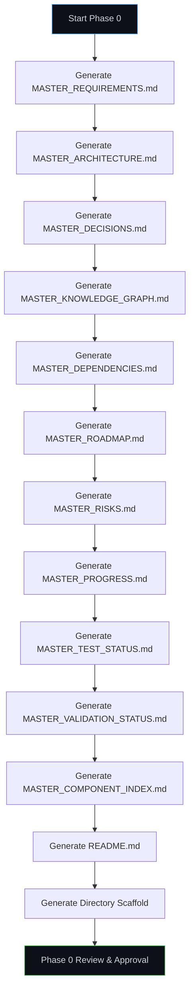

# UADOS — Phase 0: Requirements, Architecture & Roadmap

## Goal

Design and document the complete foundation for the **Universal Autonomous Driving Operating System (UADOS)** — a modular, safety-critical, platform-agnostic autonomy stack. Phase 0 produces no runtime code; it produces the **blueprints, constraints, and decision records** that every subsequent phase builds on.

---

## Scope of Phase 0 Deliverables

| # | Deliverable | Path |
|---|-------------|------|
| 1 | Master Requirements | `AI_BRAIN/MASTER_REQUIREMENTS.md` |
| 2 | Master Architecture | `AI_BRAIN/MASTER_ARCHITECTURE.md` |
| 3 | Master Decisions | `AI_BRAIN/MASTER_DECISIONS.md` |
| 4 | Master Knowledge Graph | `AI_BRAIN/MASTER_KNOWLEDGE_GRAPH.md` |
| 5 | Master Dependencies | `AI_BRAIN/MASTER_DEPENDENCIES.md` |
| 6 | Master Progress | `AI_BRAIN/MASTER_PROGRESS.md` |
| 7 | Master Roadmap | `AI_BRAIN/MASTER_ROADMAP.md` |
| 8 | Master Risks | `AI_BRAIN/MASTER_RISKS.md` |
| 9 | Master Test Status | `AI_BRAIN/MASTER_TEST_STATUS.md` |
| 10 | Master Validation Status | `AI_BRAIN/MASTER_VALIDATION_STATUS.md` |
| 11 | Master Component Index | `AI_BRAIN/MASTER_COMPONENT_INDEX.md` |
| 12 | Repository Structure | Root `README.md` + directory scaffold |
| 13 | Architecture Diagrams | Mermaid diagrams embedded in architecture doc |
| 14 | Risk Registry | Embedded in `MASTER_RISKS.md` |
| 15 | Success Metrics & Acceptance Criteria | Embedded in `MASTER_REQUIREMENTS.md` |

---

## User Review Required

> [!IMPORTANT]
> **Technology Stack Decisions** — The choices below drive every subsequent phase. Please confirm or override.

| Decision | Proposed Choice | Rationale |
|----------|----------------|-----------|
| **Primary Language** | **C++20** (kernel, runtime, performance-critical) + **Python 3.12** (tooling, ML, simulation, validation) | Industry standard for AV stacks; C++ for determinism & performance, Python for rapid iteration on ML/tooling |
| **Build System** | **CMake 3.28+** with Conan 2 for C++ dependency management | Cross-platform, widely supported in automotive |
| **IPC / Middleware** | **Custom zero-copy shared-memory event bus** with optional DDS bridge | Lowest latency for intra-process; DDS for cross-vehicle/fleet |
| **Serialization** | **FlatBuffers** (hot path) + **Protobuf** (config/fleet/API) | Zero-copy for real-time, Protobuf for tooling ergonomics |
| **ML Framework** | **ONNX Runtime** (inference) + **PyTorch** (training/export) | Hardware-agnostic inference, strong ecosystem |
| **Simulation** | **Custom engine** + **CARLA bridge** + **SUMO bridge** | Full control + industry-standard scenario sources |
| **OS Target** | **Linux (Ubuntu 22.04/24.04 LTS)** primary; RTOS (Zephyr) for safety-critical ECU targets | Linux is the AV industry standard |
| **Observability** | **OpenTelemetry** + **Prometheus** + **Grafana** | Open standards, extensible |
| **CI/CD** | **GitHub Actions** + **Bazel Remote Cache** (optional) | Accessible, well-integrated |
| **Documentation** | **Markdown** + **Doxygen** (C++) + **Sphinx** (Python) + **Mermaid** (diagrams) | Maintainable, version-controlled |

> [!IMPORTANT]
> **Vehicle Platform Targets** — Which initial platforms should we design reference drivers for?

| Option | Description |
|--------|-------------|
| A | **Simulation-only** (CARLA virtual vehicle) — fastest to validate |
| B | **Simulation + RC-car** (1/10 scale) — physical validation without full-scale risk |
| C | **Simulation + production vehicle** (specific make/model TBD) — real-world from day one |
| D | **Simulation + NVIDIA DRIVE platform** — GPU-accelerated reference |

> [!WARNING]
> **Safety Criticality Level** — UADOS is designed with safety as a core pillar, but the level of formal verification and ASIL compliance changes the engineering effort by 5-10x. Please confirm:

| Option | Description |
|--------|-------------|
| 1 | **Research/prototype grade** — best-effort safety, no formal ASIL compliance |
| 2 | **Pre-production grade** — ASIL-B design patterns, documented hazard analysis, but no formal certification |
| 3 | **Production grade** — full ISO 26262 ASIL-D compliance, formal methods where required |

---

## Open Questions

> [!IMPORTANT]
> 1. **Hardware-in-the-Loop (HIL)**: Do you have or plan to acquire any HIL test benches? This affects Phase 4+ validation strategy.
> 2. **HD Map Source**: Should we design for a specific HD map provider (e.g., HERE, TomTom, Lanelet2) or build a generic map abstraction?
> 3. **Fleet Scale Target**: What is the target fleet size for Phase 14 (Fleet Platform)? 1-10 vehicles? 10-100? 100+?
> 4. **Cloud Provider Preference**: Any preference for cloud infrastructure (AWS, GCP, Azure) for fleet telemetry and OTA?

---

## Proposed Architecture Overview

The system follows a **layered microkernel architecture** with strict dependency flow:

```
┌─────────────────────────────────────────────────────────────────┐
│                     FLEET PLATFORM (Phase 14)                    │
│  Telemetry · OTA · Remote Diagnostics · Fleet Analytics          │
├─────────────────────────────────────────────────────────────────┤
│                  DIGITAL TWIN & SIMULATION (Phase 11-12)         │
│  Vehicle Twins · Sensor Twins · Road Twins · Scenario Engine     │
├─────────────────────────────────────────────────────────────────┤
│                   VALIDATION PLATFORM (Phase 13)                 │
│  Automated Validation · Regression · Chaos Testing               │
├─────────────────────────────────────────────────────────────────┤
│                    SAFETY PLATFORM (Phase 10)                    │
│  Safety Monitors · Fault Detection · Emergency Response          │
├──────────┬──────────┬──────────┬──────────┬─────────────────────┤
│ PERCEP-  │ LOCALI-  │ PREDIC-  │ PLANNING │ CONTROL             │
│ TION     │ ZATION   │ TION     │          │                     │
│ (Ph.5)   │ (Ph.6)   │ (Ph.7)   │ (Ph.8)   │ (Ph.9)             │
├──────────┴──────────┴──────────┴──────────┴─────────────────────┤
│                    SENSOR PLATFORM (Phase 4)                     │
│  Camera · Radar · LiDAR · GPS · IMU · Sensor Fusion             │
├─────────────────────────────────────────────────────────────────┤
│              VEHICLE ABSTRACTION LAYER (Phase 3)                 │
│  Vehicle API · Driver SDK · Reference Drivers · Simulation Drv.  │
├─────────────────────────────────────────────────────────────────┤
│              VEHICLE OS KERNEL (Phase 2)                         │
│  Event Bus · Scheduler · Health Monitor · Plugin System          │
├─────────────────────────────────────────────────────────────────┤
│              FOUNDATION PLATFORM (Phase 1)                       │
│  Build · Deps · Docs · CI/CD · Observability · Repo Structure    │
└─────────────────────────────────────────────────────────────────┘
```

### Key Architectural Principles

1. **Microkernel Design** — Minimal trusted core; all subsystems are plugins
2. **Zero-Copy Data Flow** — Shared-memory message passing on hot paths
3. **Deterministic Scheduling** — Priority-based, deadline-aware task scheduling
4. **Driver Abstraction** — All vehicle hardware accessed through a unified driver interface
5. **Sensor Abstraction** — All sensors accessed through a unified sensor interface
6. **Pipeline Architecture** — Perception → Localization → Prediction → Planning → Control as a directed acyclic graph
7. **Safety Envelope** — Independent safety monitor with authority to override all other subsystems
8. **Plugin System** — All major subsystems loaded as plugins with versioned interfaces
9. **Observable by Default** — Every component emits structured telemetry
10. **Simulation-First** — Every component must be testable in simulation before hardware

---

## Proposed Repository Structure

```
h:\uados\
├── AI_BRAIN/                          # Context Preservation Framework
│   ├── MASTER_REQUIREMENTS.md
│   ├── MASTER_ARCHITECTURE.md
│   ├── MASTER_DECISIONS.md
│   ├── MASTER_KNOWLEDGE_GRAPH.md
│   ├── MASTER_DEPENDENCIES.md
│   ├── MASTER_PROGRESS.md
│   ├── MASTER_ROADMAP.md
│   ├── MASTER_RISKS.md
│   ├── MASTER_TEST_STATUS.md
│   ├── MASTER_VALIDATION_STATUS.md
│   └── MASTER_COMPONENT_INDEX.md
│
├── core/                              # Phase 2 — Vehicle OS Kernel
│   ├── kernel/                        # Microkernel core
│   │   ├── include/uados/kernel/
│   │   ├── src/
│   │   └── tests/
│   ├── event_bus/                     # Zero-copy event bus
│   │   ├── include/uados/event_bus/
│   │   ├── src/
│   │   └── tests/
│   ├── scheduler/                     # Deterministic task scheduler
│   ├── health/                        # Health monitoring
│   ├── lifecycle/                     # Component lifecycle management
│   ├── plugin/                        # Plugin system
│   └── messaging/                     # IPC messaging layer
│
├── hal/                               # Phase 3 — Vehicle Abstraction Layer
│   ├── api/                           # Vehicle API definitions
│   │   ├── include/uados/hal/
│   │   └── proto/                     # Protobuf/FlatBuffers schemas
│   ├── sdk/                           # Driver SDK
│   ├── drivers/                       # Reference drivers
│   │   ├── simulation/               # Simulation drivers (CARLA, etc.)
│   │   ├── canbus/                   # CAN bus generic driver
│   │   └── reference/               # Reference vehicle drivers
│   └── validation/                    # Driver validation framework
│
├── sensors/                           # Phase 4 — Sensor Platform
│   ├── api/                           # Sensor API definitions
│   ├── camera/
│   ├── radar/
│   ├── lidar/
│   ├── gps/
│   ├── imu/
│   └── fusion/                        # Sensor fusion foundation
│
├── perception/                        # Phase 5 — Perception
│   ├── detection/
│   ├── classification/
│   ├── tracking/
│   ├── segmentation/
│   ├── lanes/
│   ├── signs/
│   └── traffic_lights/
│
├── localization/                      # Phase 6 — Localization
│   ├── gps_fusion/
│   ├── visual/
│   ├── slam/
│   ├── hdmap/
│   └── pose/
│
├── prediction/                        # Phase 7 — Prediction
│   ├── trajectory/
│   ├── behavior/
│   └── risk/
│
├── planning/                          # Phase 8 — Planning
│   ├── strategic/
│   ├── behavior/
│   └── motion/
│
├── control/                           # Phase 9 — Control
│   ├── steering/
│   ├── brake/
│   ├── throttle/
│   ├── transmission/
│   └── loops/                         # PID, MPC, etc.
│
├── safety/                            # Phase 10 — Safety Platform
│   ├── monitors/
│   ├── fault_detection/
│   ├── runtime_validation/
│   └── emergency/
│
├── digital_twin/                      # Phase 11 — Digital Twin Platform
│   ├── vehicle/
│   ├── sensor/
│   ├── road/
│   ├── traffic/
│   └── weather/
│
├── simulation/                        # Phase 12 — Simulation Platform
│   ├── scenarios/
│   ├── orchestration/
│   ├── replay/
│   └── metrics/
│
├── validation/                        # Phase 13 — Validation Platform
│   ├── automated/
│   ├── regression/
│   ├── performance/
│   ├── chaos/
│   └── fault_injection/
│
├── fleet/                             # Phase 14 — Fleet Platform
│   ├── telemetry/
│   ├── ota/
│   ├── diagnostics/
│   └── analytics/
│
├── tools/                             # Development & operational tooling
│   ├── cli/                           # UADOS CLI
│   ├── dashboard/                     # Web dashboard
│   ├── codegen/                       # Code generators
│   └── analysis/                      # Static analysis configs
│
├── docs/                              # Documentation
│   ├── architecture/
│   ├── api/
│   ├── guides/
│   ├── safety/
│   └── diagrams/
│
├── scripts/                           # Build & deployment scripts
│   ├── build/
│   ├── deploy/
│   ├── ci/
│   └── setup/
│
├── configs/                           # Configuration files
│   ├── vehicle/
│   ├── sensor/
│   ├── simulation/
│   └── fleet/
│
├── third_party/                       # Third-party integrations
│
├── CMakeLists.txt                     # Root build file
├── conanfile.py                       # Dependency manifest
├── pyproject.toml                     # Python tooling config
├── .github/                           # CI/CD workflows
│   └── workflows/
├── .clang-format                      # C++ formatting
├── .clang-tidy                        # C++ linting
├── README.md                          # Project overview
└── LICENSE
```

---

## Proposed Changes — Phase 0 Execution Plan

### Component 1: AI_BRAIN (Context Preservation Framework)

All 11 master documents will be generated with full content. These serve as the project's persistent memory across sessions.

#### [NEW] `AI_BRAIN/MASTER_REQUIREMENTS.md`
- Functional requirements for all 15 phases
- Non-functional requirements (latency, throughput, reliability, safety)
- Success metrics per phase
- Acceptance criteria per phase
- Traceability matrix (requirement → component → test)

#### [NEW] `AI_BRAIN/MASTER_ARCHITECTURE.md`
- System architecture with Mermaid diagrams
- Component interaction diagrams
- Data flow diagrams
- Deployment architecture
- Technology stack rationale
- Interface contracts between layers

#### [NEW] `AI_BRAIN/MASTER_DECISIONS.md`
- Architecture Decision Records (ADRs) in standard format
- Decision log with rationale, alternatives considered, and trade-offs

#### [NEW] `AI_BRAIN/MASTER_KNOWLEDGE_GRAPH.md`
- Component → dependency mapping
- Component → interface mapping
- Requirement → component → test traceability
- Concept taxonomy (e.g., "Perception" → "Detection" → "YOLO-based Object Detector")

#### [NEW] `AI_BRAIN/MASTER_DEPENDENCIES.md`
- External library inventory with versions, licenses, and security status
- Internal dependency graph
- Build dependency chain

#### [NEW] `AI_BRAIN/MASTER_PROGRESS.md`
- Phase completion status
- Milestone tracking
- Blockers and resolutions

#### [NEW] `AI_BRAIN/MASTER_ROADMAP.md`
- Gantt-style phase timeline
- Dependencies between phases
- Critical path analysis
- Resource estimates

#### [NEW] `AI_BRAIN/MASTER_RISKS.md`
- Risk registry with probability, impact, mitigation strategies
- Safety hazard analysis (preliminary HARA)
- Technical debt tracking

#### [NEW] `AI_BRAIN/MASTER_TEST_STATUS.md`
- Test suite inventory per component
- Coverage metrics
- Pass/fail rates
- Quality gate status

#### [NEW] `AI_BRAIN/MASTER_VALIDATION_STATUS.md`
- Validation evidence inventory
- Simulation results summary
- Safety validation status

#### [NEW] `AI_BRAIN/MASTER_COMPONENT_INDEX.md`
- Complete index of all components with paths, status, owners, and phase

---

### Component 2: Root Project Files

#### [NEW] `README.md`
- Project overview, vision, architecture summary
- Quick-start guide
- Phase status badges

#### [NEW] `LICENSE`
- TBD based on user preference (MIT, Apache 2.0, proprietary)

---

## Execution Order



---

## Verification Plan

### Automated Checks
- All markdown files pass lint (`markdownlint`)
- All Mermaid diagrams render without errors
- All internal cross-references resolve correctly
- Traceability matrix has no orphaned requirements
- No duplicate decision IDs in ADR log

### Manual Verification
- User reviews and approves all architectural decisions
- User confirms technology stack choices
- User confirms target vehicle platforms
- User confirms safety criticality level

---

## Estimated Effort

| Deliverable | Estimated Size | Tokens (approx) |
|-------------|---------------|-----------------|
| MASTER_REQUIREMENTS | ~2,000 lines | ~15,000 |
| MASTER_ARCHITECTURE | ~1,500 lines | ~12,000 |
| MASTER_DECISIONS | ~500 lines | ~4,000 |
| MASTER_KNOWLEDGE_GRAPH | ~800 lines | ~6,000 |
| MASTER_DEPENDENCIES | ~300 lines | ~2,500 |
| MASTER_ROADMAP | ~400 lines | ~3,000 |
| MASTER_RISKS | ~600 lines | ~5,000 |
| MASTER_PROGRESS | ~200 lines | ~1,500 |
| MASTER_TEST_STATUS | ~200 lines | ~1,500 |
| MASTER_VALIDATION_STATUS | ~200 lines | ~1,500 |
| MASTER_COMPONENT_INDEX | ~300 lines | ~2,500 |
| README + scaffold | ~200 lines | ~1,500 |
| **Total** | **~7,200 lines** | **~56,000** |

> [!NOTE]
> Phase 0 generates zero runtime code. All output is documentation, architecture, and project scaffolding. This ensures we have a solid foundation before any implementation begins.

---

## What Happens After Approval

Upon approval of this plan, I will:

1. **Generate all 11 AI_BRAIN documents** — sequentially, with full content
2. **Create the directory scaffold** — empty directories with `.gitkeep` files
3. **Generate `README.md`** — project overview with architecture diagram
4. **Present Phase 0 for final review** — all deliverables ready for sign-off
5. **Upon Phase 0 sign-off** — immediately begin Phase 1 (Foundation Platform) planning
