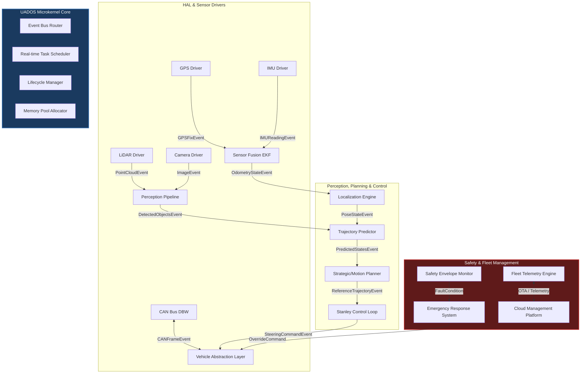

# UADOS — Architecture System Overview

> **Classification**: Open Source Autonomous Stack  
> **Status**: Active / Production-Ready  
> **Target Audience**: Core Engineers & Integrators  

---

## 1. High-Level Architecture Design

UADOS (Universal Autonomous Driving Operating System) is designed using a **modular microkernel-inspired architecture**. Instead of a monolithic control loop, functions are split into decoupled subsystems running on top of a highly responsive **Event Bus** scheduler.

---

## 2. Platform Core Subsystems

### A. UADOS Microkernel Core
The microkernel manages deterministic execution, logging, configuration, memory, and the IPC bus.
- **Event Bus (`core/event_bus/`)**: A thread-safe, lock-free lockless event dispatch ring-buffer that enables zero-copy messaging between independent C++ components.
- **Scheduler (`core/scheduler/`)**: Multi-threaded real-time executor supporting priority scheduling, rate limiting, and execution timing guarantees.
- **Health / Lifecycle (`core/health/`, `core/lifecycle/`)**: System lifecycle state managers ensuring safe transition states (`Uninitialized` → `Initialized` → `Running` → `Stopped` → `Panic`).

### B. Hardware Abstraction Layer (HAL)
Standardizes interface boundaries between actual vehicle drive-by-wire (DBW) systems and higher-level path planning.
- Supports physical `SocketCAN` CAN frame streaming.
- Built-in simulation driver interface for direct CARLA integration.

### C. Sensory & Perception Engines
Handles EKF (Extended Kalman Filtering) sensor fusion, point-cloud transformations, visual classification, and HD lane-map matching.
- **Sensor Fusion (`sensors/fusion/`)**: Fuses coordinate tracking from GPS and IMU sensors to yield highly accurate metric position estimates.
- **Inference Engine (`perception/detection/`)**: Parses incoming vision frames via ONNX networks to localize and label roadway obstacles.

### D. Planning & Stanley Control
Translates the mapped roadway and obstacle predictions into standard steer/throttle commands.
- **Strategic Planner (`planning/strategic/`)**: Generates high-level highway corridor waypoints.
- **Stanley Control Loop (`control/loops/`)**: Uses lateral cross-track steering error geometry to drive physical actuators.

### E. Emergency Envelope
A fail-operational safety layer that continuously evaluates hardware metrics.
- **Emergency Response System (`safety/emergency/`)**: Instantly overrides nominal controls with MRC (Minimum Risk Maneuver) fallback trajectories when a critical fault is discovered.
